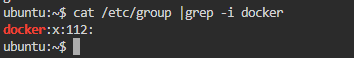
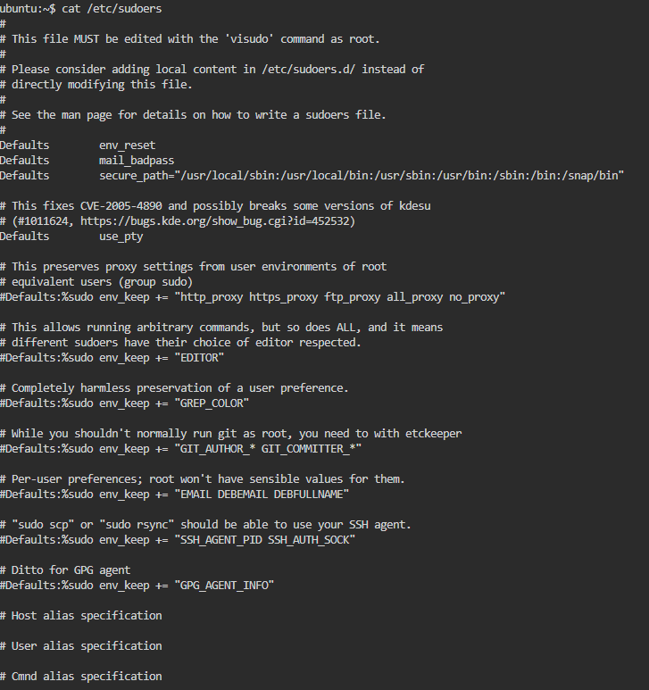
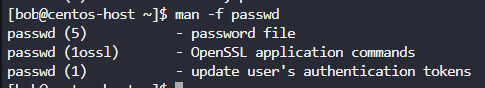

# Linux Accounts

##  <span style="color:red">User</span>

uid=UID(username) gid=GID(groupname) groups=GID(groupname)[, GID2(groupname2)]

```
cat /etc/passwd
```

```
id root
grep -i root /etc/passwd
```

#### `uid=UID(username)`
The User ID (UID) uniquely identifies a user on the system.
Example: uid=0(root) means the user is the root (administrator), while uid=5(games) is a system-level user for game-related tasks.

##### `gid=GID(groupname)`
The Group ID (GID) indicates the user's primary group.
This group determines file permissions for files created by the user.

#### `groups=GID(groupname)`
Lists all additional groups the user belongs to.
Group membership defines access to shared files and system resources.

```bash
user01@host:~$ cat /etc/passwd
...output omitted...
user01:x:1000:1000:User One:/home/user01:/bin/bash
```
Consider each part of the code block, separated by a colon:

- `user01` : The username for this user.
- `x` : The user's encrypted password was historically stored here; it is now a placeholder.
- `1000` : The UID number for this user account.
- `1000` : The GID number for this user account's primary group. Groups are discussed later in this section.
- `User One` : A brief comment, description, or the real name for this user.
- `/home/user01`: The user's home directory, and the initial working directory when the login shell starts.
- `/bin/bash` : The default shell program for this user that runs at login. Some accounts use the /sbin/nologin shell to disallow interactive logins with that account.


##  <span style="color:red">Group</span> 

```
cat /etc/group
```
___
**Example:**


____

- **`group_name`**  
  The name of the group (e.g., `sudo`, `games`, `developers`).

- **`password`**  
  Optional and rarely used. Usually `x` to indicate that the password is stored in `/etc/gshadow`.

- **`GID` (Group ID)**  
  A numeric ID that uniquely identifies the group (e.g., `0` for `root`, `60` for `games`).

- **`user_list`**  
  A comma-separated list of users who are **members of the group**, aside from the user whose primary group it is.


```bash
user01@host:~$ cat /etc/group
...output omitted...
group01:x:10000:user01,user02,user03
```

- `group01` : The name for this group.
- `x` : Obsolete group password field; it is now a placeholder.
- `10000` : The GID number for this group (10000).
- `user01,user02,user03` : A list of users that are members of this group as one of their supplementary groups.

##  <span style="color:red">Account Types</span>


### **Regular User**
Regular user accounts used for interactive logins and daily tasks.

**Examples:**
- Edwin
- Camilo

These users typically have limited privileges and belong to one or more groups.

Use the `ps` command to view process information. By default, the ps command only displays processes that are running with the same UID as the current user and that are associated with the terminal on which the ps command was run.

You can add different options to change this behavior. If you use the `awwu` options together, then the ps command lists processes that are owned by any user that is associated with a terminal (`a`), provides more user-oriented information for each process (`u`), and does not truncate each line of output (`ww`).

In the following output, the first column shows the username of the user that owns each process.

```bash
user01@host:~$ ps awwu
USER     PID %CPU %MEM    VSZ   RSS TTY    STAT START  TIME COMMAND
root    1690  0.0  0.0 220984  1052 ttyS0  Ss+  22:43  0:00 /sbin/agetty -o -- \u --noreset --noclear --keep-baud 115200,57600,38400,9600 - vt220
user01  1769  0.0  0.1 454012  5556 tty2   Ssl+ 22:45  0:00 /usr/libexec/gdm-wayland-session /usr/bin/gnome-session
user01  1800  0.0  0.3 521412 19824 tty2   Sl+  22:45  0:00 /usr/libexec/gnome-session-binary
user01  3072  0.0  0.0 224152  5756 pts/1  Ss   22:48  0:00 /usr/bin/bash
user01  3122  0.0  0.0 225556  3652 pts/1  R+   22:49  0:00 ps awwu
```

### **Superuser**

The superuser (also known as **root**) has full access to the system.

- **Username:** `root`
- **UID:** `0`

Used for administrative tasks such as managing users, installing packages, modifying system configuration, and more.

The system user accounts are used by processes that provide supporting services. These processes, or daemons, usually do not need to run as the superuser and do not have a controlling terminal session. They are often assigned nonprivileged system user accounts to secure their files and other resources from each other and from regular users on the system. Users do not interactively log in with a system user account.

### **System User**

Non-login accounts used by the system or software packages.

- Typically have **UIDs < 100** (on Debian/Ubuntu) or **UIDs < 500** (on older Red Hat-based systems).
- Examples: `daemon`, `bin`, `games`, `mail`

These accounts are used to run system services and processes in an isolated and secure way.


### **Service Accounts**


Special-purpose accounts created to run background services or daemons.

- Often created during software installation (e.g., `nginx`, `mysql`, `postgres`)
- Usually **have no login shell** (`/usr/sbin/nologin`) to prevent direct access.
- Provide **separation of privileges** for individual services.

---
**Commands**

```
id
```
`id` Displays the current user's UID, GID, and group memberships.


```
who 
```
`who` Shows who is currently logged into the system.


``` 
last
```

`last` Displays the login history of users (from /var/log/wtmp).


##  <span style="color:red">Switching User </span> 
You can switch users or run commands as another user using the following commands:

```bash
su -
sudo su -
su -c "whoami"

```
To check or configure which users can run commands as root, you can view the sudoers file:

```bash
cat /etc/sudoers
```

⚠️ Important: Edit /etc/sudoers safely using visudo to prevent syntax errors that could lock you out of administrative access



##### 🔐 `sudo` – Granting Privileges with `/etc/sudoers`

The `/etc/sudoers` file controls **who can run commands as another user (typically root)**.  
Each rule defines what actions a user or group can perform with `sudo`.

#### 📘 Field Breakdown

| Field            | Description                                       | Example                         |
|------------------|---------------------------------------------------|---------------------------------|
| **1. User/Group**| The user or group being granted permission        | `bob`, `%sudo`                  |
| **2. Hosts**     | On which host(s) the rule applies                 | `localhost`, `ALL` (default)    |
| **3. RunAs User**| The user(s) the command can be run as             | `ALL` (default: any user)       |
| **4. Command**   | Which command(s) can be executed                  | `/bin/ls`, `ALL` (unrestricted) |

---

#### 📂 Example Entries
The user `root` can run any command, on any host, as any user and group.
```bash
root    ALL=(ALL:ALL) ALL
```
Any user in the `sudo` group can execute any command as any user.
```bash
%sudo   ALL=(ALL:ALL) ALL
```

The user `bob` has full sudo privileges.
```bash
bob     ALL=(ALL:ALL) ALL
```

The user `sarah` can only reboot the system using the specified command, and only on `localhost`.
```bash
sarah   localhost=/usr/bin/shutdown -r now
```

To enable full sudo access for the user01 user, you can create the `/etc/sudoers.d/user01` file with the following content:
```bash
user01        ALL=(ALL)       ALL
```

To enable full sudo access for the group01 group, you can create the `/etc/sudoers.d/group01` file with the following content:

```bash
%group01        ALL=(ALL)       ALL
```

To enable users in the games group to run the id command as the operator user, you can create the /etc/sudoers.d/games file with the following content:

```bash
%games ALL=(operator) /bin/id
```

You can also set up sudo to allow a user to run commands as another user without entering their password, by using the `NOPASSWD: ALL` command:

```bash
Ansible        ALL=(ALL)       NOPASSWD: ALL
```

##  <span style="color:red">Use System Documentation</span>  
Linux provides built-in tools to access help and manual pages for nearly all commands.

#### 🔹 `--help` Option

```bash
ls --help
journalctl --help
```


### 🔹 `man` 

The `man` command provides detailed documentation for commands, system calls, configuration files, and more.

```bash
man ls
man journalctl
```

`mandb`

```bash
 sudo mandb
```

* Purpose: Updates the manual page index database.
* Useful after installing new software or adding custom man pages.
* Requires sudo because it writes to system-wide directories (like /var/cache/man).

`apropos`

**🧾 What is apropos?**

The apropos command searches the man pages for keywords related to what you're looking for. It gives you a list of man page entries (from all sections) that match your search term.

Think of it like a "man page search engine."

```bash
 apropos director
```
* Purpose: Searches the manual page descriptions for the keyword "director".
* Displays a list of all commands and topics that mention "director" in their short man descriptions.
* 🧠 Think of apropos as a man page search engine.

##  <span style="color:red">Managing Local Users</span> 


### Add User
The `useradd` `username` command creates a user account named username. This command completes the following tasks to set up and configure the new account:


**1.** Run the useradd command as the superuser.

**2.** The useradd command reads the configuration for user creation from the /etc/login.defs file.

**3.** The useradd command writes an entry in the /etc/group, /etc/passwd, and /etc/shadow files with the information that is assigned to the username user (user ID and group ID).

**4.** The useradd command creates the home directory of the username user in the /home/username path.

**5.** The useradd command copies the user profile files in the /etc/skel directory to the username user's home directory (under /home/username).

By default, the useradd command assigns new users the first free UID that is greater than or equal to 1000, unless you explicitly specify a UID by using the `-u` option.

**Table 10.1 – `usermod` Command Options to Modify Users**

| **Option**              | **Usage**                                                                                     |
|-------------------------|-----------------------------------------------------------------------------------------------|
| `-a`, `--append`        | Use with the `-G` option to add supplementary groups to the user's existing group list.       |
| `-c`, `--comment`       | Add text to the comment field (e.g., user description).                                       |
| `-d`, `--home HOME-DIR` | Specify a new home directory for the user account.                                            |
| `-g`, `--gid GROUP`     | Set the primary group for the user account.                                                   |
| `-G`, `--groups GROUPS` | Provide a comma-separated list of supplementary g

### Deleting Users

The `userdel` username command removes the username user from the `/etc/passwd` file, but leaves the user's home directory intact. The userdel -r username command removes the user from the `/etc/passwd` file and deletes the user's home directory.

**Warning**

When you remove a user without specifying the `userdel -r` option, an unassigned UID now owns the user's files. If you create a user and that user is assigned the deleted user's UID, then the new account owns those files, which is a security risk. Typically, organization security policies disallow deleting user accounts, and instead lock them from being used, to avoid this scenario.

The following example demonstrates how this scenario can lead to information leakage:

```bash
root@host:~# useradd user01
root@host:~# ls -l /home
drwx------.  4 user01     user01       93 May  9 17:40 user01
root@host:~# userdel user01
root@host ~# ls -l /home
drwx------.  4       1000       1000   93 May  9 17:40 user01
root@host:~# useradd -u 1000 user02
root@host:~# ls -l /home
drwx------.  4 user02     user02       93 May  9 17:40 user01
drwx------.  4 user02     user02       93 May  9 17:41 user02
```
Notice that the user02 user now owns all files that the user01 user previously owned. The root user can use the find / -nouser -o -nogroup command to find all unowned files and directories.


### Setting Passwords

The `passwd username` command sets the initial password or changes the existing password for the username user.

```bash
root@host:~# passwd user01
New password: Temp1234
BAD PASSWORD: The password is shorter than 8 characters
Retype new password: Temp12344
passwd: password updated successfully
root@host:~#
```

The root user can set a password to any value. If the password does not meet the minimum recommended criteria, then the terminal displays a message. You can retype the same password, and the passwd command updates it successfully.

## 📂 Exploring Documentation: `cd /usr/share/doc`

```bash
cd /usr/share/doc
ls
```

* This command navigates to the system documentation directory.
* Located at /usr/share/doc, it contains text files, changelogs, and READMEs for installed packages.

Inside each folder, you may find:

* README – Introduction or usage notes

* changelog.gz – Changes made in each version

* copyright – Licensing information

* examples/ – Sample configuration files

## What are "man pages"?

Man pages (manual pages) are the official documentation for most commands, programs, system calls, and configuration files on Unix/Linux systems. You view them using the man command.

#### **Manual Sections Overview**

Man pages are organized into numbered sections, each covering a different type of content.


###  **Common Sections of the Linux Manual**

| Section | Content type                                 | Description                                      |
|---------|----------------------------------------------|--------------------------------------------------|
| 1       | User commands                                | Both executable and shell programs              |
| 2       | System calls                                 | Kernel routines that are invoked from user space|
| 3       | Library functions                            | Provided by program libraries                   |
| 4       | Special files                                | For example, device files                       |
| 5       | File formats                                 | For many configuration files and structures     |
| 6       | Games and screensavers                       | Historical section for amusing programs         |
| 7       | Conventions, standards, and miscellaneous    | Protocols and file systems                      |
| 8       | System administration and privileged commands| Maintenance tasks                               |
| 9       | Linux kernel API                             | Internal kernel calls                           |


 Find all available sections for a command

 ```bash
 man -f command
 ```
```bash
man -k ssh
```


 ```bash
 man -f passwd
 ```


```bash
man 5 passwd
```


## `whereis`

The `whereis` command in Linux is used to locate the binary, source, and manual pages for a given command. It performs a quick lookup using predefined paths rather than doing a deep filesystem search (like find or locate).

```bash
whereis [options] command_name
```

**⚙️ Common Options**

| Option           | Description                                                     |
| ---------------- | --------------------------------------------------------------- |
| `-b`             | Search for binaries only                                        |
| `-m`             | Search for manual sections only                                 |
| `-s`             | Search for sources only                                         |
| `-u`             | Show files that have unusual entries                            |
| `-B`, `-M`, `-S` | Specify custom search paths for binaries, man pages, or sources |

```bash
whereis bash
```

