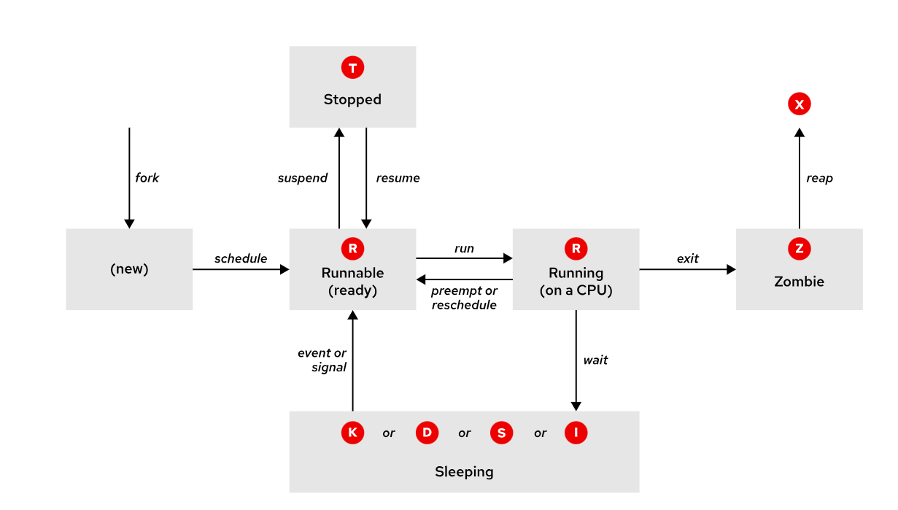

#  Monitoring and Managing Linux Processes
 
## Processes and the Process Lifecycle

### Definition of a Process
A process is a running instance of a launched, executable program. From the moment that a process is created, it consists of the following items:

- An address space of allocated memory
- Security properties, including ownership credentials and privileges
- One or more execution threads of program code
- A process state

The environment of a process is a list of information that includes the following items:

- Local and global variables
- A current scheduling context
- Allocated system resources, such as file descriptors and network ports

An existing parent process duplicates its own address space, which is known as a process fork, to create a child process structure. Every new process is assigned a unique process ID (PID) for tracking and security purposes. The PID and the parent's process ID (PPID) are elements of the new process environment. Any process can create a child process. All processes are descendants of the first system process, systemd, on a Red Hat system.


Through the fork routine, a child process inherits security identities, previous and current file descriptors, port and resource privileges, environment variables, and program code. A child process can then execute its own program code.

Typically, a parent process sleeps when the child process runs, and sets a wait request to be signaled when the child process completes. After the child process exits, it closes or discards its resources and environment, and leaves a zombie resource, which is an entry in the process table. The parent process, which is signaled to wake when the child process exits, cleans the process table of the child's entry, and it frees the last resource of the child process. The parent process then continues with its own program code execution.

### Process States

In a multitasking operating system, each CPU (or CPU core) can work on one process at a time. As a process runs, its immediate requirements for CPU time and resource allocation change. Processes are assigned a state, which changes as circumstances dictate.

The following diagram and table describe Linux process states in detail.



**Table 15.1. Linux Process States**


| Name     | Flag | Kernel-defined state name and description |
|----------|------|-------------------------------------------|
| **Running** | R | **TASK_RUNNING**: The process is either executing on a CPU or waiting to run. The process can be executing user routines or kernel routines (system calls), or be queued and ready when in the *Running* (or *Runnable*) state. |
| **Sleeping** | S | **TASK_INTERRUPTIBLE**: The process is waiting for some condition: a hardware request, system resource access, or a signal. When an event or signal satisfies the condition, the process returns to *Running*. |
|           | D | **TASK_UNINTERRUPTIBLE**: This process is also sleeping, but unlike the S state, it does not respond to signals. This state is used only when process interruption might cause an unpredictable device state. |
|           | K | **TASK_KILLABLE**: Same as the uninterruptible D state, but modified to allow a waiting task to respond to the signal to kill it (exit completely). Utilities often display *Killable* processes as the D state. |
|           | I | **TASK_REPORT_IDLE**: A subset of state D that is used for kernel threads. The kernel does not count these processes when calculating the load average. The `TASK_UNINTERRUPTIBLE` and `TASK_NOLOAD` flags are set. This state is similar to TASK_KILLABLE, and it accepts fatal signals. |
| **Stopped** | T | **TASK_STOPPED**: The process is stopped (suspended), usually by being signaled by a user or another process. The process can be continued (resumed) by another signal to return to running. |
|           | T | **TASK_TRACED**: A process that is being debugged is also temporarily stopped and shares the T state flag. |
| **Zombie** | Z | **EXIT_ZOMBIE**: A child process signals to its parent as it exits. All resources except for the process identity (PID) are released. |
|           | X | **EXIT_DEAD**: When the parent process cleans up (reaps) the remaining child process structure, the process is now released completely. This state cannot be observed in process-listing utilities. |

### Interpreting Process States

Understanding how the kernel communicates with processes, and how processes communicate with each other, can help you to troubleshoot a system.

The system assigns a state to every new process. The `S` column of the top command or the STAT column of the ps command displays the state of each process. On a single CPU system, only one process can run at a time. Several processes can be in an `R` state. However, not all processes are running consecutively; some of them are in waiting status.

```bash
top
ps aux
```

Use signals to suspend, stop, resume, terminate, or interrupt processes. Processes can receive signals from the kernel, other processes, and other users on the same system.

### Listing Processes

The `ps` command lists detailed information for current processes:

- User identification (UID), which determines process privileges
- Unique process identification (PID)
- Amount of used CPU and elapsed real time
- Amount of allocated memory
- The process stdout location, which is known as the controlling terminal
- The current process state

**Important**

The Linux version of the ps command supports the following option formats:

- UNIX (POSIX) options, which can be grouped and must be preceded by a dash (-).
- BSD options, which can be grouped and must not be used with a dash.
- GNU long options, which are preceded by two dashes.

For example, the `ps -aux` command is not the same as the `ps aux` command.

The commonly used `ps aux` command displays all processes, including processes without a controlling terminal. In the following examples, scheduled kernel threads are displayed in brackets at the top of the list.

```bash
ps aux
```

The long listing (the `ps lax` command) provides more detail, and returns results more quickly by avoiding username lookups.

```bash
ps lax
```

The similar UNIX syntax uses the `-ef` options to display all processes.

```bash
ps -ef
```

The default output of the ps command is sorted by process ID number (PID). Initially, the output might appear to use chronological order, but the kernel reuses process IDs, so the order is less structured than it appears. Use the ps command `-O` or `--sort` options to sort the output. The display order matches that of the system process table, which reuses table rows when processes die and spawn.

By default, the `ps` command with no options selects all processes with the current user's effective user ID (EUID), and selects processes that are associated with the terminal that is running the command. Zombie processes are listed with the exiting or defunct label.

You can use the `ps` command `--forest` option to display the processes in a tree format so that you can view the relationships between parent and child processes

## Managing Processes with Job Control

### Jobs and Sessions

With the job control shell feature, you can run and manage multiple commands in a single shell instance.

A job is associated with each pipeline that is entered at a shell prompt. All processes in that pipeline are part of the job and are members of the same process group. You can consider a minimal pipeline to be only one command that is entered in the shell prompt to create a job with only one member.

Only one job at a time can read input and keyboard-generated signals from a particular terminal window. Processes that are part of that job are foreground processes of that controlling terminal.

A background process of that controlling terminal is any other job that is associated with that terminal. Background processes of a terminal cannot read input or receive keyboard-generated interrupts from the terminal, but they can write to the terminal. A background job might be stopped (suspended) or it might be running. If a running background job tries to read from the terminal, and then it is automatically suspended.

Each terminal runs in its own session, and can have a foreground process and any number of background processes. A job that runs in its own session belongs to its controlling terminal.

The `ps` command displays the device name of the controlling terminal in the TTY column.

```bash
ps
```

Some processes, such as system daemons, are started by the system and not from a controlling terminal. These processes are not members of a job, and cannot be brought to the foreground. The ps command displays a question mark (?) in the TTY column for these processes.

Use the `ps j` command to find process and session information, as well as details about jobs.

```bash
ps j
```
```bash
PPID     PID    PGID     SID TTY    TPGID STAT   UID   TIME COMMAND
...output omitted...
8527    8528    8528    8528 pts/0   8633 Ss    1000   0:00 -bash
8528    8559    8559    8528 pts/0   8633 T     1000   0:00 sleep 10000
8528    8633    8633    8528 pts/0   8633 R+    1000   0:00 ps j
```

- The PID is the unique process ID of the process.
- The parent process ID (PPID) is the PID of the parent process that started (forked) this process.
- The PGID is the PID of the process group leader, typically the first process in the job's pipeline.
- The SID is the PID of the session leader, which (for a job) is typically the interactive shell that is running on its controlling terminal.

### Running Jobs in the Background

You can start any command or pipeline in the background by appending an ampersand (`&`) to the command. The Bash shell displays a job number (unique to the session) and the process ID (PID) of the new child process. The shell does not wait for the child process to terminate, but instead displays the shell prompt.

In the following example, the `sleep` command runs in the background with the & operator, pausing for `10000` seconds. The output shows the job number that the shell assigns ([1]) and a process ID (PID) of 5947.

```bash
sleep 10000 &
```

When a command line with a pipe (`|`) is sent to the background, the PID of the last command in the pipeline is displayed. All pipeline processes are members of that job.

In the following example, the ls command is piped through the sort command, and the sorted output is sent via email by using the mail `-s` command. The entire pipeline runs in the background with the & operator, enabling the terminal to remain available.

```bash
ls | sort | mail -s "Sort output" &
```

Use the `jobs` command to display the list of jobs for the shell's session.

```bash
jobs
```

### Bringing a Background Job to the Foreground

Use the `fg` command to bring a background job to the foreground. Use the (`%jobNumber`) format to specify which process to foreground.

```bash
fg %1
```

In the previous example, the sleep command is running in the foreground on the controlling terminal. The shell itself is asleep and waiting for this child process to exit.

### Sending a Foreground Process to the Background

To send a foreground process to the background, press the keyboard-generated suspend request (Ctrl+Z) in the terminal. The job moves to the background and is suspended.

```bash
user@host:~$ sleep 10000
^Z
[1]+  Stopped                 sleep 10000
```

### Starting a Suspended Process

To start running the suspended process, use the bg command with the job ID:

```bash
bg %1
```

## Sending Signals to Processes

### Controlling Processes with Signals

A `signal` is a software interrupt that is delivered to a process. Signals report events to an executing program. Events that generate a signal can be an error, an external event (an I/O request or an expired timer), or by the explicit use of a signal-sending command or keyboard sequence.

The following table lists the fundamental signals that system administrators use for routine process management. Refer to signals by their short (HUP) or proper (SIGHUP) name.

**Fundamental Process Management Signals**

| Signal | Name   | Definition |
| ------ | ------ | ---------- |
| 1      | HUP    | **Hangup**: Reports termination of the controlling process of a terminal. Also requests process re-initialization (configuration reload) without termination. |
| 2      | INT    | **Keyboard interrupt**: Causes program termination. It can be blocked or handled. Sent by pressing the INTR (Interrupt) key sequence (Ctrl+C). |
| 3      | QUIT   | **Keyboard quit**: Similar to SIGINT; adds a process dump at termination. Sent by pressing the QUIT key sequence (Ctrl+\\). |
| 9      | KILL   | **Kill, unblockable**: Causes abrupt program termination. It cannot be blocked, ignored, or handled; consistently fatal. |
| 15 (default) | TERM   | **Terminate**: Causes program termination. Unlike SIGKILL, it can be blocked, ignored, or handled. It allows the program to complete essential operations and to self-cleanup before termination. |
| 18     | CONT   | **Continue**: Sent to a process to resume if stopped. It cannot be blocked. Even if handled, it always resumes the process. |
| 19     | STOP   | **Stop, unblockable**: Suspends the process. It cannot be blocked or handled. |
| 20     | TSTP   | **Keyboard stop**: Unlike SIGSTOP, it can be blocked, ignored, or handled. Sent by pressing the suspend key sequence (Ctrl+Z). |

Each signal has a default action, which is usually one of the following actions:

- Term : Terminate a program (exit) immediately.
- Core : Save a program's memory image (core dump), and then terminate.
- Stop : Stop a running program (suspend) and wait to continue (resume).

Programs react to the expected event signals by implementing handler routines to ignore, replace, or extend a signal's default action.

**Important**
Red Hat recommends sending the SIGTERM signal first, and then trying SIGINT. If both signals fail, then try again with SIGKILL. Administrators commonly use SIGKILL first because this signal forces the process termination no matter the process state and cannot be ignored. However, with the SIGKILL signal, the process is not allowed to run any self-cleanup routines.

### Sending Signals by Explicit Request

You can signal the current foreground process by pressing a keyboard control sequence to suspend (Ctrl+Z), kill (Ctrl+C), or core dump (Ctrl+\) the process. However, you might use signal-sending commands to send signals to background processes in a different session.

You can specify signals either by name (for example, with the -HUP or -SIGHUP options) or by number (with the related -1 option). Users can kill their processes, but root privilege is required to kill processes that other users own.

The `kill` command uses a process ID (PID) number to send a signal to a process. Despite its name, you can use the `kill` command to send any signal, not just those signals for terminating programs. You can use the `kill` command `-l` option to list the names and numbers of all available signals.

```bash
kill -l
```
```bash
 1) SIGHUP       2) SIGINT       3) SIGQUIT      4) SIGILL       5) SIGTRAP
 6) SIGABRT      7) SIGBUS       8) SIGFPE       9) SIGKILL     10) SIGUSR1
11) SIGSEGV     12) SIGUSR2     13) SIGPIPE     14) SIGALRM     15) SIGTERM
16) SIGSTKFLT   17) SIGCHLD     18) SIGCONT     19) SIGSTOP     20) SIGTSTP
21) SIGTTIN     22) SIGTTOU     23) SIGURG      24) SIGXCPU     25) SIGXFSZ
26) SIGVTALRM   27) SIGPROF     28) SIGWINCH    29) SIGIO       30) SIGPWR
31) SIGSYS      34) SIGRTMIN    35) SIGRTMIN+1  36) SIGRTMIN+2  37) SIGRTMIN+3
38) SIGRTMIN+4  39) SIGRTMIN+5  40) SIGRTMIN+6  41) SIGRTMIN+7  42) SIGRTMIN+8
43) SIGRTMIN+9  44) SIGRTMIN+10 45) SIGRTMIN+11 46) SIGRTMIN+12 47) SIGRTMIN+13
48) SIGRTMIN+14 49) SIGRTMIN+15 50) SIGRTMAX-14 51) SIGRTMAX-13 52) SIGRTMAX-12
53) SIGRTMAX-11 54) SIGRTMAX-10 55) SIGRTMAX-9  56) SIGRTMAX-8  57) SIGRTMAX-7
58) SIGRTMAX-6  59) SIGRTMAX-5  60) SIGRTMAX-4  61) SIGRTMAX-3  62) SIGRTMAX-2
63) SIGRTMAX-1  64) SIGRTMAX
```

To find the PID of the process that you want to terminate, you can use the ps aux command and filter by the process name. In the following example, you search for all processes that contain task in their name and then terminate the task1 process by using the default `SIGTERM` signal. The `SIGTERM` signal allows the process to complete tasks and to perform cleanup routines.
```bash
ps aux | grep task
```

```bash
kill 6564
```
Continuing with the task processes example, you then terminate the task2 and task3 processes by using the SIGKILL signal. You use the numerical value of the signal to terminal the task2 process, and you use the signal name to terminate the task3 process. The SIGKILL signal terminates the process abruptly.

```bash
kill -9 6566
```

```bash
kill -SIGKILL 6568
```

### Controlling Specific Processes

Use the `pkill` command to signal one or more processes that match selection criteria. Selection criteria can be a command name, a process that a specific user owns, or all system-wide processes. Processes and sessions can be individually or collectively signaled.

Because the initial process in a login session (session leader) is designed to handle session termination requests and to ignore unintended keyboard signals, killing all the processes and login shells for a single user requires the SIGKILL signal.

When a process is in the T (stopped/traced) state, such as after receiving a SIGSTOP signal, the process cannot respond to signals like SIGTERM, which is what the `pkill`   and `killall` commands send by default. As a result, the process remains in the T state and is displayed in the output of the top and ps commands, even after using the `pkill` command.

Use the `pgrep` command to identify the PID numbers to kill. This command operates similarly to the `pkill` command, including most of the same options, except that the `pgrep` command lists processes rather than killing them.

Use the `pgrep` command with the `-l` option to list the process names and IDs. Use either command with the `-u` option to specify the ID of the user who owns the processes. The following example lists the processes for the bob user and then sends the SIGKILL signal to all processes of that user.

```bash
root@host:~# pgrep -l -u bob
6964 bash
6998 sleep
6999 sleep
7000 sleep
root@host:~# pkill -SIGKILL -u bob
root@host:~# pgrep -l -u bob
```

When the target processes are in the same login session, killing all the processes of a user might not be needed. In this scenario, you can identify the user terminal for the session, and then kill only the processes that reference the same terminal ID. You can determine the terminal for the session by using the w -u username command. Then you can use the `pkill -t ttyN` command, where `N` is the number of the target terminal.

**Note**
Unless SIGKILL is specified, the session leader (here, the Bash login shell) successfully handles and survives the termination request, but terminates all other session processes.

In the following example, you list all processes that belong to the bob user, determine the terminal for the session, and then send the default termination signal (SIGTERM). Note that all processes that belong to the bob user are terminated, except the session leader, the bash process. The commands are run as the root user so that you can observe the difference between sending the SIGTERM and the SIGKILL signals.

```bash
root@host:~# pgrep -l -u bob
7391 bash
7426 sleep
7427 sleep
7428 sleep
root@host:~# w -u bob
USER     TTY      FROM             LOGIN@   IDLE   JCPU   PCPU WHAT
bob      tty3                      18:37    5:04   0.03s  0.03s -bash
root@host:~# pkill -t tty3
root@host:~# pgrep -l -u bob
7391 bash
```

By sending the SIGKILL signal, you also terminate the session leader, as shown in the following example.

```bash
pkill -SIGKILL -t tty3
pgrep -l -u bob
```

You can apply the same selective process termination with parent and child process relationships. Use the `pstree` command to view a process tree for the system or for a single user. Use the parent process's PID to kill all child processes that it created. The parent Bash login shell survives this time, because the signal is directed only at its child processes.

```bash
root@host:~# pstree -p bob
bash(8391)─┬─sleep(8425)
           ├─sleep(8426)
           └─sleep(8427)
root@host:~# pkill -P 8391
root@host:~# pgrep -l -u bob
bash(8391)
root@host:~# pkill -SIGKILL -P 8391
root@host:~# pgrep -l -u bob
bash(8391)
```

### Sending a Signal to Multiple Processes

The `killall` command can signal multiple processes, based on their command name. In the following example, you first list all processes that contain job in their name and then terminate all those processes.

```bash
ps aux | grep job
killall job
```

### Terminating Background Jobs
To terminate background jobs, use the kill command and specify the job number. Use the jobs command to find the job number of the process to terminate.

```bash
jobs
kill -SIGTERM %1


>>>>>>> 3026f49b2bede694b1c49ee111c1bf399989fcb8