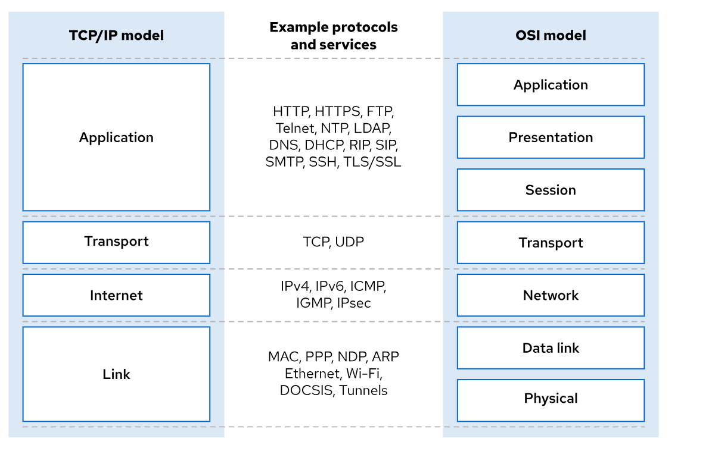
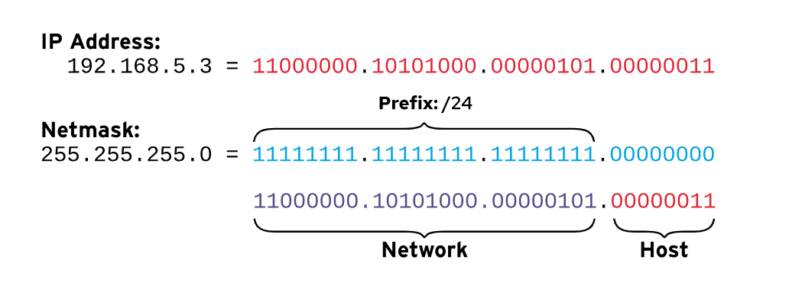
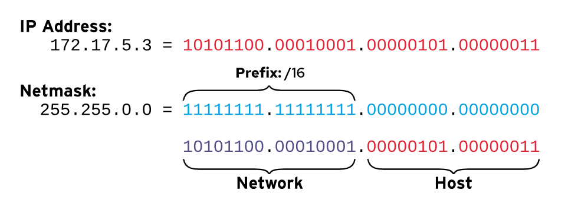
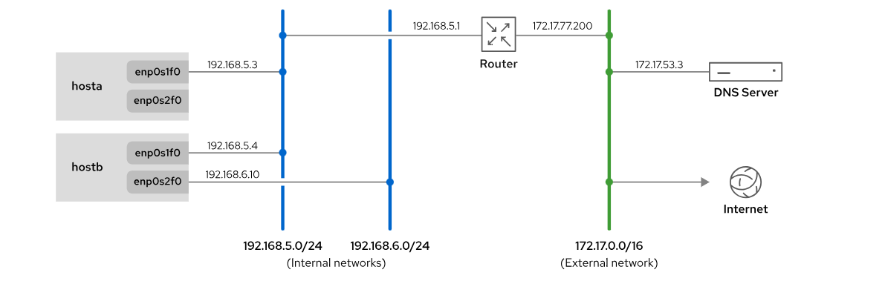
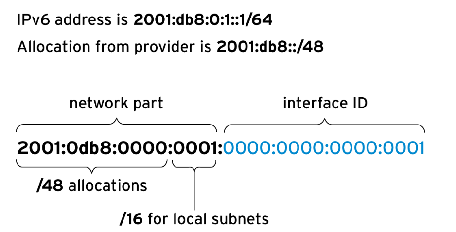
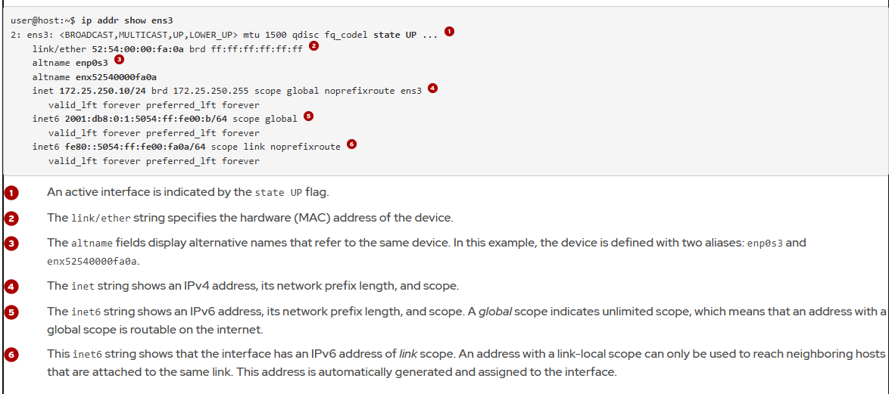

# Networking Concepts
---
## The TCP/IP Network Model

The TCP/IP network model is a four-layer set of communication protocols that describes how data communications are packetized, addressed, transmitted, routed, and received between computers over a network. The protocol is specified by RFC 1122: Requirements for Internet Hosts - Communication Layers.

The four layers of the TCP/IP network model are: application, transport, internet, and link.

### Application

Each application has specifications for communication so that clients and servers can communicate across platforms. Common protocols include SSH (remote access), HTTPS (secure web), FTP (file sharing), and SMTP (electronic mail delivery).

### Transport

Transmission Control Protocol (TCP) and User Datagram Protocol (UDP) are the fundamental protocols at the transport layer. TCP provides a reliable, connection-oriented communication method, ensuring data delivery and order. In contrast, UDP is a connectionless datagram protocol, offering faster but less reliable communication.

Application protocols, such as HTTP or DNS, use specific TCP or UDP ports to communicate. A comprehensive list of these well-known and registered ports can be found in the `/etc/services` file. When data is sent across a network, the combination of an IP address and a service port forms a socket. Every network packet includes both a source socket (identifying the sender) and a destination socket (identifying the receiver). Therefore, identifying network socket information is essential for effective traffic monitoring and filtering.

### Internet
The internet layer, also known as the network layer, is responsible for transmitting data packets from a source host to a destination host across interconnected networks. Key protocols at this layer include IPv4 and IPv6. Each host on a network has a unique IP address and a prefix, which together determine its network address (for example, 192.168.3.19/24). Routers play a crucial role at this layer by connecting different networks and forwarding traffic between them.

### Link

The link layer, or media access layer, provides the connection to physical media. The most common types of networks are wired Ethernet (802.3) and wireless Wi-Fi (802.11). Each physical device has a Media Access Control (MAC) address, which is also known as a hardware address, to identify the destination of packets on the local network segment.

Although TCP/IP is the standard for networking, the Open Systems Interconnection (OSI) model remains a popular teaching reference due to its more granular structure. This granularity is particularly useful for in-depth studies, such as differentiating protocol functionalities (for example, NFS) within TCP/IP's application layer. You might find references to "Layer 2" for Ethernet, "Layer 3" for IP, or "Layer 4" for TCP; these numbers directly correspond to layers in the OSI model.

The following diagram compares the seven-layer OSI model with the four-layer TCP/IP model



## Network Interface Naming

Each network device in a system is identified and configured by using its unique name. In Red Hat Enterprise Linux 7 and later, the system generates consistent network interface names that persist across reboots. These names are not based on detection order, but instead on information from the firmware, the Peripheral Component Interconnect (PCI) bus topology, and the type of network device.

Network interface names start with the type of interface:

- Ethernet interface names begin with `en`.
- WLAN interface names begin with `wl`.
- WWAN interface names begin with `ww`.

The rest of the interface name is based on information from the server's firmware, or is determined by the location of the device in the PCI topology.

- `oN` indicates an onboard device with unique index N from the server's firmware. The eno1 name is onboard Ethernet device 1.
- `sN` indicates a device in PCI hotplug slot N. For example, ens3 is an Ethernet card in PCI hotplug slot 3.

- `pMsN` indicates a PCI device on bus M in slot N. For example, enp2s3.

A `wlp4s0` interface is a WLAN card on PCI bus 4 in slot 0.  If the card is a multifunction device (such as an Ethernet card with multiple ports, or a device with both Ethernet and another function), then you might see fN in the device name. An `enp0s1f0` interface is function 0 of the Ethernet card on bus 0 in slot 1. A second card interface would be named `enp0s1f1`, which is function 1 of that same device.

With persistent naming, you can be confident that your network interface names stay the same on a system, even after you add or remove hardware. The name of a device is generated based on unique hardware information, rather than reverting to the less predictable eth0 naming convention.

**Note**
Earlier versions of Red Hat Enterprise Linux used names such as eth0, eth1, and eth2 for each network interface. The eth0 interface name was the first network port detected, eth1 was the second interface, and so on. However, as devices were added and removed, the mechanism that named devices could change which interface was assigned to which name. Furthermore, the Peripheral Component Interconnect Express (PCIe) standard does not guarantee the order in which PCIe devices are detected on boot, which could change device naming unexpectedly due to variations during device or system startup.

## IPv4 Networking

System administrators must have a basic understanding of IPv4 networking to manage networking on servers. Although IPv6 has surpassed IPv4 usage in cellular networks, IPv4 remains the most common addressing scheme in enterprise networks.

### IPv4 Addresses

An IPv4 address is a 32-bit number, which is expressed as four 8-bit octets in a decimal format that ranges in value from 0 to 255, separated by single dots. The address is divided into two parts: the network prefix and the host identifier. The network prefix identifies a unique physical or virtual subnet. The host identifier represents a specific host on the subnet. All hosts on the same subnet have the same network prefix and can communicate to each other directly without a router. A network gateway connects different networks, and a network router commonly operates as the gateway for a subnet.

**Note**
An IP network is often divided into multiple, smaller network segments. Generally, segment refers to the physical or virtual link layer, whereas subnet refers to the logical IP addressing scheme applied to that segment. Subnetting is a technique to subdivide a large network allocation into smaller segments.

A network mask (`netmask`) is a binary mask whose length indicates how many bits belong to the network prefix that identifies the subnet. Because an IPv4 address is always 32 bits long, a subnet with a longer network mask has fewer available bits to identify hosts, which means fewer possible hosts. A subnet with a shorter network mask has more available bits to identify hosts, which means more possible hosts in the subnet.

Network masks are expressed in one of two forms, which are both used routinely. The first form, CIDR notation, appends a forward slash (/) and an integer up to 32 that indicates the number of bits in the binary mask. The second notation displays the number of bits in the binary mask as four 8-bit octets in decimal format.

## IPv4 Subnets

The number of available host addresses in a subnet depends on the network prefix size. For example, a network prefix of /24 leaves 8 bits, or 255 possible host addresses in the subnet. A network prefix of /16 leaves 16 bits, or 65536 possible host addresses in the subnet.

- The network address for a subnet is the lowest possible address on a subnet, where the host identifier is all binary zeros.
- The broadcast address for a subnet is the highest possible address on a subnet, where the host identifier is all binary ones, and is a special address for broadcasting packets to all subnet hosts.
- The gateway address for a subnet can be any unique host identifier in the subnet, but is commonly set to the first available host address. This gateway numbering convention is not mandatory, and subnets that do not need external communication do not set a network gateway.

The following figures illustrate how to use a netmask to determine the network and host portions of an IP address. A bitwise AND operation is performed for each binary bit in the IP address and the corresponding netmask. If both bits in the compared position are 1, the result is 1; otherwise the result is 0.






Performing binary calculations manually each time that you configure a network interface is time-consuming and prone to errors. Red Hat Enterprise Linux includes the ipcalc command-line tool in its BaseOS repository to help with subnetting tasks.

```bash
ipcalc 10.1.1.18/8
```

### IPv4 Routing

Network packets move from host to host on a subnet and through routers from network to network. Each host uses a routing table to determine which network interface to use for sending packets to particular networks.

A routing table entry lists the destination network, which network interface to use, and the IP address of the router that will forward the packet to the final destination. The host uses the routing table entry that matches the network prefix of the destination address to route the packet.

If multiple entries are valid for the destination address, then the host uses the entry with the longer prefix. If the destination network does not match a more specific entry, then the host routes the packet to the default gateway that is indicated by the 0.0.0.0/0 entry in its routing table. This default route must point to a router on a local subnet that the host can reach.

Networks are interconnected by routers, which are specialized devices equipped with at least two interfaces. If the router receives packets that are not addressed to itself, then the router consults its routing table to determine where to forward the packets. This forwarding decision might involve sending the packet directly to the destination host if it resides on the router's directly connected subnet, or it might forward the packet to another router. This iterative process of packet forwarding across multiple routers continues until the packet successfully reaches its intended destination network and host.

For example, consider the following network diagram and host routing table:



**Table 17.4. Example Routing Table for the hostb Machine** 

| Destination           | Interface | Router (if needed) |
|-----------------------|-----------|--------------------|
| 192.168.5.0/24        | enp0s1f0  |                    |
| 192.168.6.0/24        | enp0s2f0  |                    |
| 0.0.0.0/0 (default)   | enp0s1f0  | 192.168.5.1         |

- Network traffic from the hostb machine to any host in the 192.168.6.0/24 network is transmitted directly via the enp0s2f0 interface.

    - The reason for this forwarding decision is that the hostb machine has an interface attached to that network, and therefore a router is not required to reach the destination.

- Network traffic with a destination that does not match any entry in the routing table is sent to the default route. The default route, which is designated with 0.0.0.0/0, is shown in the third entry in the table.

    - For example, all traffic from the hostb machine to the DNS server with the 172.17.53.3 IP address is forwarded to the router with the address of 192.168.5.1, which is reachable via the enp0s1f0 interface. The router can forward the packet directly to its destination.

### IPv4 Address Configuration

A host can automatically configure its IPv4 network settings by interacting with a Dynamic Host Configuration Protocol (DHCP) server. The DHCP client broadcasts a discovery request on its local network segment to locate an available DHCP server. Upon receiving an offer from the DHCP server, the client requests and is assigned a unique IPv4 address, along with other network parameters like the subnet mask, default gateway, and DNS server addresses. This assignment is valid for a defined lease duration. The client must periodically request a lease renewal to maintain continuous use of the assigned network configuration.

Alternatively, you can configure a server to use a static network configuration. Static network settings are read from local configuration files. The settings that you use must be appropriate for your subnet. Coordinate with your network administrator to avoid conflicts with other hosts in the same subnets.

## IPv6 Networking

IPv6 is widely deployed in both enterprise networks and for mobile communications. Many Internet Service Providers (ISPs) use IPv6 extensively for their core internal infrastructure and for dynamically assigning addresses to customer devices. Designed to overcome the address exhaustion of IPv4, IPv6 dramatically increases the pool of unique device addresses that are globally available.

IPv6 can also be used in parallel with IPv4 in a dual-stack mode. A network interface can have both IPv6 and IPv4 addresses. Red Hat Enterprise Linux operates in a dual-stack mode by default.

### IPv6 Addresses

An IPv6 address is a 128-bit number, typically shown as eight colon-separated groups of four hexadecimal digits. Each hexadecimal digit (a nibble) represents four bits, which means that a quartet represents 16 bits of the IPv6 address.

```bash
2001:0db8:0000:0010:0000:0000:0000:0001
```

For convenience in writing IPv6 addresses, any leading zeros in a colon-separated quartet can be omitted. However, each quartet must retain at least one hexadecimal digit.

```bash
2001:db8:0:10:0:0:0:1
```

To further simplify IPv6 addresses, one or more consecutive groups of 0000 can be replaced by a double colon (::). This double colon can appear only one time in an address to avoid ambiguity.
```bash
2001:db8:0:10::1
```

Although `2001:0db8:0:0010:0:0000:0:1` is also a valid IPv6 address, its notation makes it less practical and harder to read.

Follow these tips to write consistently readable addresses:

- Suppress any leading zeros in a group. For example, 0010 becomes 10, and 0000 becomes 0.
- Use the double colon (::) to shorten the address as much as possible.
- If an address contains two consecutive groups of zeros, which are equal in length, then shorten the leftmost groups of zeros to :: and the rightmost groups to :0: for each group.
- Although it is allowed, do not use :: to shorten a single group of zeros. Use :0: instead, and save :: for consecutive groups of zeros.
- Always use lowercase letters (a through f) for hexadecimal digits.

**Important**

    When including a TCP or UDP network port after an IPv6 address, always enclose the IPv6 address in square brackets so that the port does not appear to be part of the address.

### IPv6 Subnets

A standard IPv6 unicast address is divided into two parts: the network prefix and interface ID. The network prefix identifies the subnet.  The interface ID identifies a particular interface on the subnet. Two network interfaces on the same subnet cannot have the same interface ID.

Unlike IPv4, IPv6 employs a standardized subnet mask: most typical unicast addresses use a /64 prefix length. . This means that half of the 128 bit address represents the network prefix and the other half the interface ID. With 64 bits available for host identification, a single IPv6 subnet could theoretically accommodate an enormous number of devices (up to 2^64 hosts).

Typically, an Internet Service Provider (ISP) allocates a shorter network prefix to an organization, commonly /48. This organizational prefix leaves the remaining bits within the network portion for the organization to define its own subnets. For instance, with a /48 allocation, 16 bits are available for subnetting (64-48=16), allowing for 2^16 or 65,536 distinct subnets within that allocated block.



A number of addresses have special meaning in IPv6. The following table lists these special addresses and well-known IPv6 prefixes.

**Common IPv6 Addresses and Networks**

| IPv6 address or network | Purpose | Description |
|-------------------------|---------|-------------|
| `::1/128`               | localhost | The IPv6 equivalent to the `127.0.0.1/8` address, which is set on the loopback interface. |
| `::`                    | The unspecified address | The IPv6 equivalent to `0.0.0.0`. For a network service, it might indicate that it is listening on all configured IP addresses. |
| `::/0`                  | The default route (the IPv6 internet) | The IPv6 equivalent to the `0.0.0.0/0` address. The default route in the routing table matches this network; the router for this network is where all traffic is sent in the absence of a better route. |
| `2000::/3`              | Global unicast addresses | The Internet Assigned Numbers Authority (IANA) currently allocates public, routable IPv6 addresses from this space. The addresses include all the networks that range from `2000::/16` through `3fff::/16`. |
| `fd00::/8`              | Unique local addresses (RFC 4193) | IPv6 has no direct equivalent of the RFC 1918 private address space, although this network range is close. A site can use these networks to self-allocate a private routable IP address space inside the organization. However, these networks cannot be used on the global internet. The site must randomly select a `/48` from this space, but it can subnet the allocation into `/64` networks normally. |
| `fe80::/10`             | Link-local addresses | Every IPv6 interface automatically configures a link-local unicast address that cannot be routed to public networks. |
| `ff00::/8`              | Multicast address | The IPv6 equivalent to the `224.0.0.0/4` address. Multicast sends packets to multiple hosts simultaneously. This one-to-many functionality is particularly important, because IPv6 does not use broadcast addresses. |


**Important**

    The previous table lists network address allocations that are reserved for specific purposes. These allocations might consist of many networks. IPv6 networks are allocated from the global unicast and link-local unicast address spaces, which have a standard /64 network mask.

A link-local address in IPv6 is an unroutable address that the system uses only to communicate to other systems on the same network link. To ensure that the IP address is unique, the system uses a specific method to compute the interface ID of the link-local address

**Note** 

    Originally, the interface ID for the IPv6 link-local address was constructed from the MAC address of the network device. Exposing the MAC address as part of the IPv6 address might cause some security and privacy issues, because it becomes possible to identify and track a computer on the network.

    By default, NetworkManager generates a random but stable interface ID for the interface, according to the algorithm in RFC 7217. This algorithm is controlled by the ipv6.addr-gen-mode connection setting, which defaults to stable-privacy.

    IPv6 Privacy Extensions (RFC 4941) are a different solution to the same concern and are controlled by different settings, which are disabled by default.

To operate correctly, IPv6 relies on the link-local address. The interface always keeps that address, regardless of whether you assign a routable IPv6 address manually or with an automated method.

With multicast, one system can send traffic to a special IP address that multiple systems receive. Multicast differs from broadcast, because broadcast packets are not routable and reach only local subnet hosts. Conversely, multicast packets are routed to specific hosts that announced a request for the uniquely addressed multicast packets. Multicast packets can be routed to other subnets, if all intermediary routers support forwarding multicast requests and routing.

Multicast plays a larger role in IPv6 than in IPv4, because IPv6 has no broadcast address. The ff02::1 IPv6 address is a key multicast address that is used as the all-nodes link-local address, and behaves like a broadcast address. You can ping this address to send traffic to all nodes on the link.

### IPv6 Address Configuration

IPv4 offers two methods for configuring addresses on network interfaces: manual assignment by an administrator or dynamic configuration via DHCP. In contrast, IPv6 supports manual configuration along with two dynamic methods: DHCPv6 and SLAAC (Stateless Address Autoconfiguration).

#### Manual Configuration

Similar to IPv4, you can select interface IDs for static IPv6 addresses, and configure them manually. Be aware that some addresses are reserved and must not be used. In IPv4, two addresses on a network cannot be used:

- The lowest address, which is the network address.
- The highest address, which is the broadcast address.

In IPv6, two interface IDs are reserved, and cannot be used as regular host interface addresses:

- The all-zeros identifier 0000:0000:0000:0000 (subnet router anycast) that all routers on the link use. For example, on the 2001:db8::/64 network, the anycast address is 2001:db8::.

- The identifiers fdff:ffff:ffff:ff80 through fdff:ffff:ffff:ffff.

#### Automatic Configuration with DHCPv6

Unlike IPv4 DHCP, DHCPv6 lease negotiations operate without the use of broadcast addresses. Instead, a host sends its DHCPv6 requests from a link-local address to the special ff02::1:2 multicast address on UDP port 547. This ff02::1:2 address is a reserved, link-scope multicast address that is specifically designated for all DHCPv6 servers and relay agents.

When a DHCPv6 server processes a client's request, it sends a reply with the necessary configuration information to UDP port 546 on the client's link-local address.

The kea package in Red Hat Enterprise Linux 10 provides support for a DHCPv6 server.

#### Automatic Configuration with SLAAC

In addition to DHCPv6, IPv6 also supports another dynamic configuration method: Stateless Address Autoconfiguration (SLAAC). To use SLAAC, a host configures its interface with a link-local fe80::/64 address automatically, and sends a router solicitation message to the ff02::2 link-local multicast address. This address is designated for all routers on the local network segment.

An IPv6 router on the local link responds to the host's link-local address and provides the subnet's pre-configured network prefix and other relevant information. The host subsequently uses this provided network prefix along with an automatically generated interface ID to create its complete IPv6 address. To ensure network settings remain current, the router regularly sends multicast router advertisements to update or confirm the provided information.

The `radvd` package in RHEL provides the Router Advertisement Daemon, which implements SLAAC.

**Important**

    A Red Hat Enterprise Linux 10 system that is configured for dynamic IPv4 addresses with DHCP is typically configured for dynamic IPv6 by using SLAAC. Hosts with a dynamic IPv6 configuration might unexpectedly obtain additional IPv6 addresses when a new IPv6 router is added to the network.

    Some IPv6 deployments combine SLAAC and DHCPv6. These deployments use SLAAC to provide the network address information, and use DHCPv6 to provide more network options, such as DNS servers and search domains.

## Hostnames and Name Resolution

IP addresses are not human-friendly for daily use; people generally prefer hostnames over numeric strings. Linux provides name resolution mechanisms to map these hostnames to their corresponding IP addresses.

A straightforward method for name resolution is to create static entries for hostnames in each system's `/etc/hosts` file. This method comes with a significant drawback: you must manually update the hosts file on every system.

A more robust solution for handling name resolution is the Domain Name System (DNS). Unlike static host files, DNS operates as a distributed network of servers that dynamically maps hostnames and IP addresses. To function, a host must be configured to contact a nameserver, which can reside in a different subnet as long as it is network-accessible. Nameserver settings are typically provisioned through DHCP or by specifying static addresses in the `/etc/resolv.conf` file.

---
# Validating Network Configuration
---
## Gathering Network Information
Linux offers robust tools for gathering network information and managing components. Red Hat recommends the versatile ip command, which is widely available and provides comprehensive details about network interfaces, including statistics, addresses, and routes.

## Identifying Network Devices

The ip link command lists all available network interfaces on your system. In the following example, the server has three network interfaces: lo, which is the loopback virtual interface that allows a device to communicate with itself, and two Ethernet interfaces, ens3 and ens4.

``bash
ip link show
```

```bash
1: lo: <LOOPBACK,UP,LOWER_UP> mtu 65536 qdisc noqueue state UNKNOWN ...
    link/loopback 00:00:00:00:00:00 brd 00:00:00:00:00:00
2: ens3: <BROADCAST,MULTICAST,UP,LOWER_UP> mtu 1500 qdisc fq_codel state UP ...
    link/ether 52:54:00:00:fa:0a brd ff:ff:ff:ff:ff:ff
    altname enp0s3
    altname enx52540000fa0a
3: ens4: <BROADCAST,MULTICAST,UP,LOWER_UP> mtu 8942 qdisc fq_codel state UP ...
    link/ether 52:54:00:01:fa:1e brd ff:ff:ff:ff:ff:ff
    altname enp0s4
    altname enx52540001fa1e
```

When configuring network interfaces, it is essential to identify which interface connects to which network. The MAC address is a vital identifier for this purpose. In the previous command output, the MAC address is shown in the line starting with the link/ether flag.

## Displaying IP Addresses

The `ip` command displays both device and IP address information. A single network interface can have multiple IPv4 or IPv6 addresses.

```bash
ip addr show ens3
```



## Displaying Performance Statistics

In addition to configuration, the `ip` command also provides valuable network performance statistics. Its network interface counters can help to detect network issues, as they record statistics including received (RX) and transmitted (TX) packet counts, packet errors, and dropped packets

```bash
ip -s link show ens3
```

## Verifying Connectivity Between Hosts

The `ping` command is a fundamental tool for verifying IPv4 connectivity. The command runs continuously until the Ctrl+C key combination is pressed, unless options are specified to limit the number of packets sent.

```bash
ping -c 192.168.0.254
```

The `ping6` command is the IPv6 equivalent of the ping command. It communicates over IPv6 and requires an IPv6 address as its argument.

```bash
ping6 2001:db8:0:1::1
```

When pinging IPv6 link-local addresses or the ff02::1 all-nodes multicast group, you must explicitly specify the network interface using a scope identifier (for example, ff02::1%ens3). Failing to do so results in packet loss and the command displays a warning about the missing scope identifier.

```bash
ping6 -c 1 fe80::f482:dbff:fe25:6a9f%ens4
```

You can also access services such as SSH by using link-local addresses on the local network.

```bash
ssh fe80::f482:dbff:fe25:6a9f%ens4
```

The `ping6 ff02::1` command is useful for discovering other IPv6 hosts on the local network. This is a notable link-scope multicast address that corresponds to all nodes on the local network segment.

```bash
ping6 ff02::1%ens4
```

## Troubleshooting Routing Issues

Network routing is complex, and sometimes traffic does not behave as you might expect. You can use a range of diagnostic tools to effectively troubleshoot router-related problems.

```bash
ip route
```


To display the IPv6 routing table, use the ip -6 route command.
```bash
ip -6 route
```

## Tracing Traffic Routes

To trace the network path to a remote host through multiple routers, use either the `traceroute` or `tracepath` command. These tools are valuable for identifying issues with your own routers or intermediate routers.

Both commands use UDP packets for tracing by default; however, many networks block UDP and ICMP traffic. The traceroute command has options to trace the path with UDP (default), ICMP (-I), or TCP (-T) packets. Keep in mind that traceroute is typically not installed by default.

```bash
tracepath access.redhat.com
```

Each line in the output of the tracepath command represents a router or hop that the packet passes through between the source and the final destination. The command outputs information for each hop as it becomes available, including the round trip timing (RTT) and any changes in the maximum transmission unit (MTU) size. The asymm flag means that the traffic that reached the router returned from that router by different (asymmetric) routes. These routers are for outbound traffic, not for return traffic.

The `tracepath6` and `traceroute -6` commands are the IPv6 equivalents of the tracepath and traceroute commands, respectively.

```bash
tracepath6 2001:db8:0:2::451
```

The interactive mtr command provides another way to trace the network path to a destination host. It can run continuously if no options are specified, or operate in report mode when the -r option is used. When in report mode, you must define the number of packets to send with the -c option.

```bash
mtr -r -c 5 access.redhat.com
```

## Troubleshooting Port and Service Issues

Applications use sockets as communication endpoints, which are defined by an IP address, protocol, and port number. For example, the Postfix mail service might listen on TCP port 25 and a specific IP address, which together form a socket. Services generally listen on designated standard ports, whereas client applications dynamically select a random, ephemeral port for their outgoing connections. The `/etc/services` file provides a directory of well-known service names mapped to their standard port assignments.

The `ss` command, which displays socket statistics, has superseded the earlier `netstat` tool (from the net-tools package), although the netstat command might still be familiar to experienced system administrators.


```bash
ss -tan
```


```bash
State      Recv-Q     Send-Q      Local Address:Port         Peer Address:Port
LISTEN     0          100             127.0.0.1:25                0.0.0.0:* 1
LISTEN     0          128               0.0.0.0:22                0.0.0.0:* 2
LISTEN     0          4096              0.0.0.0:111               0.0.0.0:*
ESTAB      0          52          172.25.250.10:22           172.25.250.9:57560 3
LISTEN     0          100                 [::1]:25                   [::]:* 4
LISTEN     0          4096                    *:9090                    *:* 5
LISTEN     0          128                  [::]:22                   [::]:* 6
LISTEN     0          4096                 [::]:111                  [::]:*
```


**Options for `ss` and `netstat`**

| Option | Description |
|--------|-------------|
| `-n`   | Show numbers instead of names for interfaces and ports. |
| `-t`   | Show TCP sockets. |
| `-u`   | Show UDP sockets. |
| `-l`   | Show only listening sockets. |
| `-a`   | Show all (listening and established) sockets. |
| `-p`   | Show the process that uses the sockets. |
| `-A inet` | Display active connections (but not listening sockets) for the inet address family. That is, ignore local UNIX domain sockets. For the `ss` command, both IPv4 and IPv6 connections are displayed. For the `netstat` command, only IPv4 connections are displayed. (The `netstat -A inet6` command displays IPv6 connections, and the `netstat -46` command displays IPv4 and IPv6 at the same time.) |

---

# Configuring Networking from the Command Line
---
## Managing Network Devices and Connections

In RHEL systems, you use the NetworkManager service to monitor and manage network settings. The NetworkManager service, for example, provides the network and VPN connection status shown in the system menu of the GNOME graphical environment.

The NetworkManager service manages network devices and connections. A device is any physical or virtual network interface that handles network traffic. A connection (also known as a network profile) has related configuration settings for a single network device. Each connection must have a unique name or ID, which can match the device name that it configures. Service configuration files are stored in the `/etc/NetworkManager/system-connections/` directory.

A single device can have multiple connection profiles, and the user can switch between them, but only one connection at a time can be active for the same device. For example, you might configure a laptop wireless device to use a fixed IP address at a work site, and to use a second connection with an automated address for home.

Important
    In Red Hat Enterprise Linux 10, support for ifcfg configuration files and the `/etc/sysconfig/network-scripts/` directory is fully removed.

    NetworkManager now uses an INI-style keyfile format, which is a key-value pair structure to organize properties. NetworkManager stores network profiles in the `/etc/NetworkManager/system-connections/` directory.

### Viewing Network Information

Use the `nmcli` utility to create and edit connection files from the command line. The `nmcli device status` command displays the status of all network devices:

```bash
nmcli dev status
```

The `nmcli connection show` command displays a list of all connections. Use the `--active` option to list only active connections.

```bash
nmcli con show
nmcli con show --active
```

### Adding a Network Connection

Use the `nmcli connection add` command to add network connections. The data for the added network connection is stored in the `/etc/NetworkManager/system-connections/` directory as a file with a `.nmconnection` suffix

The following example adds a connection of the ethernet type for the enp8s0 network interface. Notice that NetworkManager automatically names the connection as ethernet-enp8s0.

```bash
nmcli con add ifname enp8s0 type ethernet
```

The next example creates an enp9s0 connection of the ethernet type for the enp9s0 network interface with a static IPv4 network setting. This command configures the 192.168.0.5 IP address with a network prefix of /24 and a network gateway of 192.168.0.254. The nmcli connection add command fails if the connection name that you try to add already exists.

```bash
nmcli con add con-name enp9s0 type ethernet ifname enp9s0 \
ipv4.method manual ipv4.addresses 192.168.0.5/24 ipv4.gateway 192.168.0.254
```

The next example creates an enp10s0 connection for the enp10s0 device with static IPv6 and IPv4 addresses. This command configures the 2001:db8:0:1::c000:207 IPv6 address with the /64 network prefix and the 2001:db8:0:1::1 address as the default gateway. The command also configures the 192.0.2.7 IPv4 address with the /24 network prefix and the 192.0.2.1 address as the default gateway.

```bash
nmcli con add con-name enp10s0 type ethernet ifname enp10s0 \
ipv6.method manual ipv6.addresses '2001:db8:0:1::c000:207/64' ipv6.gateway \
'2001:db8:0:1::1' ipv4.method manual ipv4.addresses '192.0.2.7/24' \
ipv4.gateway '192.0.2.1'
```

Note
    IP addresses do not require quotation marks with the nmcli command, but using them can help tab completion in the shell

### Managing Network Connections

The `nmcli connection up` command activates a network connection on the device that it is bound to. Activating a network connection requires the connection name, not the device name.

```bash
nmcli con show
nmcli con up enp8s0
```

The `nmcli device disconnect` command disconnects the network device and closes the connection:

```bash
nmcli dev dis enp8s0
```

### Updating Network Connection Settings

NetworkManager service connections have two setting types. Static connection properties are configured by the administrator and are stored in the `/etc/NetworkManager/system-connections/*.nmconnection` configuration files. Dynamic connection properties are requested from a DHCP server and are not stored persistently.

To list the current settings for a connection, use the `nmcli connection show` command. Settings in lowercase are static properties that the administrator can change. Settings in uppercase are settings that are active only during runtime. The `-p` option is available to pretty-print the output to make it more readable.

```bash
nmcli -p con show enp8s0
```

You can also select specific fields when printing connection details:

```bash
nmcli -f ipv4.method,ipv4.addresses,ipv4.gateway con show enp8s0
```

### Updating Connection Settings from the Command Line

Use the `nmcli connection modify` command to update connection settings. These changes are saved in the `/etc/NetworkManager/system-connections/name.nmconnection` file. Consult the nm-settings(5) man page for the available settings.

Use the following command to update the enp8s0 connection to set the 192.0.2.2/24 IPv4 address and the 192.0.2.254 default gateway. Use the nmcli command connection.autoconnect parameter to automatically enable or disable the connection at system boot.

```bash
nmcli con mod enp8s0 ipv4.addresses 192.0.2.2/24 \
ipv4.gateway 192.0.2.254 connection.autoconnect yes
```

Use the following command to update the enp8s0 connection to set the 2001:db8:0:1::a00:1/64 IPv6 address and the 2001:db8:0:1::1 default gateway:

```bash
nmcli con mod enp8s0 ipv6.addresses '2001:db8:0:1::a00:1/64' \
ipv6.gateway '2001:db8:0:1::1'
```

**Important**

    To change a DHCP connection configuration to be static, update the ipv4.method setting from auto or dhcp to manual. For an IPv6 connection, update the ipv6.method setting. If the method is not set correctly, then the connection might hang or be incomplete when activated, or it might obtain an address from DHCP or SLAAC in addition to the configured static address.

Some settings can have multiple values. A specific value can be added to the list or deleted from the connection settings by adding a plus (+) or minus (-) symbol to the start of the setting name. If a plus or minus is not included, then the specified value replaces the setting's current list.

The following example adds the 2.2.2.2 DNS server to the enp8s0 connection:

```bash
nmcli con mod enp8s0 +ipv4.dns 2.2.2.2
```

### Updating Connection Settings by Using Configuration Files

You can also modify network profiles by editing the connection's configuration file in the `/etc/NetworkManager/system-connections/` directory. Whereas nmcli commands communicate directly with NetworkManager to implement modifications immediately, connection file edits are not implemented until NetworkManager reloads the configuration file. With manual editing, you can create complex configurations in steps, and then load the final configuration when ready.

After manually updating the connection's configuration file, use the nmcli command to reload all connection profiles:

```bash
nmcli con reload
```

The next example rereads only the enp8s0 connection profile at `/etc/NetworkManager/system-connections/enp8s0.nmconnection`:

```bash
nmcli con reload enp8s0
```

### Deleting a Network Connection

The `nmcli connection delete` command deletes a connection from the system. This command disconnects the device and removes the connection configuration file.

```bash
nmcli con del enp8s0
```

### Permissions to Modify NetworkManager Settings

Use the nmcli general permissions command to view your current permissions to change network configuration. As shown in the following example, the root user is granted all NetworkManager permissions:

```bash
nmcli gen permissions
```

Nonprivileged users that are logged in on the physical or virtual console can also make most network configuration changes. If a user is on the system's console, then the system is likely being used as a workstation or laptop where the user needs to configure, activate, and deactivate connections.

Nonprivileged users who log in by using SSH are not granted many permissions and must switch to the root user to change network settings. The following example lists the user's NetworkManager permissions when connected by using SSH.

```bash
nmcli gen permissions
```

## Useful NetworkManager Commands

The following table lists the key nmcli commands that are discussed in this section:

| Command                 | Purpose                                                                 |
|--------------------------|-------------------------------------------------------------------------|
| `nmcli dev status`       | Show the NetworkManager status of all network interfaces                |
| `nmcli con show`         | List all connections                                                    |
| `nmcli con show name`    | List the current settings for the connection `name`                     |
| `nmcli con add con-name name` | Add and name a new connection profile                              |
| `nmcli con mod name`     | Modify the connection `name`                                            |
| `nmcli con reload`       | Reload the configuration files, after manual file editing               |
| `nmcli con up name`      | Activate the connection `name`                                          |
| `nmcli dev dis dev`      | Disconnect the interface, which also deactivates the current connection |
| `nmcli con del name`     | Delete the specified connection and its configuration file              |

---
# Editing Network Configuration Files
---
## Connection Configuration Files

As an alternative to using the nmcli command, you can configure networks by directly editing the connection configuration files. Although the nmcli command is the preferred method for profile management, you can manually create or modify these configuration files. This alternative is especially useful when you plan to use the same or similar configuration files for several servers.

NetworkManager connection profiles are stored in the `/etc/NetworkManager/system-connections/` directory. These files use the keyfile syntax, which replaces the deprecated `ifcfg` format. When you add or modify connections by using the nmcli command, those changes are also persistently stored in this directory as files ending with the .nmconnection extension.

After any manual edits, you must use the `nmcli con reload` command to reload the configuration files and to inform NetworkManager of the changes. To apply the changes, you must manually activate the connection by using the `nmcli con up` command.

## The Keyfile Syntax

NetworkManager employs an INI-style keyfile syntax for its network connection profiles. Configuration items are structured into sections (groups), with each setting represented as a key-value pair within these groups. This configuration syntax offers readability benefits, such as specifying IP addresses as 192.168.0.1/24 instead of less intuitive integer arrays.

The following table shows some `nmcli` commands along with their equivalent settings in the `*.nmconnection` file.

**Comparison of NetworkManager Settings and the Keyfile Syntax**

| nmcli con mod Example                         | *.nmconnection file Syntax   | Effect                                                                 |
|-------------------------------------------------|-------------------------------|------------------------------------------------------------------------|
| `ipv4.method manual`                            | `[ipv4]`<br>`method=manual`  | Configure IPv4 addresses statically.                                   |
| `ipv4.method auto`                              | `[ipv4]`<br>`method=auto`    | Obtain configuration settings from a DHCPv4 server.                    |
| `ipv4.addresses 192.0.2.1/24`                   | `[ipv4]`<br>`address1=192.0.2.1/24` | Set a static IPv4 address and prefix. Use `address2`, `address3` for multiple IPs. |
| `ipv4.gateway 192.0.2.254`                      | `[ipv4]`<br>`gateway=192.0.2.254` | Set the default gateway.                                               |
| `ipv4.dns 8.8.8.8`                              | `[ipv4]`<br>`dns=8.8.8.8`    | Modify `/etc/resolv.conf` to use this name server.                     |
| `ipv4.dns-search example.com`                   | `[ipv4]`<br>`dns-search=example.com` | Modify `/etc/resolv.conf` to use this domain in the search directive.  |
| `ipv4.ignore-auto-dns true`                     | `[ipv4]`<br>`ignore-auto-dns=true` | Ignore DNS info from DHCP server.                                      |
| `ipv6.method manual`                            | `[ipv6]`<br>`method=manual`  | Configure IPv6 addresses statically.                                   |
| `ipv6.method auto`                              | `[ipv6]`<br>`method=auto`    | Configure network settings with SLAAC from router advertisements.      |
| `ipv6.method dhcp`                              | `[ipv6]`<br>`method=dhcp`    | Configure network settings using DHCPv6 (not SLAAC).                   |
| `ipv6.addresses 2001:db8::a/64`                 | `[ipv6]`<br>`address1=2001:db8::a/64` | Set a static IPv6 address and prefix. Use `address2`, `address3` for multiple. |
| `ipv6.gateway 2001:db8::1`                      | `[ipv6]`<br>`gateway=2001:db8::1` | Set the default IPv6 gateway.                                          |
| `ipv6.dns fde2:6494:1e09:2::d`                  | `[ipv6]`<br>`dns=fde2:6494:1e09:2::d` | Modify `/etc/resolv.conf` to use this IPv6 DNS server.                 |
| `ipv6.dns-search example.com`                   | `[ipv6]`<br>`dns-search=example.com` | Modify `/etc/resolv.conf` to use this domain in the search directive.  |
| `ipv6.ignore-auto-dns true`                     | `[ipv6]`<br>`ignore-auto-dns=true` | Ignore DNS info from DHCPv6 server.                                    |
| `connection.autoconnect yes`                    | `[connection]`<br>`autoconnect=true` | Automatically activate this connection at boot.                        |
| `connection.id ens3`                            | `[connection]`<br>`id=Main eth0` | Set the name of the connection.                                        |
| `connection.interface-name ens3`                | `[connection]`<br>`interface-name=ens3` | Assign the connection to a specific interface.                         |
| `802-3-ethernet.mac-address 00:1A:2B:3C:4D:5E`  | `[802-3-ethernet]`<br>`mac-address=00:1A:2B:3C:4D:5E` | Bind the connection to a specific MAC address.                         |


## Configuration File Locations

Connection configuration files, which are in the `/etc/NetworkManager/system-connections/` directory, are typically named name.nmconnection, where name corresponds to the device or connection that it controls.

NetworkManager organizes its configuration files in the following directories:

`/etc/NetworkManager/system-connections/`
This directory holds persistent connection profiles that users have created or modified.

`/run/NetworkManager/system-connections/`
This directory stores temporary profiles. These profiles are automatically deleted upon system reboot.

`/usr/lib/NetworkManager/system-connections/`
This directory contains preconfigured, immutable connection profiles.

## Examples of Editing Configuration Files

The following sample file configures a static IPv4 connection:

```bash
[connection]
id=Wired connection 1
uuid=27afa607-ee36-43f0-b8c3-9d245cdc4bb3
type=ethernet
autoconnect=true
interface-name=ens4

[ethernet]
mac-address=00:1A:2B:3C:4D:5E

[ipv4]
method=manual
address1=172.25.0.10/24
gateway=172.25.0.254
dns=172.25.254.254
dns-search=example.com
```

For added specificity, the connection can include the MAC address, but it is not mandatory.

In the following scenario, imagine that you want to permanently change the IP address of the static-ens4 connection from 172.24.250.30 to 172.24.250.40. To accomplish this task by directly editing the connection file, you must make the change by using a text editor, reload the connection, and then re-activate the connection.

First, verify the current interface settings. Initially, both the ip and nmcli commands show the active IP address of 172.25.250.30. Note that the ip command displays real-time network information, whereas the nmcli con show command displays the persistent configuration that is used during system startup.

```bash
ip -4 -br addr show dev ens4
```
```bash
nmcli -f ipv4.addresses con show static-ens4
```

Next, edit the connection file to permanently change the IP address information. For brevity, this example uses the sed stream editor, although you can use any text editor.

```bash
sed -i 's/172.24.250.30/172.24.250.40/' \
/etc/NetworkManager/system-connections/static-ens4.nmconnection
```

To apply the changes from the connection file, use the `nmcli con reload` command to instruct NetworkManager to reload the connection:

```bash
nmcli con reload
```

After reloading, the nmcli con show command displays the new IP address, but the ip command still shows the original address in the current runtime configuration.
```bash
nmcli -f ipv4.addresses con show static-ens4
ip -4 -br addr show dev ens4
```


To see the new IP address in the runtime configuration, the connection must be re-activated by using the nmcli con up command:

```bash
nmcli con up static-ens4
ip -4 -br addr show dev ens4
```