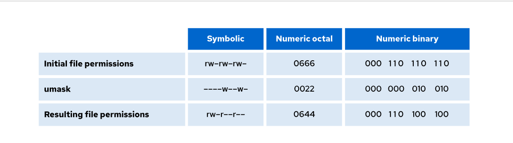

## Change Group

The `chgrp` command in Linux is used to change the group ownership of a file or directory.

```bash
chgrp [options] <group> <file>
```
```bash
chgrp root script.sh
```

#### Change group of a directory recursively
```bash
chgrp -R admin /var/www
```

##### 🧪 Check Current Group Ownership
```bash
ls -l filename
```
#### **🔒 Permissions Note**
You must be root (sudo) to change ownership to another user.
- You must be owner of the file or have sudo privileges to change the group.
- You can only change to a group you are a member of (unless you're root).

## Change Owner
he `chown` command in Linux is used to change the owner and/or group of a file or directory.

```bash
chown [options] [owner][:group] <file>
```
- owner: new user to own the file
- group: new group to own the file (optional, separated by : or .)
- file: target file or directory


##### Change only the owner

```bash
chown root script.sh
```

#### Change owner and group:
```bash
chown edwin:developers script.sh
```

#### Change only the group (you can also use chgrp for this)
```bash
chown :developer file.txt
```

##### Recursive change (including all contents of a directory):
```bash
chown -R edwin:developers /project
```

##### **🔒 Permissions Note**
- You must be root (sudo) to change ownership to another user.

## File and Directory Permissions

```bash
ls -l
```

#### breakdown


| Position | Meaning                         |
| -------- | ------------------------------- |
| 1        | File type (`-`, `d`, `l`, etc.) |
| 2-4      | Owner permissions               |
| 5-7      | Group permissions               |
| 8-10     | Others permissions              |


#### 🔍 File Types Summary

| Symbol | Type             | Description                           |
| ------ | ---------------- | ------------------------------------- |
| `-`    | Regular file     | Text, binary, scripts, etc.           |
| `d`    | Directory        | Folder containing files               |
| `l`    | Symbolic link    | Points to another file                |
| `c`    | Character device | Devices like keyboard, serial port    |
| `b`    | Block device     | Devices like hard drives              |
| `s`    | Socket           | For IPC (inter-process communication) |
| `p`    | Named pipe       | FIFO special file for communication   |

#### 👥 User Classes

| Symbol | Class  | Description               |
| ------ | ------ | ------------------------- |
| `u`    | user   | The file owner            |
| `g`    | group  | Users in the file's group |
| `o`    | others | All other users           |
| `a`    | all    | All of the above (u+g+o)  |


#### 🛠 Permission Types

| Symbol | Value | Meaning                |
| ------ | ----- | ---------------------- |
| `r`    | 4     | Read                   |
| `w`    | 2     | Write                  |
| `x`    | 1     | Execute (or enter dir) |
| `-`    | 0     | No permission          |

#### 🔢 Numeric (Octal) Mode

| Value | Permissions | Meaning      |
| ----- | ----------- | ------------ |
| 7     | `rwx`       | Full access  |
| 6     | `rw-`       | Read/write   |
| 5     | `r-x`       | Read/execute |
| 4     | `r--`       | Read only    |
| 0     | `---`       | No access    |


#### Set permissions:

```bash
chmod 755 file.sh
```

Means:

- Owner: rwx (7)
- Group: r-x (5)
- Others: r-x (5)

#### ✅ Add Permissions (`+`)

| Command               | Description                                  |
|-----------------------|----------------------------------------------|
| `chmod u+r file`      | Add read to user (owner)                     |
| `chmod g+w file`      | Add write to group                           |
| `chmod o+x file`      | Add execute to others                        |
| `chmod a+x script.sh` | Add execute for all (user, group, others)    |
| `chmod ug+x file`     | Add execute to user and group                |
| `chmod u+rw file`     | Add read and write to user                   |


#### ❌ Remove Permissions (`-`)

| Command               | Description                                  |
|-----------------------|----------------------------------------------|
| `chmod u-w file`      | Remove write from user                       |
| `chmod g-r file`      | Remove read from group                       |
| `chmod o-x file`      | Remove execute from others                   |
| `chmod a-w file`      | Remove write from all                        |
| `chmod go-r file`     | Remove read from group and others            |


#### 🟰 Set Exact Permissions (`=`)

| Command               | Description                                  |
|-----------------------|----------------------------------------------|
| `chmod u=rw file`     | Set user permissions to read and write only  |
| `chmod g=r file`      | Set group to read only                       |
| `chmod o= file`       | Remove all permissions from others           |
| `chmod a=r file`      | Read-only access for everyone                |


#### ✍️ Symbolic chmod Examples

| Command               | Description                    |
| --------------------- | ------------------------------ |
| `chmod u+x file.sh`   | Add execute to user            |
| `chmod go-w file.txt` | Remove write from group/others |
| `chmod a+r file.txt`  | Add read to all                |


##### 🧪 Check File Type
```bash
file filaname
```

## Unmask

In addition to setting special permissions, you can also manage the default permissions of new files and directories by using the umask setting. The umask setting alters the permission settings for newly created files or directories.

New files are assigned initial permissions based on two factors:

- Whether you are creating a regular file or a directory.
- The current umask (user file-creation mask).


 Initial Permissions Before umask

| **Type**  | **Initial Octal Method** | **Initial Symbolic Method** |
| --------- | ------------------------ | --------------------------- |
| File      | `0666`                   | `rw-rw-rw-`                 |
| Directory | `0777`                   | `rwxrwxrwx`                 |


**Effects of umask on Files and Directories**

The umask is a permission filter that is applied to the default permissions when a file or directory is created. Each bit set in the umask removes a corresponding permission from the final permissions of new files or directories.

`umask` Examples: Effects on Files and Directories

| **umask** | **Effect on Files** | **Effect on Directories** |
| --------- | ------------------- | ------------------------- |
| `0022`    | `rw-r--r--`         | `rwxr-xr-x`               |
| `0027`    | `rw-r-----`         | `rwxr-x---`               |
| `0002`    | `rw-rw-r--`         | `rwxrwxr-x`               |




In RHEL 9 and later versions, the default umask for all regular users is `0022`. The umask command without arguments displays the current value of the shell's umask

```bash
unmask
```


