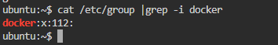
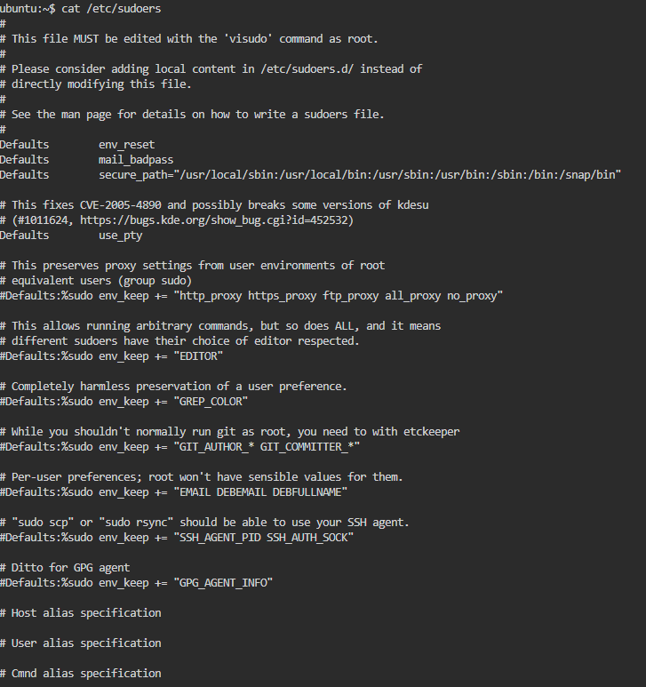
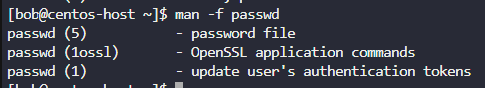
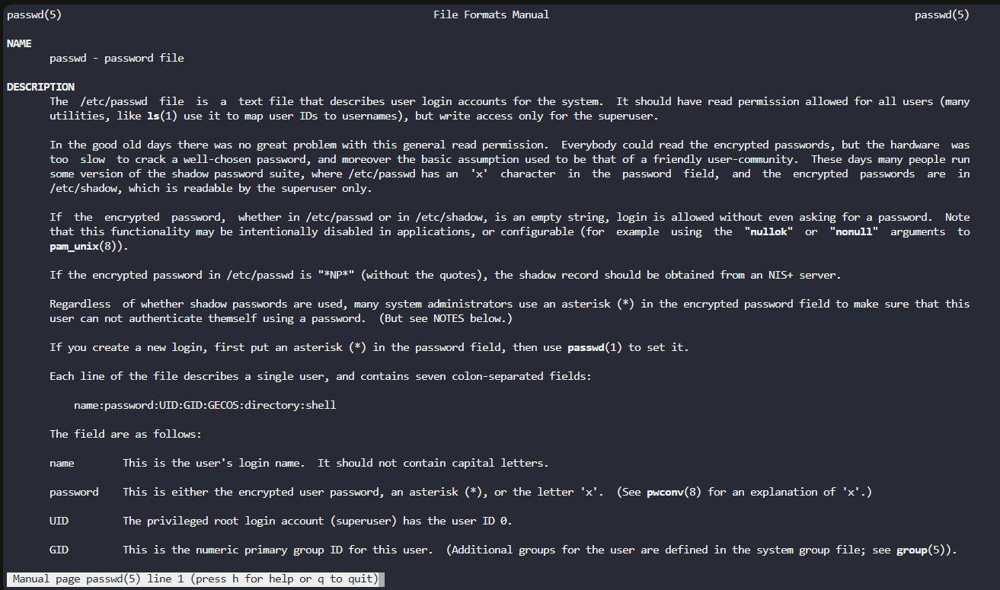

# Linux Accounts

##  <span style="color:red">User</span>

uid=UID(username) gid=GID(groupname) groups=GID(groupname)[, GID2(groupname2)]

```
cat /etc/passwd
```

```
id root
grep -i root /etc/passwd
```

#### `uid=UID(username)`
The User ID (UID) uniquely identifies a user on the system.
Example: uid=0(root) means the user is the root (administrator), while uid=5(games) is a system-level user for game-related tasks.

##### `gid=GID(groupname)`
The Group ID (GID) indicates the user's primary group.
This group determines file permissions for files created by the user.

#### `groups=GID(groupname)`
Lists all additional groups the user belongs to.
Group membership defines access to shared files and system resources.


##  <span style="color:red">Group</span> 

```
cat /etc/group
```
___
**Example:**


____

- **`group_name`**  
  The name of the group (e.g., `sudo`, `games`, `developers`).

- **`password`**  
  Optional and rarely used. Usually `x` to indicate that the password is stored in `/etc/gshadow`.

- **`GID` (Group ID)**  
  A numeric ID that uniquely identifies the group (e.g., `0` for `root`, `60` for `games`).

- **`user_list`**  
  A comma-separated list of users who are **members of the group**, aside from the user whose primary group it is.


##  <span style="color:red">Account Types</span>


#### User Account
Regular user accounts used for interactive logins and daily tasks.

**Examples:**
- Edwin
- Camilo

These users typically have limited privileges and belong to one or more groups.

#### Superuser Account

The superuser (also known as **root**) has full access to the system.

- **Username:** `root`
- **UID:** `0`

Used for administrative tasks such as managing users, installing packages, modifying system configuration, and more.


#### System Accounts

Non-login accounts used by the system or software packages.

- Typically have **UIDs < 100** (on Debian/Ubuntu) or **UIDs < 500** (on older Red Hat-based systems).
- Examples: `daemon`, `bin`, `games`, `mail`

These accounts are used to run system services and processes in an isolated and secure way.


#### Service Accounts


Special-purpose accounts created to run background services or daemons.

- Often created during software installation (e.g., `nginx`, `mysql`, `postgres`)
- Usually **have no login shell** (`/usr/sbin/nologin`) to prevent direct access.
- Provide **separation of privileges** for individual services.

---
**Commands**

```
id
```
`id` Displays the current user's UID, GID, and group memberships.


```
who 
```
`who` Shows who is currently logged into the system.


``` 
last
```

`last` Displays the login history of users (from /var/log/wtmp).


##  <span style="color:red">Switching User </span> 
You can switch users or run commands as another user using the following commands:

```bash
su -
sudo su -
su -c "whoami"

```
To check or configure which users can run commands as root, you can view the sudoers file:

```bash
cat /etc/sudoers
```

⚠️ Important: Edit /etc/sudoers safely using visudo to prevent syntax errors that could lock you out of administrative access



##### 🔐 `sudo` – Granting Privileges with `/etc/sudoers`

The `/etc/sudoers` file controls **who can run commands as another user (typically root)**.  
Each rule defines what actions a user or group can perform with `sudo`.

#### 📘 Field Breakdown

| Field            | Description                                       | Example                         |
|------------------|---------------------------------------------------|---------------------------------|
| **1. User/Group**| The user or group being granted permission        | `bob`, `%sudo`                  |
| **2. Hosts**     | On which host(s) the rule applies                 | `localhost`, `ALL` (default)    |
| **3. RunAs User**| The user(s) the command can be run as             | `ALL` (default: any user)       |
| **4. Command**   | Which command(s) can be executed                  | `/bin/ls`, `ALL` (unrestricted) |

---

#### 📂 Example Entries
The user `root` can run any command, on any host, as any user and group.
```bash
root    ALL=(ALL:ALL) ALL
```
Any user in the `sudo` group can execute any command as any user.
```bash
%sudo   ALL=(ALL:ALL) ALL
```

The user `bob` has full sudo privileges.
```bash
bob     ALL=(ALL:ALL) ALL
```

The user `sarah` can only reboot the system using the specified command, and only on `localhost`.
```bash
sarah   localhost=/usr/bin/shutdown -r now
```


##  <span style="color:red">Use System Documentation</span>  
Linux provides built-in tools to access help and manual pages for nearly all commands.

#### 🔹 `--help` Option

```bash
ls --help
journalctl --help
```


### 🔹 `man` 

The `man` command provides detailed documentation for commands, system calls, configuration files, and more.

```bash
man ls
man journalctl
```

`mandb`

```bash
 sudo mandb
```

* Purpose: Updates the manual page index database.
* Useful after installing new software or adding custom man pages.
* Requires sudo because it writes to system-wide directories (like /var/cache/man).

`apropos`

**🧾 What is apropos?**

The apropos command searches the man pages for keywords related to what you're looking for. It gives you a list of man page entries (from all sections) that match your search term.

Think of it like a "man page search engine."

```bash
 apropos director
```
* Purpose: Searches the manual page descriptions for the keyword "director".
* Displays a list of all commands and topics that mention "director" in their short man descriptions.
* 🧠 Think of apropos as a man page search engine.

## 📂 Exploring Documentation: `cd /usr/share/doc`

```bash
cd /usr/share/doc
ls
```

* This command navigates to the system documentation directory.
* Located at /usr/share/doc, it contains text files, changelogs, and READMEs for installed packages.

Inside each folder, you may find:

* README – Introduction or usage notes

* changelog.gz – Changes made in each version

* copyright – Licensing information

* examples/ – Sample configuration files

## What are "man pages"?

Man pages (manual pages) are the official documentation for most commands, programs, system calls, and configuration files on Unix/Linux systems. You view them using the man command.

#### **Manual Sections Overview**

Man pages are organized into numbered sections, each covering a different type of content.


| Section | Description                                               |
| ------- | --------------------------------------------------------- |
| 1       | User commands (executables used in the shell)             |
| 2       | System calls (kernel functions)                           |
| 3       | Library functions (C standard library, etc.)              |
| 4       | Special files (usually device files in `/dev`)            |
| 5       | File formats and configuration files                      |
| 6       | Games and screensavers                                    |
| 7       | Miscellaneous (conventions, standards, macro packages)    |
| 8       | System administration commands (requires root access) |

 Find all available sections for a command

 ```bash
 man -f command
 ```

 ```bash
 man -f passwd
 ```


```bash
man 5 passwd
```


