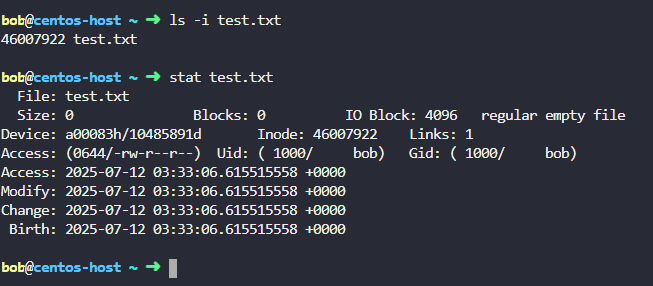
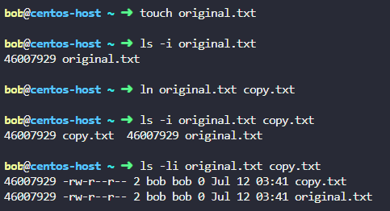

## Inodes

**📦 What Is an Inode?**
- An inode (index node) is a data structure used by Unix/Linux file systems to store metadata about a file or directory, but not the file name or content

- Each file or directory on the system has a unique inode number.

**📋 What Information Does an Inode Store?**

| Metadata                | Description                                      |
| ----------------------- | ------------------------------------------------ |
| File type               | Regular file, directory, symbolic link, etc.     |
| Permissions (mode)      | Read/write/execute flags for user, group, others |
| Owner (UID)             | User ID who owns the file                        |
| Group (GID)             | Group ID associated with the file                |
| File size               | In bytes                                         |
| Timestamps              | Last access, modification, and inode change      |
| Link count              | Number of hard links to the file                 |
| Pointers to data blocks | Physical location of file data on disk           |


🔍 View Inodes with `ls` and `stat`

See inode number of files:
```bash
ls -i
```

Detailed file info including inode:
```bash
stat file.txt
```



## Hard Links

#### **🔗 What Is a Hard Link?**
A hard link is another name (alias) for an existing file. It points directly to the same inode, meaning both the original file and the hard link share the same data on disk.

#### **📦 Key Properties of Hard Links**

| Feature                        | Description                                                               |
| ------------------------------ | ------------------------------------------------------------------------- |
| Shared inode                   | Both the original file and hard link point to the **same inode**.         |
| Shared data                    | They reference the **same content** on disk.                              |
| Independent filenames          | You can delete one; the other still works (unless all links are removed). |
| Only works on same filesystem  | You **cannot hard link across partitions or mounts**.                     |
| Not for directories (normally) | Most systems **disallow hard links to directories** to avoid loops.       |

#### **🔧 Create a Hard Link**

```bash
ln original.txt copy.txt
```

- Both share the same inode.

- Modifying one modifies both.

- Deleting one does not remove the file content — the inode remains as long as at least one hard link exists.

Verify with `ls -i`
```bash
ls -i original.txt copy.txt
```
You’ll see the same inode number for both:



## ❌ Deleting a Hard Link
```bash
rm original.txt
```
- This removes the filename, but the actual file still exists because `copy.txt` still points to the inode.

- Only when all hard links are deleted does the data get removed.


### ⚠️ Hard Link: Limitations and Considerations

#### ❌ 1. Cannot Link Across Filesystems

**Limitation:** Hard links must reside on the same filesystem (partition or disk).

**Why?** A hard link points directly to an **inode number**, and inodes are unique only within a filesystem.

✅ **Alternative:** Use a **symbolic link** (`ln -s`) if cross-filesystem linking is needed.

---

##### 🚫 2. Cannot Link Directories (Usually)

**Limitation:** Most systems prevent hard links to directories.

**Why?** To avoid creating **cyclical directory structures** that can:

- Confuse tools like `find`, `du`, or `rsync`
- Cause infinite loops
- Corrupt the filesystem

🔒 **Note:** Only the root user can force this under specific conditions (e.g., via low-level tools), but it's **strongly discouraged**.

---

##### 🧹 3. Difficult File Management

**Consideration:** When multiple hard links point to the same file, it becomes harder to:

- Track file ownership
- Know which name was the "original"
- Avoid accidental deletion or modification

📝 **Example:**  
If you create:

```bash
ln fileA fileB
```

## Soft Links

### **🧷 What is a Soft Link (Symbolic Link)?**
A soft link is a pointer to another file or directory — similar to a shortcut in Windows.

It does not share the inode of the original file, but instead stores the path to it.

### **🔗 Key Characteristics**
| Feature                 | Description                                                      |
| ----------------------- | ---------------------------------------------------------------- |
| Points to path          | Stores a reference to the **filename/path**, not the data itself |
| Different inode         | Has a **different inode** than the target                        |
| Cross-filesystem        | ✅ Can link across filesystems or partitions                      |
| Broken links possible   | ❌ Breaks if the target is moved or deleted                       |
| Can link to directories | ✅ Can point to directories (unlike hard links)                   |


#### 🔧 Create a Soft Link

```bash
ln -s target linkname
```

Creates a symbolic link index-link.html in your home directory, pointing to the original file in /var/www/html.

```bash
ln -s /var/www/html/index.html ~/index-link.html
```


🔍 Check a Symlink
```bash
ls -l index-link.html
```

example 

```bash
cat <<EOF > index.html
<!DOCTYPE html>
<html>
  <head>
    <title>¡Este es el título de la página web!</title>
  </head>
  <body>
    Este es un párrafo de ejemplo. Todo lo que esté en la etiqueta <strong>body</strong> aparecerá en la página, al igual que esta etiqueta <strong>p</strong> y su contenido.
  </body>
</html>
EOF
```

```bash
ls -s index.html /tmp/
```


A symbolic link can point to a directory. The symbolic link then acts like the directory. If you use the cd command to change to the symbolic link, then the current working directory becomes the linked directory. Some tools might track that you followed a symbolic link. For example, by default, the cd command updates your current working directory by using the name of the symbolic link rather than the name of the actual directory. If you want to update the current working directory by using the name of the actual directory, then you can use the -P option.

```bash
user@host:~$ ln -s /etc /home/user/configfiles
user@host:~$ cd /home/user/configfiles
user@host:~/configfiles$ pwd
/home/user/configfiles
user@host:~/configfiles$ cd -P /home/user/configfiles
user@host:/etc$ pwd
/etc
```

### **🆚 Hard Link vs Soft Link**

| Feature                    | Hard Link    | Soft (Symbolic) Link |
| -------------------------- | ------------ | -------------------- |
| Shares inode               | ✅ Yes        | ❌ No                 |
| Breaks if original removed | ❌ No         | ✅ Yes                |
| Cross-filesystem           | ❌ No         | ✅ Yes                |
| Points to                  | Data/inode   | File path            |
| Can link directories       | ❌ Usually no | ✅ Yes                |
| Created with               | `ln`         | `ln -s`              |
