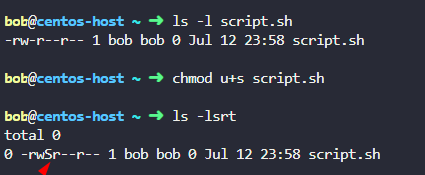
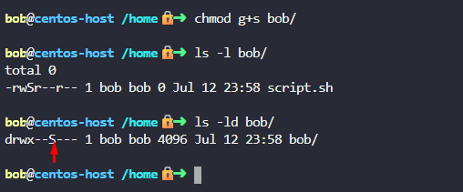
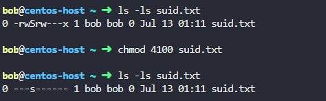

## 🧑‍💻 SUID (Set User ID)
- Applies to executable files.
- When a user runs the file, it executes with the permissions of the file owner, not the user who ran it.


```bash
chmod u+s /usr/bin/passwd
```
- `passwd` is owned by `root` but needs to modify `/etc/shadow`.
- Normal users can run it because of SUID.

Example:



## 👥 SGID (Set Group ID)

On Files:
- Similar to SUID, but runs with the group ID of the file.

On Directories:
- New files created in the directory inherit the group of the directory, not the user’s primary group.

```bash
chmod g+s /shared
```
example:



## 📌 Sticky Bit
- Applies to directories only.
- Users can only delete their own files, even if the directory is world-writable.

```bash
chmod +t /tmp
```

The t at the end shows the Sticky Bit is set.

## Numeric Values for Special Bits

| Permission | Symbol | Octal Value |
| ---------- | ------ | ----------- |
| SUID       | `s`    | `4`         |
| SGID       | `s`    | `2`         |
| Sticky Bit | `t`    | `1`         |

When used with chmod, you place these as a fourth digit:

```bash
chmod 4755 file   # SUID + rwxr-xr-x
chmod 2755 dir    # SGID + rwxr-sr-x
chmod 1777 /tmp   # Sticky + full access
```
 
## 🔍 Difference between s and S

| Symbol | Meaning                            | Execute (`x`) Present? | Special Bit Set? | Example     |
| ------ | ---------------------------------- | ---------------------- | ---------------- | ----------- |
| `s`    | Special bit **+** executable       | ✅ Yes                  | ✅ Yes            | `rwsr-xr-x` |
| `S`    | Special bit **without** executable | ❌ No                   | ✅ Yes            | `rwSr--r--` |

#### 🧪 Examples

🔸 SUID (u+s on a file):
- rws → Owner has execute, and SUID is active (normal case).
- rwS → SUID is set, but no execute permission for the owner, so it shows as S (likely a misconfiguration).

🔸 SGID (g+s on a file or directory):
- rwxr-sr-x → Group has execute, and SGID is active.
- rwxr-Sr-x → SGID is set, but group can't execute (uppercase S).

**⚠️ Why is uppercase S a warning?**

- The special bit (SUID or SGID) will not work unless the file is also executable.
- An uppercase S usually means something is misconfigured or unnecessary.

