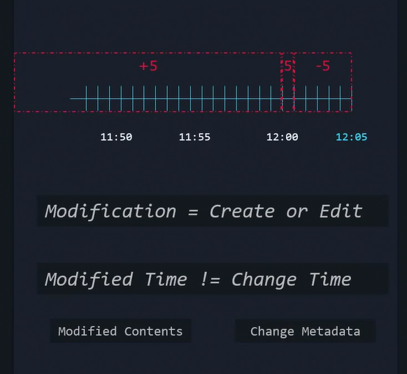

# Search Files

## Searching for Files 

A system administrator must be able to search file systems for files that match specific criteria. This section discusses two commands to search for files in the file-system hierarchy:

- The `locate` command searches a pre-generated index for file names or file paths, and returns the results instantly.
- The `find` command searches for files in real time by parsing the file-system hierarchy.

## Locating Files by Name

The `locate` command searches for files based on the name or path to the file. The `locate` command is fast, because it looks up the information from the mlocate database. However, this database does not update in real time and requires frequent updates for accurate results. This feature also means that the locate command does not search for files that were created after the last database update.

The `locate` database updates automatically every day. However, the root user might use the updatedb command to force an immediate update.

```bash
updatedb
```

The `locate` command restricts results for unprivileged users. To see the resulting file name, the user must have search permission on the directory where the file resides. For example, locate the files that the `developer` user can read, and that match the `passwd` keyword in the name or path:

```bash
locate passwd
```

The following example shows the file name or path for a partial match with the search query:

```bash
locate image
```

The `locate` command `-i` option performs a case-insensitive search. This option returns all possible combinations of matching uppercase and lowercase letters:

```bash
locate -i messages
```

The `locate` command `-n` option limits the number of returned search results. The following example limits the search results from the `locate` command to the first five matches:

```bash
locate -n 5 passwd
```

## Searching for Files in Real Time

The `find` command locates files by searching in real time in the file-system hierarchy. This command is slower but more accurate than the locate command. The find command also searches for files based on criteria other than the file name, such as the file's permissions, type of file, size, or modification time.

The `find` command looks at files in the file system with the user account that executed the search. The user that runs the find command must have read and execute permission on a directory to examine its contents.

The first argument to the `find` command is the directory to search. If the find command omits the directory argument, then it starts the search in the current directory and looks for matches in any subdirectory.

To search for files by file name, use the `find` command `-name FILENAME` option to return the path of files that match FILENAME exactly. For example, to search for the sshd_config files in the root (`/`) directory, run the following command


### `search`

```bash
find [path] [options] [expression]
```

```bash
find /home -name "file.txt"
```

### Search Parameters - Modified Time

```bash
find -mmin [minute]

find -mmin 5
find -mmin -5
find -mmin +5

find -mtime 2  # 24-hour periods

find -cmin -5  #Change metadata

```




### Search Parameters - File Size

```bash
find -size [size]

find -size 512k     #Equal to 512kb
find -size +512k    #Greater than 512kb
find -size -512k    #Less than 512kb


```


### 📁 Common find Examples


| 🧪 Task                          | Command                                 |
| -------------------------------- | --------------------------------------- |
| Find by name                     | `find . -name "file.txt"`               |
| Case-insensitive name            | `find . -iname "File.TXT"`              |
| Find by type (f = file, d = dir) | `find . -type f` or `find . -type d`    |
| Find by extension                | `find . -name "*.sh"`                   |
| Find empty files                 | `find . -type f -empty`                 |
| Find empty directories           | `find . -type d -empty`                 |
| Find by size                     | `find . -size +10M` (larger than 10 MB) |
| Find modified in last N days     | `find . -mtime -7` (last 7 days)        |
| Find accessed in last N minutes  | `find . -amin -10`                      |
| Find by permission               | `find . -perm 644`                      |
| Find files owned by user         | `find . -user edwin`                    |
| Find not files                   | `find -not -name "-f"` or `find \! -name "f*"`|
| Find permisions                  | `find /var/log/ -perm -g=w \! -perm /o=rx` |

### 🧪 Search in multiple directories

```bash
find /var /tmp -name "*.log"
```

### ⚙️ Advanced Usage

Delete found files (⚠️ Use with caution!)

```bash
find . -name "*.tmp" -delete
```

Execute a command on each file
```bash
find . -name "*.log" -exec rm -f {} \;
```
- `{}` is replaced with each found file
- `\`; ends the -exec clause

Combine criteria with and / or
```bash
find . -type f \( -name "*.log" -o -name "*.bak" \)
```

### 📎 Tips
- . means current directory
- Use sudo if you get permission denied errors
- Use quotes to prevent wildcard expansion by the shell

## `grep`

The grep command is used in Unix/Linux to search for text patterns in files. Here’s a quick guide on how to use it:

```bash
grep [options] PATTERN [FILE...]
```

Search for a word in a file
```bash
grep "hello" file.txt
```

Case-insensitive search
```bash
grep -i "hello" file.txt
```

Search recursively in all files in a directory
```bash
grep -r /path/to/dir
```

Show line numbers
```bash
grep -n "hello" file.txt
```

Search for exact word
```bash
grep -w "hello" file.txt
```

Search for lines that do not match
```bash
grep -v "hello" file.txt
```

**Use regular expressions**

Finds lines starting with "hello".
```bash
grep "^hello" file.txt
```

Finds lines ending with "world".
```bash
grep "world$" file.txt
```


**Output Control**

| Option         | Description                                      |
| -------------- | ------------------------------------------------ |
| `-n`           | Show line numbers in output                      |
| `-H`           | Show file names in output                        |
| `-h`           | Do **not** show file names                       |
| `-c`           | Show only the count of matching lines            |
| `-l`           | Show only file names with matches                |
| `-L`           | Show only file names **without** matches         |
| `-o`           | Print only the matched parts of a line           |
| `--color=auto` | Highlight matched text (default in many distros) |


**Recursive & Directory Searching**

| Option                | Description                            |
| --------------------- | -------------------------------------- |
| `-r` or `--recursive` | Recursively search through directories |
| `-R`                  | Like `-r`, but follows symbolic links  |
| `--exclude=PATTERN`   | Skip files matching pattern            |
| `--include=PATTERN`   | Only search files matching pattern     |
| `--exclude-dir=DIR`   | Skip directories matching name         |


**Regular Expression Options**

| Option | Description                                      |
| ------ | ------------------------------------------------ |
| `-E`   | Use **extended regex** (same as `egrep`)         |
| `-F`   | Use fixed strings (disables regex, like `fgrep`) |
| `-P`   | Use **Perl-compatible regex** (if supported)     |


**Context Options (Show lines before/after a match)**

| Option   | Description                                    |
| -------- | ---------------------------------------------- |
| `-A NUM` | Show NUM lines **after** each match            |
| `-B NUM` | Show NUM lines **before** each match           |
| `-C NUM` | Show NUM lines **before and after** each match |

🧪 Example combining options:
```bash
grep -inrw --color=auto "error" /var/log/
```
```bash
grep -e "error" -e "failed" app.log
```

`-f` — Leer patrones desde un archivo

Busca todos los patrones listados en patrones.txt dentro de app.log.
```bash
cat patrones.txt
# error
# failed
# timeout

grep -f patrones.txt app.log
```

### 🔹 What Is a Regular Expression?

A regular expression is a pattern used to match text. grep uses regex to search for complex string patterns in files or output.

Common Regex Symbols

| Symbol | Meaning                                                 | Example              | What It Matches                          |                       |                        |
| ------ | ------------------------------------------------------- | -------------------- | ---------------------------------------- | --------------------- | ---------------------- |
| `.`    | Any single character (except newline)                   | `b.t`                | Matches "bat", "bit", "but", etc.        |                       |                        |
| `^`    | Start of a line                                         | `^Error`             | Matches lines **starting** with "Error"  |                       |                        |
| `$`    | End of a line                                           | `.log$`              | Matches lines **ending** in ".log"       |                       |                        |
| `*`    | Zero or more of the previous character                  | `lo*`                | Matches "l", "lo", "loo", "looo", etc.   |                       |                        |
| `+`    | One or more of the previous character (**`-E` needed**) | `lo+`                | Matches "lo", "loo", "looo", but not "l" |                       |                        |
| `?`    | Zero or one of the previous character (**`-E` needed**) | `colou?r`            | Matches "color" or "colour"              |                       |                        |
| `[]`   | Match any one character in the set                      | `[aeiou]`            | Matches any vowel                        |                       |                        |
| `[^]`  | Match any one character **not** in the set              | `[^0-9]`             | Matches any non-digit character          |                       |                        |
| \`     | \`                                                      | OR (**`-E` needed**) | \`cat                                    | dog\`                 | Matches "cat" or "dog" |
| `()`   | Group expressions (**`-E` needed**)                     | \`(yes               | no)\`                                    | Matches "yes" or "no" |                        |
