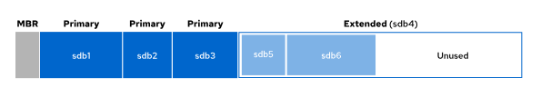

# Creating and Managing File Systems on Standard Partitions
---

## Disk Partitioning

Disk partitioning divides a hard drive into multiple logical storage partitions. You can use partitions to divide storage based on different requirements, and this division provides many benefits:

- Limit available space to applications or users.
- Separate operating system and program files from user files.
- Create a separate area for memory swapping.
- Limit disk space use to improve the performance of diagnostic tools and backup imaging.

On x86 systems, the two primary partitioning schemes are Master Boot Record (MBR) and GUID Partition Table (GPT).

### Master Boot Record (MBR) Partition Scheme

The Master Boot Record (MBR) partitioning scheme is the standard on systems that run Basic Input/Output System (BIOS) firmware. This scheme supports a maximum of four primary partitions. On Linux systems, with extended and logical partitions, you can create up to 15 partitions. With a 32-bit partition size, disks that are partitioned with MBR can have a size of up to 2 TiB.



MBR partitioning of the `/dev/sdb` storage device

The 2 TiB disk and partition size limit is now a common and restrictive limitation. Consequently, the legacy MBR scheme is superseded by the GUID Partition Table (GPT) partitioning scheme.

### GUID Partition Table (GPT) Partition Scheme

For systems that run Unified Extensible Firmware Interface (UEFI) firmware, the GUID Partition Scheme (GPT) is the standard for disk partitioning, and addresses the limitations of the MBR scheme. The GPT scheme provides a maximum of 128 partitions. The GPT scheme allocates 64 bits for logical block addresses to support partitions and disks of up to eight zebibytes (ZiB) or eight billion tebibytes (TiB).

## Managing Partitions

An administrator can use a partition editor program to change a disk's partitions, such as by creating and deleting partitions, and changing partition types.

Red Hat Enterprise Linux provides the `parted` command as the standard command-line partition editor. You can use the parted partition editor with storage that uses either the MBR partitioning scheme or the GPT partitioning scheme.

The `parted` command takes as its first argument the device name that represents the entire storage device or disk to modify, followed by subcommands.

The following example uses the print subcommand to display the partition table on the disk that is the `/dev/sda` block device (the first QEMU disk that the system detects):

```bash
parted /dev/sda print
```

To start an interactive session, execute the `parted` command as 
the `root` user and specify the disk device name as an argument:

```bash
parted /dev/sda
```

Use the `print` subcommand to display the partition table:

```bash
print
```

To exit the interactive partitioning session, use the quit command:

```bash
quit
```


By default, the parted command displays sizes in powers of 10 (KB, MB, GB). You can change the unit size with the unit parameter, which accepts the following values:

- s for sector
- B for byte
- MiB, GiB, or TiB (powers of 2)
- MB, GB, or TB (powers of 10)

The following example shows the partition table for the /dev/sda device in sectors:

```bash
parted /dev/sda unit s print
```
You can specify multiple subcommands on the same line, such as the unit and print subcommands in the previous example.

## Write the Partition Table on a New Disk

To partition a new drive, first write a disk label. The disk label indicates which partitioning scheme to use.

Use the `parted` command to write an MBR disk label:

```bash
parted /dev/sdb mklabel msdos
```

Use the `parted` command to write a GPT disk label:

```bash
parted /dev/sdb mklabel gpt
```

<div style="border: 1px solid #aaa; border-radius: 6px; padding: 12px; background: #020202ff;">
<b>Warning:</b><br><br>
The mklabel subcommand wipes the existing partition table. Use the mklabel subcommand to reuse the disk without regard to the existing data. If a new label moves the partition boundaries, then all data in existing file systems becomes inaccessible.<br><br>
</div>

## Create MBR Partitions

The following instructions create an MBR disk partition. Specify the disk device to create the partition on.

To start an interactive session, run the parted command as the root user and specify the disk device name as an argument:

```bash
parted /dev/sdb
```

Use the `mkpart` subcommand to create a partition. The help mkpart subcommand displays the syntax and available options for each argument:

```bash
help mkpart
```
```bash
 mkpart PART-TYPE [FS-TYPE] START END     make a partition

        PART-TYPE is one of: primary, logical, extended
        FS-TYPE is one of: udf, btrfs, nilfs2, ext4, ext3, ext2, f2fs, fat32, fat16,
        hfsx, hfs+, hfs, jfs, swsusp, linux-swap(v1), linux-swap(v0), ntfs, reiserfs,
        hp-ufs, sun-ufs, xfs, apfs2, apfs1, asfs, amufs5, amufs4, amufs3, amufs2,
        amufs1, amufs0, amufs, affs7, affs6, affs5, affs4, affs3, affs2, affs1, affs0,
        linux-swap, linux-swap(new), linux-swap(old)
        START and END are disk locations, such as 4GB or 10%.  Negative values count
        from the end of the disk.  For example, -1s specifies exactly the last sector.

        'mkpart' makes a partition without creating a new file system on the partition.
        FS-TYPE may be specified to set an appropriate partition ID.
```

Create a primary or extended partition.

```bash
(parted) mkpart
Partition type?  primary/extended? primary
```

<div style="border: 1px solid #aaa; border-radius: 6px; padding: 12px; background: #020202ff;">
<b>Note:</b><br><br>
If you require more than four partitions on an MBR-partitioned disk, then create three primary partitions and one extended partition. The extended partition serves as a container within which you can create multiple logical partitions.<br><br>
</div>

Next, you are prompted to enter the label for the file-system type. To list the supported file-system types, press Tab twice:

```bash
File system type?  [ext2]? Tab Tab
affs0  affs4  amufs  amufs3  apfs2  ext3  fat32  hp-ufs  linux-swap(old)  ntfs  udf
affs1  affs5  amufs0  amufs4  asfs  ext4  hfs  jfs  linux-swap(v0)  reiserfs  xfs
affs2  affs6  amufs1  amufs5  btrfs  f2fs  hfs+  linux-swap  linux-swap(v1)  sun-ufs
affs3  affs7  amufs2  apfs1   ext2   fat16  hfsx  linux-swap(new)  nilfs2  swsusp
```

Enter the file-system type to use on the partition, such as xfs or ext4. This value is only used as a partition type label, and does not create the file system.

```bash
File system type?  [ext2]? xfs
```

Specify the disk sector where the partition starts.

```bash
Start? 2048s
```

The `s` suffix provides the value in sectors, or you can use the MiB, GiB, TiB, MB, GB, or TB suffixes. The parted command defaults to the MB suffix. The parted command rounds provided values to satisfy disk constraints.

When the parted command starts, it retrieves the disk topology from the device, such as the disk's physical block size. The parted command ensures that the start position that you provide correctly aligns the partition with the disk structure, to optimize performance. If the start position results in a misaligned partition, then the parted command displays a warning. With most disks, a start sector that is a multiple of 2048 is safe.

Specify the disk sector where the partition ends. You can specify the end as a size or as an ending location. When you provide the end position, the `parted` command updates the partition table on the disk with the new partition details.

```bash
End? 1000MB
```

Exit the `parted` command:

```bash
(parted) quit
Information: You may need to update /etc/fstab.

root@host:~#
```

After creating the partition, run the `udevadm` command for the system to detect the new partition and to create the associated device file in the `/dev` directory.

```bash
udevadm settle
```

As an alternative to using interactive mode, you can create a partition in a single, noninteractive command:

```bash
parted /dev/sdb mkpart primary xfs 2048s 1000MB
```

## Create GPT Partitions

The GPT scheme also uses the parted command to create partitions. Specify the disk device to create the partition on.

To start an interactive session, execute the `parted` command as the root user and specify the disk device name as an argument:

```bash
parted /dev/sdb
```

Use the `mkpart` subcommand to begin creating the partition. With the GPT scheme, each partition is given a name.

```bash
(parted) mkpart
Partition name?  []? userdata
```

Enter the file-system type to use on the partition, such as xfs or ext4. This value is only used as a partition type label, and does not create the file system.

```bash
File system type?  [ext2]? xfs
```

Specify the disk sector where the partition starts:

```bash
Start? 2048s
```

Specify the disk sector where the partition ends. When you provide the end position, the `parted` command updates the GPT partition on the disk with the new partition details.

```bash
End? 1000MB
```

Exit the parted command.

```bash
(parted) quit
Information: You may need to update /etc/fstab.
```

Run the `udevadm` settle command. This command waits for the system to detect the new partition and to create the associated device file in the `/dev` directory.

```bash
udevadm settle
```

As an alternative to using interactive mode, you can create a partition in a single command:

```bash
parted /dev/sdb mkpart userdata xfs 2048s 1000MB
```

## Deleting Partitions

The following instructions apply for both the MBR and GPT partitioning schemes. Specify the disk that contains the partition to remove.

Run the `parted` command with the disk device as the only argument:

```bash
parted /dev/sdb
```

Identify the partition number of the partition to delete:

```bash
(parted) print
```

Delete the partition. The rm subcommand immediately deletes the partition from the partition table on the disk.

```bash
rm 1
```

Exit the parted command:

```bash
quit
```

As an alternative to using interactive mode, you can delete a partition in a single command:

```bash
parted /dev/sdb rm 1
```

## Creating File Systems

After the partitioning tool creates the partition as a new block device, the next step is to add a file system to it. Red Hat Enterprise Linux supports multiple file-system types, and XFS is the recommended default.

As the `root` user, use the `mkfs.xfs` command to format the partition with the XFS file system:


```bash
mkfs.xfs /dev/sdb1
```

To add an ext4 file system, use the `mkfs.ext4` command.

## Mounting File Systems

After you add the file system, the last step is to mount the file system to a directory in the directory structure. When you mount a file system to the directory hierarchy, user-space utilities can access or write files on the device.

## Manually Mount File Systems

Use the `mount` command to manually attach a device to a mount point directory location.

The `mount` command requires a device and a mount point, and can include file-system mount options. File-system options customize the behavior of the file system.

```bash
mount /dev/sdb1 /mnt
```

You also use the `mount` command to view currently mounted file systems, the mount points, and their options. To display the output of the mount command, do not provide a trailing slash with the partition.


```bash
mount | grep sdb1
```

## Persistently Mount File Systems

Manually mounting a file system is a good way to verify that a formatted device is accessible and is working as expected. However, when the server reboots, the system does not automatically mount the file system again.

To configure the system to automatically mount the file system during system boot, add an entry to the `/etc/fstab` file. This configuration file lists the file systems to mount at system boot.

The `/etc/fstab` file is a whitespace-delimited file with six fields per line.

```bash
cat /etc/fstab

UUID=a8063676-44dd-409a-b584-68be2c9f5570   /        xfs   defaults   0 0
UUID=7a20315d-ed8b-4e75-a5b6-24ff9e1f9838   /dbdata  xfs   defaults   0 0
```

The first field specifies the device. This example uses a UUID to specify the device. File systems create and store the UUID in the partition super block at creation time. Alternatively, you could use the device file, such as `/dev/sdb1`.

The second field is the mount point, which is the specified directory where the block device is accessible. The mount point must exist; if not, then create it with the `mkdir` command.

The third field displays the file-system type, such as `xfs` or `ext4`.

The fourth field is the comma-separated list of options to apply to the device. The `defaults` option is a set of commonly used options. The `mount(8)` man page documents the other available options.

The fifth field is used by the `dump` command to back up the device. Other backup applications do not usually use this field.

The last field, the `fsck` order field, determines whether to run the `fsck` command at system boot to verify that the file systems are clean. The value in this field indicates the order in which the `fsck` command must run. For XFS file systems, set this field to 0, because XFS does not use the fsck command to verify its file-system status. For ext4 file systems, set it to 1 for the root file system, and to 2 for the other ext4 file systems. By using this notation, the fsck command processes the root file system first, and then verifies file systems on separate disks concurrently, and file systems on the same disk in sequence.

<div style="border: 1px solid #aaa; border-radius: 6px; padding: 12px; background: #020202ff;">
<b>Note:</b><br><br>
An incorrect entry in the /etc/fstab file might render the machine nonbootable. Verify that an entry is valid by manually unmounting the new file system and then by using the mount command to read the /etc/fstab file, and remount the file system with that entry's mount options. If the mount command returns an error, then correct it before rebooting the machine.<br><br>

Alternatively, use the findmnt command --verify option to parse the /etc/fstab file for partition usability.<br><br>
</div>

When you add or remove an entry in the `/etc/fstab` file, run the `systemctl daemon-reload` command, or reboot the server, to ensure that the systemd daemon loads and uses the new configuration.

```bash
systemctl daemon-reload
```

Red Hat recommends the use of UUIDs to persistently mount file systems. Block device names can change in certain scenarios, such as if a cloud provider changes the underlying storage layer of a virtual machine, or if disks are detected in a different order on a system boot. The block device file name might change, but the UUID remains constant in the file system's super block.

Use the `lsblk` command `--fs` option to scan the block devices that are connected to a machine and to retrieve the file-system UUIDs.

```bash
lsblk --fs
```

---
# Managing Swap Space
---

## Swap Space Concepts

A swap space is an area of a disk under the control of the Linux kernel memory management subsystem. The kernel uses swap space to supplement the system RAM by holding inactive pages in memory. A system's virtual memory encompasses the combined system RAM and swap space.

When the memory usage on a system exceeds a defined limit, the kernel searches through RAM to look for idle memory pages that are assigned to processes. The kernel writes the idle pages to the swap area and reassigns the RAM pages to other processes. If a program requires access to a page on disk, then the kernel locates another idle page of memory, writes it to disk, and recalls the required page from the swap area.

Because swap areas are on disk, swap is slow when compared with RAM. Although swap space augments system RAM, do not consider swap space as a sustainable solution for insufficient RAM for your workload.

## Swap Space Calculation

Administrators should size the swap space based on the memory workload on the system. Application vendors sometimes provide recommendations for calculating swap space. The following table provides guidance based on the total physical memory.

Table 10.1. RAM and Swap Space Recommendations

| RAM                  | Swap space     | Swap space if allowing for hibernation |
|----------------------|----------------|----------------------------------------|
| 2 GB or less         | Twice the RAM  | Three times the RAM                    |
| Between 2 GB and 8 GB| Same as RAM    | Twice the RAM                          |
| Between 8 GB and 64 GB| At least 4 GB | 1.5 times the RAM                      |
| More than 64 GB      | At least 4 GB  | Hibernation is not recommended         |


The laptop and desktop hibernation function uses the swap space to save the RAM contents before powering off the system. When you turn the system back on, the kernel restores the RAM contents from the swap space and does not require a complete boot. For those systems, the swap space must be greater than the amount of RAM.

## Creating Swap Space

To create a swap space, perform the following steps:

- Create a partition with a file-system type of linux-swap. 
- Place a swap signature on the device.

### Create a Swap Partition

Use the `parted` command to create a partition of the appropriate size and set its file-system type to linux-swap. In the past, tools determined from the partition's file-system type whether to activate the device; however, that requirement is no longer the case. Even though utilities no longer use the partition's file-system type, administrators can determine the partition's purpose from that type.

The following example creates a 256 MB partition.

Use the `parted` command to open an interactive partitioning session:

```bash
parted /dev/sdb
```

Use the `print` subcommand to display the partition table:

```bash
(parted) print
Model: QEMU QEMU HARDDISK (scsi)
Disk /dev/sdb: 5369MB
Sector size (logical/physical): 512B/512B
Partition Table: gpt
Disk Flags:

Number  Start   End     Size    File system  Name  Flags
 1      1049kB  1001MB  1000MB               data
```

Use the `mkpart` subcommand to create a partition with the swap1 name:

```bash
(parted) mkpart
Partition name?  []? swap1
```

Set the `linux-swap` partition type:

```bash
File system type?  [ext2]? linux-swap
```

Specify the start location for the partition:

```bash
Start? 1001MB
```

Specify the end location for the partition:

```bash
End? 1257MB
```

Use the `print` subcommand to verify the newly created partition:

```bash
(parted) print
Model: QEMU QEMU HARDDISK (scsi)
Disk /dev/sdb: 5369MB
Sector size (logical/physical): 512B/512B
Partition Table: gpt
Disk Flags:

Number  Start   End     Size    File system     Name   Flags
 1      1049kB  1001MB  1000MB                  data
 2      1001MB  1257MB  256MB   linux-swap(v1)  swap1
```

Exit the `parted` command:

```bash
(parted) quit
```

As an alternative to using interactive mode, you can create a partition in a single, noninteractive command:

```bash
parted /dev/sdb mkpart swap1 linux-swap 1001MB 1257MB
```

After creating the partition, run the udevadm command for the system to detect the new partition and to create the associated device file in the /dev directory:

```bash
udevadm settle
```

## Format Swap Space

The `mkswap` command applies a swap signature to the device. Unlike other formatting utilities, the `mkswap` command writes a single block of data at the beginning of the device, and leaves the rest of the device unformatted so that the kernel can use it to store memory pages.

```bash
mkswap /dev/sdb2
```

## Activating Swap Space

Use the `swapon` command to activate a formatted swap space.

Use the `swapon` command with the device as a parameter, or use the `swapon` command `-a` option to activate all the listed swap spaces in the `/etc/fstab` file. The swapon command does not activate the swap space persistently.

```bash
swapon /dev/sdb2
```

Use the `swapon` command `--show` option or the free command to inspect the available swap spaces.

```bash
free
```

## Deactivate Swap Space

You can deactivate a swap space by using the `swapoff` command. If pages are written to the swap space, then the swapoff command tries to move those pages to other active swap spaces or back into memory. If the `swapoff` command cannot write data to other places, then it fails with an error, and the swap space stays active.

## Activate Swap Space Persistently

Create an entry in the `/etc/fstab` file to ensure that a swap space remains active at system boot.

The following example shows a typical line in the `/etc/fstab` file based on the previously created swap space.

```bash
UUID=39e2667a-9458-42fe-9665-c5c854605881   swap   swap   defaults   0 0
```

The example uses the partition UUID as the first field. When you format the device, the mkswap command displays the partition UUID. You can also use the `lsblk --fs` command to display the partition UUID. Alternatively, you can use the device name instead of the partition UUID.

The second field is typically reserved for the mount point. However, for swap devices, which are not accessible through the directory structure, this field takes the swap placeholder value. The `fstab(5)` man page uses the none placeholder value; however, a swap value provides more informative error messages if something goes wrong.

The third field is the file-system type. The file-system type for swap space is `swap`.

The fourth field is for options. The example uses the `defaults` option. The `defaults` option includes the auto mount option, which activates the swap space automatically at system boot.

The final two fields are the `dump` flag and the fsck order. Swap spaces do not require backing up or file-system checking, and so these fields should be set to zero.

When you add or remove an entry in the `/etc/fstab` file, run the `systemctl daemon-reload` command, or reboot the server, for the systemd daemon to register the new configuration.

```bash
systemctl daemon-reload
```

## Set Swap Space Priority

By default, the system uses swap spaces in priority order. The kernel uses the highest priority swap space until it is full, and then starts to use the low priority swap space.

The default priority for swap spaces is low, and new swap spaces are lower priority than previously created swap spaces. When swap spaces have the same priority, the kernel writes to them in a round-robin fashion.

To set the priority, use the pri option in the `/etc/fstab` file. The kernel uses the swap space with the highest priority first. The default priority is `-2`.

The following example shows three defined swap spaces in the `/etc/fstab` file. The kernel uses the last entry first, because its priority is set to 10. When that space is full, it uses the second entry, because its priority is set to 4. Finally, it uses the first entry, which has a default priority of -2.

```bash
UUID=af30cbb0-3866-466a-825a-58889a49ef33   swap   swap   defaults  0 0
UUID=39e2667a-9458-42fe-9665-c5c854605881   swap   swap   pri=4     0 0
UUID=fbd7fa60-b781-44a8-961b-37ac3ef572bf   swap   swap   pri=10    0 0
```

Use the `swapon` command `--show` option to display the swap space priorities.

