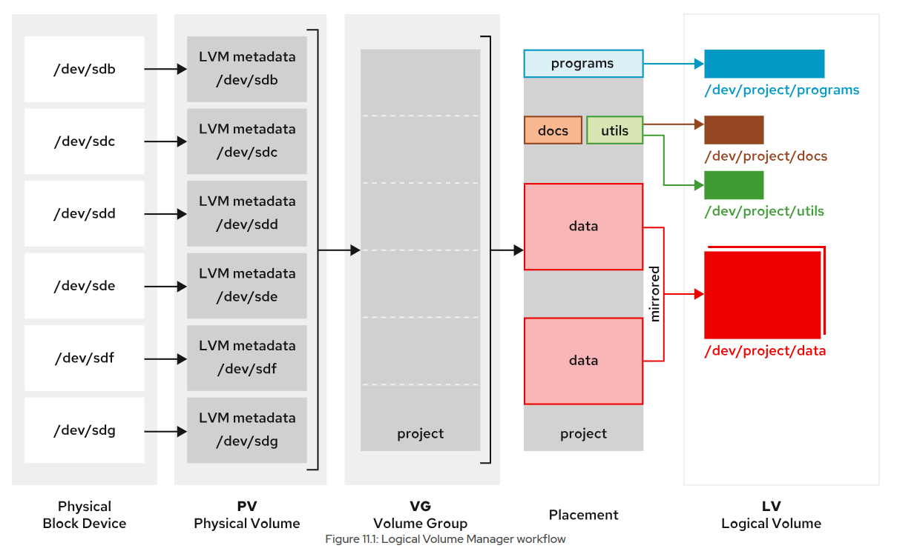

# Creating Logical Volumes
---

## Logical Volume Manager Overview

Use the LVM system to create logical storage volumes as a layer on the physical storage. This storage system provides greater flexibility than using physical storage directly. LVM hides the hardware storage configuration from the software, and enables you to resize volumes without stopping applications or unmounting file systems. LVM provides comprehensive command-line tools to manage storage.

### Physical devices

Logical volumes use physical devices for storing data. These devices might be disk partitions, whole disks, Redundant Array of Independent Disks (RAID) devices, or Storage Area Networks (SAN) disks. You must initialize a device as an LVM physical volume. An LVM physical volume must use the entire physical device.

### Physical Volumes (PVs)

LVM uses the underlying physical device as the LVM physical volume. LVM tools segment the physical volumes into physical extents (PEs) to form small chunks of data that act as the smallest storage block on a PV.

### Volume Groups (VGs)

A volume group is a storage pool that is made from one or more PVs. It is the functional equivalent of a whole disk in physical storage. A PV must be allocated only to a single VG. LVM sets the PE size automatically, although it is possible to specify it. A VG might consist of unused space and several logical volumes.

### Logical Volumes (LVs)

Logical volumes are created from free physical extents in a VG, and are provided as the storage device for applications, users, and operating systems. LVs are a collection of logical extents (LEs), which map to physical extents. By default, each LE is mapped to one PE. Setting specific LV options changes this mapping; for example, mirroring causes each LE to map to two PEs.

Logical Volume Manager Workflow
- Creating LVM storage requires building structures in a logical workflow.
- Determine the physical devices to become physical volumes, and initialize these devices as LVM physical volumes.
- Create a volume group from multiple physical volumes.
- Create the logical volumes from the available space in the volume group.
- Format the logical volume with a file system and mount it, or activate it as swap space, or pass the raw volume to a database or storage server for advanced structures.



<div style="border: 1px solid #aaa; border-radius: 6px; padding: 12px; background: #020202ff;">
<b>Note:</b><br><br>
The examples here use the /dev/sdb device name and its storage partitions. The device names on your classroom system might be different. Use the lsblk, blkid, or cat /proc/partitions commands to identify your system's devices.<br><br>
</div>

## Build LVM Storage

Creating a logical volume involves creating physical device partitions, physical volumes, and volume groups. After creating an LV, format the volume and mount it to access it as storage.

## Prepare Physical Devices

<div style="border: 1px solid #aaa; border-radius: 6px; padding: 12px; background: #020202ff;">
<b>Note:</b><br><br>
Partitioning is optional. You can use the whole raw physical device as a physical volume.<br><br></div>


Use the `parted` command to label the partition.

```bash
parted /dev/sdb mklabel gpt mkpart primary 1MiB 769MiB
```

Use the `parted` command to create a partition on the physical device.

```bash
parted /dev/sdb mkpart secondary 770MiB 1026MiB
```

Set the first partition to the Linux LVM partition type.

```bash
parted /dev/sdb set 1 lvm on
```

Set the second partition to the Linux LVM partition type.

```bash
parted /dev/sdb set 2 lvm on
```

Use the `udevadm settle` command to register the new partition with the kernel.

```bash
udevadm settle
```

## Create Physical Volumes

Use the `pvcreate` command to label the physical partition as an LVM physical volume. Label multiple devices simultaneously by using space-delimited device names as arguments to the `pvcreate` command.

This example labels the `/dev/sdb1` and `/dev/sdb2` devices as PVs that are ready for creating volume groups.

```bash
pvcreate /dev/sdb1 /dev/sdb2
```

## Create a Volume Group

The `vgcreate` command builds one or more physical volumes into a volume group. The first argument is a volume group name, followed by one or more physical volumes to allocate to this VG

This example creates the `vg01` VG by using the `/dev/sdb1` and `/dev/sdb2` PVs.

```bash
vgcreate vg01 /dev/sdb1 /dev/sdb2
```

## Create a Logical Volume

The `lvcreate` command creates a logical volume from the available PEs in a volume group. Use the `lvcreate` command to set the LV name and size, and the VG name to contain this logical volume.

This example creates the lv01 LV with 300 MiB in the vg01 VG.

```bash
lvcreate -n lv01 -L 300M vg01
```

This command might fail if the volume group does not have enough free physical extents. The LV size rounds up to the next PE size value when the size does not exactly match.

The `lvcreate` command `-L` option requires sizes in bytes, mebibytes (binary megabytes), and gibibytes (binary gigabytes), or similar. The lowercase `-l` requires sizes that are specified as a number of physical extents.

The following commands are two choices for creating the same LV with the same size:

- `lvcreate -n lv01 -L 128M vg01` : Create an LV of size 128 MiB, rounded to the next PE.
- `lvcreate -n lv01 -l 32 vg01` : Create an LV of size 32 PEs at 4 MiB each, total 128 MiB.

## Create a File System on the Logical Volume

Specify the logical volume by using either the `/dev/vgname/lvname` traditional name or the `/dev/mapper/vgname-lvname` kernel device mapper name.

Use the `mkfs` command to create a file system on the new logical volume.

```bash
mkfs -t xfs /dev/vg01/lv01
```

Create a mount point by using the `mkdir` command.

```bash
mkdir /mnt/data
```

To make the file system available persistently, add an entry to the `/etc/fstab` file.

```bash
/dev/vg01/lv01 /mnt/data xfs defaults 0 0
```

Update the `systemd` daemon with the new `/etc/fstab` configuration file.

```bash
systemctl daemon-reload
```

Mount the LV by using the `mount` command.

```bash
mount /mnt/data/
```

<div style="border: 1px solid #aaa; border-radius: 6px; padding: 12px; background: #020202ff;">
<b>Note:</b><br><br>
You can mount a logical volume by name or by UUID, because LVM parses the PVs by looking for the UUID. This behavior is successful even when the VG was created by using a name, because the PV always contains a UUID.<br><br></div>

## Display LVM Component Status

LVM provides various utilities to display the status information for PV, VG, and LV. Use the `pvdisplay`, `vgdisplay`, and `lvdisplay` commands to show the status information for the LVM components.

The associated `pvs`, `vgs`, and `lvs` commands are commonly used and show a subset of the status information, with one line for each entity.

### Display Physical Volume Information

The `pvdisplay` command displays information about the PVs. Use the command without arguments to list information for all PVs on the system. Providing the name of the PV as the argument to the command shows the information that is specific to the PV.

Use the `pvdisplay` command to display the information for the `/dev/sdb1` PV:

```bash
pvdisplay /dev/sdb1
```

```bash
  --- Physical volume ---
  PV Name               /dev/sdb1                         #1
  VG Name               vg01                              #2
  PV Size               768.00 MiB / not usable 4.00 MiB  #3
  Allocatable           yes
  PE Size               4.00 MiB                          #4
  Total PE              191
  Free PE               116                               #5
  Allocated PE          75
  PV UUID               evAimq-gs8W-6X9C-3H6q-ndDk-pvTx-QEZ9Jc
```

`1` PV Name shows the device name.

`2` VG Name shows the volume group where the PV is allocated.

`3` PV Size shows the physical size of the PV, including unusable space.

`4` PE Size shows the physical extent size.

`5` Free PE shows the available PE size in the VG to create LVs or to extend existing LVs.

### Display Volume Group Information

The `vgdisplay` command shows the information about volume groups. To list information about all VGs, use the command without arguments. Provide the name of the VG as an argument to list information that is specific to the VG.

Use the `vgdisplay` command to display the information for the `vg01` volume group:

```bash
vgdisplay vg01
```
```bash
  --- Volume group ---
  VG Name               vg01                #1
  System ID
  Format                lvm2
  Metadata Areas        2
  Metadata Sequence No  2
  VG Access             read/write
  VG Status             resizable
  MAX LV                0
  Cur LV                1
  Open LV               1
  Max PV                0
  Cur PV                2
  Act PV                2
  VG Size               1016.00 MiB         #2
  PE Size               4.00 MiB
  Total PE              254                 #3
  Alloc PE / Size       75 / 300.00 MiB
  Free  PE / Size       179 / 716.00 MiB    #4
  VG UUID               F5a4lm-Ln8v-cYM0-YJth-f7fj-lQYZ-1AP8Zu
```

`1` VG Name shows the name of the volume group.

`2` VG Size displays the total size of the storage pool that is available for LV allocation.

`3` Total PE shows the total size of PE units.

`4` Free PE / Size shows the available space in the VG to create or extend LVs.


### Display Logical Volume Information

The `lvdisplay` command displays information about logical volumes. Use the command without arguments to list information for all LVs. Providing the name of the LV as an argument displays the information that is specific to the LV.

Use the `lvdisplay` command to display the information for the `/dev/vg01/lv01` volume.

```bash
lvdisplay /dev/vg01/lv01
```
```bash
  --- Logical volume ---
  LV Path                /dev/vg01/lv01         #1
  LV Name                lv01
  VG Name                vg01                   #2
  LV UUID                7Toe5z-ozzv-aW4I-mJYQ-2VOV-MiP2-hNGFCf
  LV Write Access        read/write
  LV Creation host, time servera, 2025-06-18 18:49:54 +0000
  LV Status              available
  # open                 1
  LV Size                300.00 MiB             #3
  Current LE             75                     #4
  Segments               1
  Allocation             inherit
  Read ahead sectors     auto
  - currently set to     8192
  Block device           253:0
```

`1` LV Path shows the device name of the LV.

`2` VG Name shows the VG that is used for creating this LV.

`3` LV Size shows the total size of the LV. Use the file-system tools to determine the free and used space for the LV.

`4` Current LE shows the number of logical extents that this LV uses.
