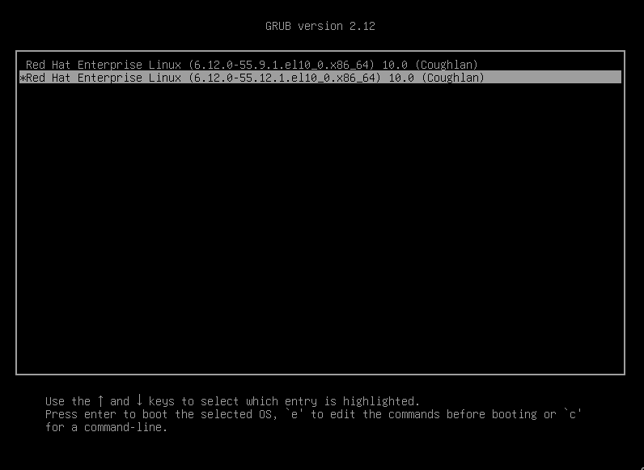
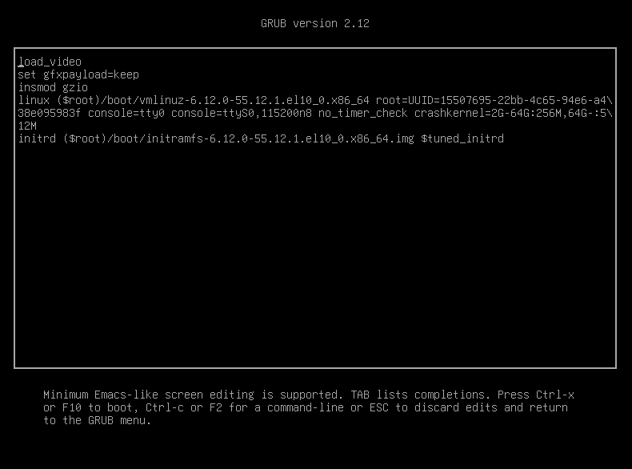

# Managing the Boot Loader and Kernel Command Line
---

## The Boot Loader

Modern computer systems are complex combinations of hardware and software. Starting from an undefined, powered-down state to a running system with a login prompt requires many pieces of hardware and software to work together.

When a computer is powered on, it loads a firmware boot system from a ROM chip on the motherboard. In modern x86 machines, this firmware boot system is typically either Unified Extensible Firmware Interface (UEFI) or Basic Input/Output System (BIOS). BIOS was more common in machines manufactured before 2020, and UEFI is the most common system present in current motherboards.

The job of the firmware boot system is to load a boot loader from a disk and to pass the control of the boot process to the boot loader. Boot loaders are programs designed to interface with the firmware boot system, set the system for boot, and then start the kernel to continue the system initialization. The default boot loader for Red Hat Enterprise Linux 10 is the GRand Unified Bootloader version 2 (GRUB2).

## GRUB2 with UEFI

In a UEFI system, the boot firmware reads settings from nonvolatile RAM (NVRAM) to determine which disk and Extensible Firmware Interface (EFI) application to load. The disk typically contains an EFI system partition, which is usually mounted on the /boot/efi directory. GRUB2 generates files that the UEFI system can load. After the GRUB2 boot-loader EFI application has been loaded, the system moves to the next boot stage.

## GRUB2 with BIOS

In a BIOS system, the boot firmware reads a specially formatted boot sector on a disk for the `boot.img` boot-loader image. This boot-loader image loads the `core.img` image from the unpartitioned MBR space before the first partition. The `core.img` image loads extra modules that can initialize file systems, and the system moves to the next boot stage. GRUB2 generates and installs these images into the MBR space on the disk.

## Further Boot Stages

After GRUB2 has fully initialized and loaded disks, it presents a boot menu to the user.



From this boot menu, you can select which preconfigured kernel to boot, as well as apply any kernel arguments to boot. The Linux kernel package typically generates these boot-menu entries when you install a new version.

To modify a boot entry from the GRUB2 menu, you can use the built-in editor. You can access the editor in GRUB2 by pressing E.



The changes made within the GRUB2 editor apply to only that boot instance. To make any changes persistent in future boot instances, you can make those changes by using the `grubby` command.

## Controlling GRUB2 from a Booted System

You can modify the default configuration of GRUB2 by using the `grubby` command. You can use the `grubby` command to perform various tasks, such as adding or removing kernel arguments, changing the default boot-menu entry, and viewing information about existing boot-menu entries.

To view information about an existing entry, you can use the `grubby` command `--info` option.

```bash
grubby --info 1
```
```bash
index=1 #1
kernel="/boot/vmlinuz-6.12.0-55.12.1.el10_0.x86_64" #2
args="console=tty0 ... crashkernel=2G-64G:256M,64G-:512M $tuned_params" #3
root="UUID=15507695-22bb-4c65-94e6-a438e095983f" #4
initrd="/boot/initramfs-6.12.0-55.12.1.el10_0.x86_64.img $tuned_initrd" #5
title="Red Hat Enterprise Linux (6.12.0-55.12.1.el10_0.x86_64) 10.0 (Coughlan)" #6
id="b70d796f931842cb9776f658cd068435-6.12.0-55.12.1.el10_0.x86_64" #7
```

`1` The index value is the entry number for the boot-menu list, starting at 0.

`2` The kernel value is the path to the Linux kernel that GRUB2 loads.

`3` The args value is a list of kernel arguments that are passed to the Linux kernel.

`4` The root value is the block device that the kernel and the initramfs image exist on.

`5` The initrd value is the path to the initial RAM file system image, which the early stages of Linux boot within.

`6` The title value is the name that is shown for the boot entry in the GRUB2 boot menu.

`7` The id value is a unique identifier for this boot entry.


To change the default boot entry, so that GRUB2 automatically chooses it on boot, you can use the `grubby` command `--set-default-index` option.

```bash
grubby --set-default-index 0
```
```bash
The default is /boot/loader/entries/ffffffffffffffffffffffffffffffff-6.12.0-55.9.1.el10_0.x86_64.conf with index 0 and kernel /boot/vmlinuz-6.12.0-55.9.1.el10_0.x86_64
```

## Kernel Command-line Arguments

You can pass various arguments to the Linux kernel to configure the system at boot. In some cases, a command-line argument is the only way to change a configuration, such as defining how the kernel behaves if it crashes. The available kernel command-line arguments and exact behavior depend on the version of the Linux kernel that you have installed.

To add a command-line argument, or make other changes related to the kernel, you can use the `grubby` command `--update-kernel` option.

The following example adds the `rhgb quiet` command-line argument to suppress kernel boot messages by using the `--args` option:

```bash
grubby --update-kernel /boot/vmlinuz-6.12.0-55.9.1.el10_0.x86_64 \
--args="rhgb quiet"
```

To remove the command-line argument, add the `rhgb` quiet argument by using the `--remove-args` option:

```bash
grubby --update-kernel /boot/vmlinuz-6.12.0-55.9.1.el10_0.x86_64 \
--remove-args="rhgb quiet"
```