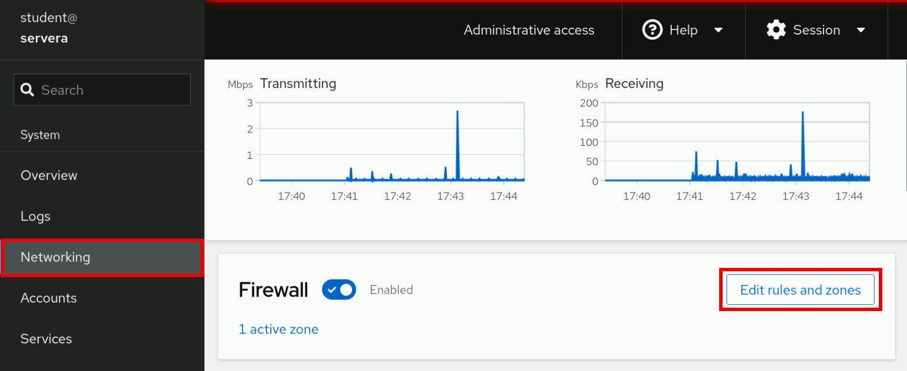
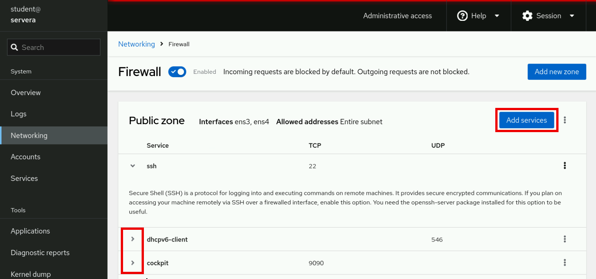
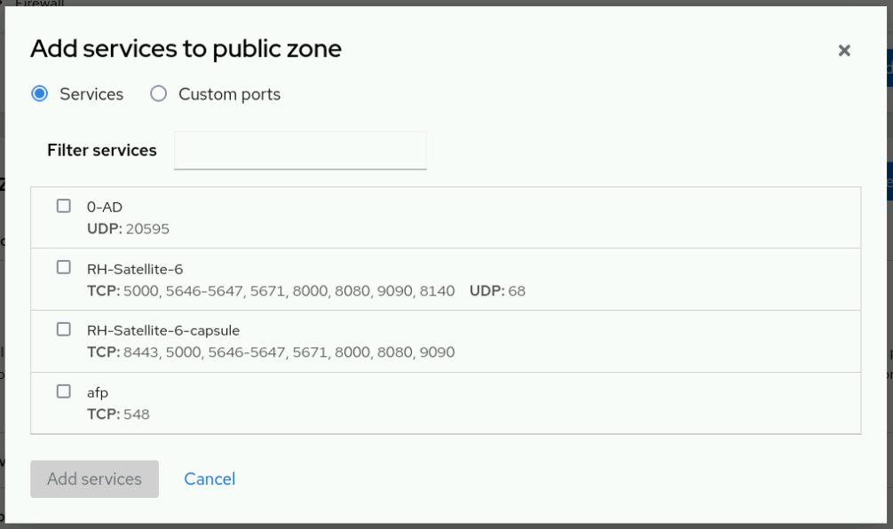
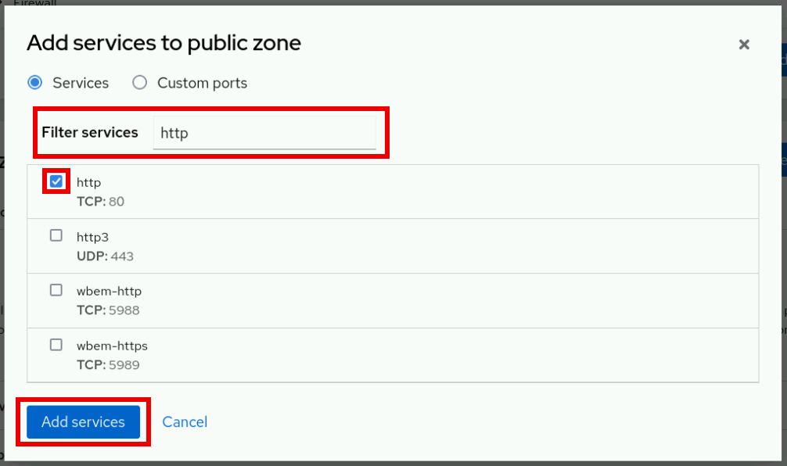
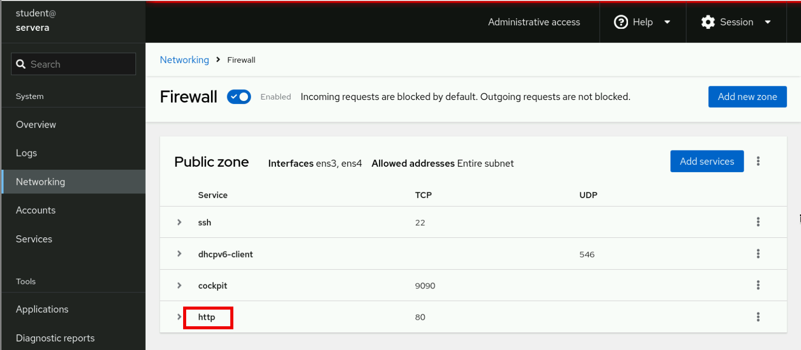

# Managing Server Firewalls
---

## Linux Firewall Architecture Concepts

The Linux kernel provides the `netfilter` framework for network traffic operations such as packet filtering, network address translation, and port translation. The `nftables` packet classification framework builds on the `netfilter` framework to apply firewall rules to network traffic.

In Red Hat Enterprise Linux 10, the `nftables` framework is the system firewall core.

<div style="border: 1px solid #aaa; border-radius: 6px; padding: 12px; background: #020202ff;">
<b>Note:</b><br><br>
The nftables framework is the successor to the iptables and ip6tables utilities, among others. It offers many improvements in convenience, features, and performance over the previous packet-filtering tools. You can convert the earlier iptables configuration files to their nftables equivalents by using the iptables-translate and ip6tables-translate utilities.<br><br>
</div>

## The Firewall Service

The `firewalld` service is a dynamic firewall manager, and is the recommended front end to the `nftables` framework. Red Hat Enterprise Linux 10 includes the firewalld package.

The `firewalld` service simplifies firewall management by classifying network traffic into zones. A network packet's assigned zone depends on criteria such as the source IP address of the packet or the incoming network interface. Each zone has its own list of ports and services that are either open or closed.

<div style="border: 1px solid #aaa; border-radius: 6px; padding: 12px; background: #020202ff;">
<b>Note:</b><br><br>
For machines that often change networks, the NetworkManager service can automatically set the firewall zone for a connection. This service is useful when switching between home, work, or public wireless networks. A user might want their system's sshd service to be reachable when connected to their home or corporate networks, but not when connected to a public wireless network in the local coffee shop.<br><br>
</div>

The `firewalld` service inspects the source address for every incoming packet into the system. If the source address is assigned to a specific zone, then the rules for that zone apply. If the source address is not assigned to a zone, then the firewalld service associates the packet with the zone for the incoming network interface, and the rules for that zone apply. If the network interface is not associated with a zone, then the firewalld service sends the packet to the default zone.

The default zone is not a separate zone; you configure one of the existing zones to be assigned as the default zone. Initially, the `firewalld` service designates the `public` zone as the default, and maps the lo loopback interface to the `trusted` zone.

Most zones allow traffic through the firewall if the local destination of the traffic matches a list of ports and protocols, such as 631/udp, or a predefined service configuration, such as the ssh service. Normally, if the traffic does not match a permitted port and protocol or service, then it is rejected. An exception is the `trusted` zone, which permits all traffic by default.

### Predefined Zones

The `firewalld` service uses predefined zones, which you can customize. By default, all zones allow any incoming traffic that is part of an existing session that the system initiated, and also allow all outgoing traffic.

The following table shows the initial zone configuration:

**Default Configuration of Firewall Zones**

# FirewallD Zones and Default Configurations

| **Zone name** | **Default configuration** |
|----------------|-----------------------------|
| **trusted** | Allow all incoming traffic. |
| **home** | Reject incoming traffic unless related to outgoing traffic or matching the **ssh**, **mdns**, **ipp-client**, **samba-client**, or **dhcpv6-client** predefined services. |
| **internal** | Reject incoming traffic unless related to outgoing traffic or matching the **ssh**, **mdns**, **ipp-client**, **samba-client**, or **dhcpv6-client** predefined services (same as the *home* zone to start with). |
| **work** | Reject incoming traffic unless related to outgoing traffic or matching the **ssh**, **ipp-client**, or **dhcpv6-client** predefined services. |
| **public** | Reject incoming traffic unless related to outgoing traffic or matching the **ssh** or **dhcpv6-client** predefined services. This is the default zone for newly added network interfaces. |
| **external** | Reject incoming traffic unless related to outgoing traffic or matching the **ssh** predefined service. Outgoing IPv4 traffic that is forwarded through this zone is masqueraded to appear that it originated from the IPv4 address of the outgoing network interface. |
| **dmz** | Reject incoming traffic unless related to outgoing traffic or matching the **ssh** predefined service. |
| **block** | Reject all incoming traffic unless related to outgoing traffic. |
| **drop** | Drop all incoming traffic unless related to outgoing traffic (do not even respond with ICMP errors). |

For a list of available predefined zones and their intended use, see the firewalld.zones(5) man page.


## Predefined Services

The `firewalld` service includes predefined configurations for commonly used services, to simplify setting firewall rules.

For example, instead of researching the relevant ports for an NFS server, use the predefined nfs configuration to create rules for the correct ports and protocols.

The following table lists some predefined service configurations that might be active in your default firewalld zone:

**Selected Predefined Firewall Services**

| **Service name** | **Configuration** |
|------------------|-------------------|
| **ssh** | Local SSH server. Traffic to **22/tcp**. |
| **dhcpv6-client** | Local DHCPv6 client. Traffic to **546/udp** on the **fe80::/64** IPv6 network. |
| **ipp-client** | Local Internet Printing Protocol (IPP) printing. Traffic to **631/udp**. |
| **samba-client** | Local Windows file and print sharing client. Traffic to **137/udp** and **138/udp**. |
| **mdns** | Multicast DNS (mDNS) local-link name resolution. Traffic to **5353/udp** to the **224.0.0.251 (IPv4)** or **ff02::fb (IPv6)** multicast addresses. |
| **cockpit** | Red Hat Enterprise Linux web-based interface for managing and monitoring your local and remote systems. Traffic to **9090/tcp**. |

The `firewalld` package includes many predefined service configurations. You can list the services with the `firewall-cmd` command `--get-services` option


```bash
firewall-cmd --get-services
```

If the predefined service configurations are not appropriate for your scenario, then you can manually specify the required ports and protocols. You can use the web console graphical interface to review predefined services and manually define more ports and protocols.

## Configure the Firewalld Daemon

The following list shows two ways for system administrators to interact with the `firewalld` service:

- The web console graphical interface
- The `firewall-cmd` command-line tool

#### Configure Firewall Services with the Web Console

To manage firewall services with the web console, you must log in and escalate privileges, by clicking the Limited access or Turn on administrative access buttons.

Then, enter your password when prompted. The administrative mode elevates privileges based on your user's sudo configuration. Remember to toggle back to limited access mode after you perform the system task that requires administrative privileges.

Click the `Networking` option in the left navigation menu to display the `Firewall` section on the main networking page. Click the `Edit rules and zones` button to go to the Firewall page.



The `Firewall` page displays active zones and their allowed services. Click the arrow icon (>) to the left of a service name to view its details. To add a service to a zone, click the `Add services` button in the upper right corner of the applicable zone.



The `Add Services` page displays the available predefined services.



To select a service, scroll through the list or enter a selection in the `Filter services` text box.

In the following example, the http string filters the options to show web-related services. Select the checkbox to the left of the service to allow it through the firewall. Click the `Add services` button to complete the process.



The interface returns to the `Firewall` page, where you can review the updated allowed services list.



### Configure the Firewall from the Command Line

The `firewall-cmd` command interacts with the `firewalld` daemon.

It is installed as part of the `firewalld` package, and is available for administrators who prefer to work on the command line, or for working on systems without a graphical environment, or for scripting a firewall setup.

Most commands work on the runtime configuration, unless the `--permanent` option is specified. If the `--permanent` option is specified, then you must activate the setting by also running the `firewall-cmd` command `--reload` option, which applies the current permanent configuration as the new runtime configuration. Many of the listed commands take the `--zone=ZONE` option to find which zone they affect. Where a netmask is required, use Classless Inter-Domain Routing (CIDR) notation, such as 192.168.1/24.

The following table lists some firewall-cmd commands:


| **Command** | **Explanation** |
|--------------|----------------|
| `--get-default-zone` | Query the current default zone. |
| `--set-default-zone=ZONE` | Set the default zone, which changes both the runtime and the permanent configuration. |
| `--get-zones` | List all available zones. |
| `--get-active-zones` | List all zones in use (with an interface or source that is tied to them), along with their interface and source information. |
| `--add-source=CIDR [--zone=ZONE]` | Route all traffic from the IP address or from the network with their netmask to the specified zone. If no `--zone=` option is provided, then the default zone is used. |
| `--remove-source=CIDR [--zone=ZONE]` | Remove the rule that routes all traffic from the zone that comes from the IP address or network. If no `--zone=` option is provided, then the default zone is used. |
| `--add-interface=INTERFACE [--zone=ZONE]` | Route all traffic from `INTERFACE` to the specified zone. If no `--zone=` option is provided, then the default zone is used. |
| `--change-interface=INTERFACE [--zone=ZONE]` | Associate the interface with `ZONE` instead of its current zone. If no `--zone=` option is provided, then the default zone is used. |
| `--list-all [--zone=ZONE]` | List all configured interfaces, sources, services, and ports for `ZONE`. If no `--zone=` option is provided, then the default zone is used. |
| `--list-all-zones` | Retrieve all information for all zones (interfaces, sources, ports, and services). |
| `--add-service=SERVICE [--zone=ZONE]` | Allow traffic to `SERVICE`. If no `--zone=` option is provided, then the default zone is used. |
| `--add-port=PORT/PROTOCOL [--zone=ZONE]` | Allow traffic to the `PORT/PROTOCOL` ports. If no `--zone=` option is provided, then the default zone is used. |
| `--remove-service=SERVICE [--zone=ZONE]` | Remove `SERVICE` from the allowed list for the zone. If no `--zone=` option is provided, then the default zone is used. |
| `--remove-port=PORT/PROTOCOL [--zone=ZONE]` | Remove the `PORT/PROTOCOL` ports from the allowed list for the zone. If no `--zone=` option is provided, then the default zone is used. |
| `--reload` | Drop the runtime configuration and apply the permanent configuration. |
| `--runtime-to-permanent` | Create permanent rules from the runtime configuration. |


The following example sets the default zone to dmz:

```bash
firewall-cmd --set-default-zone=dmz
```

Assign all traffic from the `192.168.0.0/24` network to the internal zone:

```bash
firewall-cmd --permanent --zone=internal --add-source=192.168.0.0/24
```

Open the network ports for the `mysql` service on the `internal` zone:

```bash
firewall-cmd --permanent --zone=internal --add-service=mysql
```

Update the changes to the `firewalld` daemon:

```bash
firewall-cmd --reload
```

As another example, to add all the incoming traffic from the `172.25.25.11` single IPv4 address to the `public` zone, use the following commands:

```bash
firewall-cmd --permanent --zone=public --add-source=172.25.25.11/32
```

Update the changes to the firewalld daemon:

```bash
firewall-cmd reload
```

