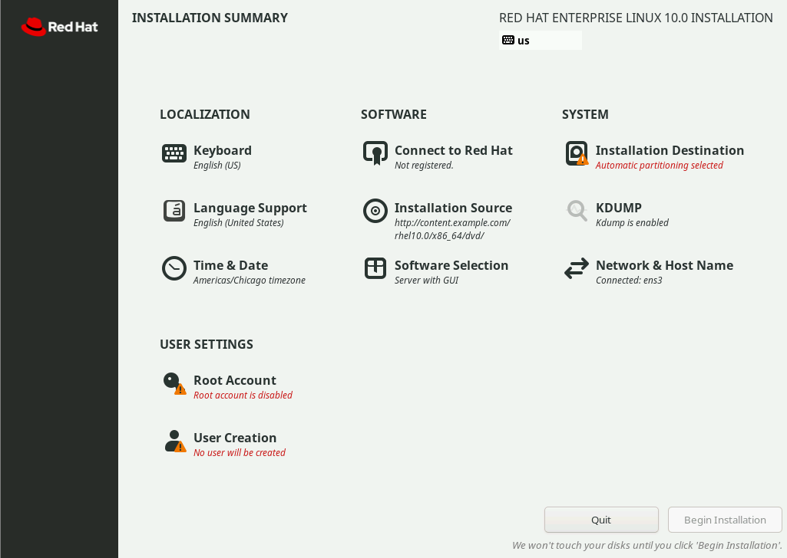
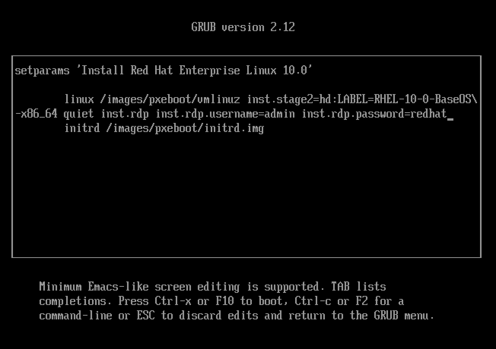

# Installing Red Hat Enterprise Linux Interactively
---

## Installation Media

Red Hat provides different forms of installation media that you can download from the Customer Portal website by using your active subscription.

- A binary image file in ISO 9660 format that contains the Anaconda Red Hat Enterprise Linux installation program, and the BaseOS and AppStream package repositories. These repositories contain the necessary packages to complete the installation without additional repositories.

- A smaller boot ISO image file that contains only the Anaconda installer, and which requires network access during installation to download packages from online repositories that are hosted by HTTP, FTP, or NFS servers.

- Source code (human-readable programming language instructions) for Red Hat Enterprise Linux. The source DVDs have no documentation. This image helps to compile or develop your software according to the Red Hat Enterprise Linux version. The availability of the operating system source code offers transparency and helps developers to build their own software by using Red Hat Enterprise Linux as a foundation.

Red Hat Enterprise Linux 10 supports the following architectures:

- AMD and Intel 64-bit architectures (x86-64-v3)
- The 64-bit ARM architecture (ARMv8.0-A)
- IBM Power Systems, Little Endian (POWER9)
- 64-bit IBM Z (z14)

After downloading your preferred image, create bootable installation media by following the instructions in the Interactively Installing RHEL from Installation Media guide.

https://docs.redhat.com/en/documentation/red_hat_enterprise_linux/10/html-single/interactively_installing_rhel_from_installation_media/index

For example, to install RHEL on a bare-metal server, you could copy one of the ISO images to a USB drive and boot from that.

### Build Customized Images with RHEL Image Builder

Red Hat Enterprise Linux image builder helps to create customized images of Red Hat Enterprise Linux. RHEL image builder enables administrators to build custom system images for deployment on cloud platforms or on virtual environments for specialized use cases.

Use the `composer-cli` command or the Red Hat web console interface to access RHEL image builder.

### Disk and Memory Requirements

To install Red Hat Enterprise Linux 10, you must have a minimum of 10 GiB of space on the partition where RHEL will be installed.

The minimum RAM requirement depends on the installation type:

| Installation type                        | Recommended minimum RAM size                                      |
|------------------------------------------|-------------------------------------------------------------------|
| **Local media installation (USB, DVD)**  | 1.5 GiB for x86–64–v3, ARMv8.0–A, and z14 architectures 3 GiB for POWER9 architecture |
| **NFS network installation**              | 1.5 GiB for x86–64–v3, ARMv8.0–A, and z14 architectures 3 GiB for POWER9 architecture |
| **HTTP, HTTPS, or FTP network installation** | 3 GiB for x86–64–v3 and z14 architectures 4 GiB for ARMv8.0–A and POWER9 architecture |

## Install Red Hat Enterprise Linux Manually

By using the binary DVD or boot ISO, administrators install a new RHEL system on a bare-metal server or on a virtual machine. The Anaconda program supports two installation methods: manual and automated.

- The manual installation interacts with the user to query how Anaconda installs and configures the system.
- The automated installation uses a Kickstart file to direct Anaconda how to install the system.

## Install RHEL by Using the Graphical Interface

Anaconda starts as a graphical application when you boot the system from the binary DVD or from the boot ISO.

At the **WELCOME TO RED HAT ENTERPRISE LINUX 10** screen, select the language, and click **Continue**. Individual users can choose a preferred language after installation.

Anaconda presents the **INSTALLATION SUMMARY** window, the central interface to customize parameters before beginning the installation.

From this window, configure the installation parameters by selecting the icons in any order. Select an item to view or to edit. In any item, click **Done** to return to this main screen.

Anaconda marks mandatory items with a triangle warning symbol and message. The orange status bar at the bottom of the screen reminds you to complete the required information before the installation begins.

Complete the following items as needed:

**Keyboard**
Add keyboard layouts.

**Language Support**
Select additional languages to install.

**Time & Date**
Select the system's location by selecting the location from a list. Specify the local time zone even when using Network Time Protocol (NTP). Alternatively, you can leave NTP disabled and set the time and date manually.

**Connect to Red Hat**
Register the system with your Red Hat account and select the system purpose. The system purpose feature enables the registration process to automatically attach the most appropriate subscription to the system. You must first connect to the network by using the **Network & Host Name** icon to register the system. Unless you remove the corresponding checkmark, the system might also be enrolled in Red Hat Insights by default.

**Installation Source**
Provide the source package location that Anaconda requires for installation. The **Installation Source** field already refers to the DVD when using the binary DVD.

**Software Selection**
Select the base environment to install, and include any additional software. The Minimal Install environment installs only the essential packages to run Red Hat Enterprise Linux.

**Installation Destination**
You must select at least one disk that has enough space to install Red Hat Enterprise Linux. To complete this task quickly, the administrator can rely on automatic storage configuration, which uses Logical Volume Management by default. Custom configuration is also available to help advanced users to create complex storage layouts. Note that even in custom mode, Anaconda enables you to automatically create partitions or volumes. Letting the installer determine the size is recommended because the installer considers the overall disk and RAM size.

The default radio button for automatic partitioning allocates the selected storage devices by using all available space.

**KDUMP**
The `kdump` kernel crash dump feature collects information about the state of the system memory when the kernel crashes. Red Hat engineers analyze a kdump file to identify the cause of a crash. Use this Anaconda item to enable or to disable kdump

**Network & Host Name**
Detected network connections are listed on the left. Select a connection to display its details. By default, Anaconda activates the network automatically.

**Root Account**
Starting in Red Hat Enterprise Linux 10, the root account is disabled by default. To enable it, select the Enable root account option and then set your root password.

<b>Note:</b>  
By default, SSH access by the root account does not allow password-based authentication. However, password-based authentication can be allowed in Anaconda.  

**User Creation**

If the `root` account is disabled by default, then creating a non-root account with administrative privileges is mandatory. The non-root account with administrative privileges can use the `sudo` command to run commands as the `root` account. The non-root account with administrative privileges is added to the wheel group.

Creating a local, non-root user account is a recommended practice but is optional unless the `root` account is locked. You can also create accounts after the installation is complete if the `root` account is not disabled.

After you complete the installation configuration, resolve all warnings and click **Begin Installation**. Clicking **Quit** halts the installation without applying any changes to the system.

When the installation finishes, click **Reboot**. Anaconda displays the **Initial Setup** screen when you log in to a graphical desktop for the first time. Accept the license information and optionally register the system with the subscription manager. You might skip system registration until later.

## Install RHEL by Using Remote Desktop Protocol (RDP)

In Red Hat Enterprise Linux 10, the installer provides the option to use Remote Desktop Protocol (RDP) to control the installation. An RDP client application is required to interact remotely with the Anaconda installer, which has performance benefits compared to the now deprecated VNC mode.

To start the installation in RDP mode, you must provide the inst.rdp option on the kernel command line in the `boot-loader` stage. Starting the RDP service requires authentication, which you can provide by using the `inst.rdp.username` and `inst.rdp.password` arguments on the command line. If no authentication details are provided on the command line, then Anaconda interactively prompts for an RDP username and password before starting the RDP service.

When the installer successfully starts in RDP mode, it displays the IP address that the RDP client uses to start the installation. Although the network port for incoming client connections is not shown, the installer uses the default 5900 (TCP) RDP port. Multiple RDP clients can connect to the service for collaboration.

## Troubleshoot the Installation

During a Red Hat Enterprise Linux 10 installation, Anaconda provides two virtual consoles. The first virtual console is text-based and runs the `tmux` terminal multiplexer to provide six separate windows that show useful information. You can access that console by pressing `Ctrl+Alt+F1`. The second virtual console, which is displayed by default, shows the Anaconda graphical interface. You can access it by pressing `Ctrl+Alt+F6`.

The `tmux` terminal provides a shell prompt in the second window in the first virtual console. You can use the terminal to enter commands to inspect and troubleshoot the system while the installation continues. The other windows provide diagnostic messages, logs, and additional information.

The following table lists the keystroke combinations to access the virtual consoles and the `tmux` terminal windows. In the `tmux` terminal, the keyboard shortcuts are performed in two actions: press and release `Ctrl+B`, and then press the number key of the window to access. In the `tmux` terminal, you can also press `Alt+Tab` to rotate the current focus between the windows.

| Key sequence | Content |
|---------------|----------|
| **Ctrl+Alt+F1** | Access the tmux terminal multiplexer. |
| **Ctrl+Alt+F6** | Access the Anaconda graphical interface. |
| **Ctrl+B 1** | In the tmux terminal, access the main information page for the installation process. |
| **Ctrl+B 2** | In the tmux terminal, provide a root shell. Anaconda stores the installation log files in the `/tmp` directory. |
| **Ctrl+B 3** | In the tmux terminal, display the contents of the `/tmp/anaconda.log` file. |
| **Ctrl+B 4** | In the tmux terminal, display the contents of the `/tmp/storage.log` file. |
| **Ctrl+B 5** | In the tmux terminal, display the contents of the `/tmp/program.log` file. |
| **Ctrl+B 6** | In the tmux terminal, display the contents of the `/tmp/packaging.log` file. |

<b>Note:</b>  
For compatibility with earlier Red Hat Enterprise Linux versions, the virtual consoles from Ctrl+Alt+F2 through Ctrl+Alt+F5 also present root shells during installation.  

