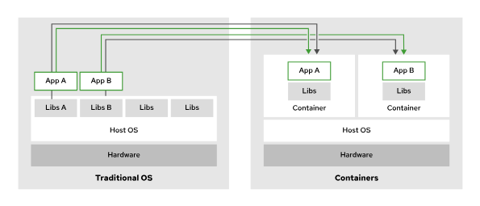

# Managing Containers with Podman
---

## Container Technology Overview

In computing, a container is an encapsulated process that includes the required runtime dependencies for a program to run. In a container, application-specific libraries are independent of the host operating system libraries. The host operating system and kernel provide libraries and functions that are not specific to the containerized application. The provided libraries and functions help to ensure that the container remains compact, and that it can quickly execute and stop as needed.

A container engine creates a union file system by merging container image layers. A layer is a component of the container image that represents a specific set of files or changes, such as system libraries, application binaries, or configuration files. Each layer builds on the previous one, forming a stacked structure that makes up the complete image. Because container image layers are immutable, a container engine adds a writable layer for runtime file modifications. Containers are ephemeral by default, which means that the container engine removes the writable layer when you remove the container.

The environment within a container is Linux-based, regardless of the host operating system. Containers use Linux kernel features, such as namespaces, control groups (cgroups), SELinux, and secure computing mode (seccomp). For example, containers use cgroups for resource management, such as CPU time allocation and system memory. Namespaces in particular provide the functionality to isolate processes within containers from each other and from the host system. When using containers on non-Linux operating systems, these Linux-specific features are often virtualized by the container engine implementation.

Containerization originated from technologies such as the `chroot` utility, a method to partially or fully isolate an environment, and evolved to the Open Container Initiative (OCI), which is a governance organization that defines standards for creating and running containers. Most container engines conform to the OCI specifications, so developers can confidently build their deployable target artifacts to run as OCI containers.

Containers use SELinux and secure computing mode to enforce security boundaries and to restrict the features that are available in containers.

## Benefits and Challenges of Using Containers

One of the main benefits is that containers can start in seconds, which makes them ideal for dynamic and scalable environments. They are also well suited for deploying modern applications, such as cloud-native applications. They are highly efficient, as they use fewer resources compared to virtual machines. Containers are portable, which means that they run consistently across development, testing, and production environments. Their isolated nature ensures that application environments remain separate and predictable.

However, containers also present some challenges. Data persistence requires additional configuration, such as using volumes to store data outside of the container's ephemeral storage. Networking becomes more complex in configurations that involve multiple containers or multiple hosts. Security management is another concern, as containers share the host's kernel and require careful access control. Although rootless containers improve security by allowing users to run containers without elevated privileges, rootless containers might also limit access to certain system functions.

## Images Versus Instances

Container images and container instances are commonly used terms when working with containers, and they have different meanings. A container image contains immutable data, instructions, and libraries that define an application. You can use container images to create container instances, which are executable versions of the image that include references to networking, disks, and other runtime necessities.

You can use a single container image multiple times to create many distinct container instances. You can also run these instances across multiple hosts. The application within a container is independent of the host environment.

<b>Note:</b>  
OCI container images are defined by the image-spec specification, whereas OCI container instances are defined by the runtime-spec specification.  

Another way to think about container images versus container instances is that an instance relates to an image as an object relates to a class in object-oriented programming.

## Container Registries

A container image registry is a storage location that hosts container images and related artifacts for container-based applications. The `/etc/containers/registries.conf` file is a system-wide configuration file. This file lists the container registries that are available for tools like Podman, Buildah, and Skopeo.

Red Hat provides the following registries:

- registry.redhat.io : requires authentication
- registry.access.redhat.com : requires no authentication
- registry.connect.redhat.com : holds Red Hat Partner Connect program images

## Comparing Containers to Virtual Machines

Containers generally serve a similar role to virtual machines (VMs), where an application resides in a self-contained environment with virtualized networking for communication. Despite this initial similarity, containers have a smaller footprint, and start and stop faster than a virtual machine. For both memory and disk usage, VMs are often measured in gigabytes, whereas containers are measured in megabytes.

A VM is useful when an additional full computing environment is required, such as when an application requires specific, dedicated hardware. Additionally, a VM is preferable when an application requires a non-Linux operating system or a different kernel from the host.

## Containers Versus Virtual Machines

Virtual machines and containers use different software for management and functionality. Hypervisors, such as Kernel-based Virtual Machine (KVM), Xen, VMware, and Hyper-V, are applications that provide the virtualization functionality for VMs. The container equivalent of a hypervisor is a container engine, such as Podman.

| Feature / Aspect              | Virtual Machines                     | Containers                            |
|-------------------------------|--------------------------------------|---------------------------------------|
| **Machine-level functionality** | Hypervisor                          | Container engine                      |
| **Management**                 | VM management interface              | Container engine or orchestration software |
| **Virtualization level**       | Fully virtualized environment        | Only relevant parts                   |
| **Size**                       | Measured in gigabytes                | Measured in megabytes                 |
| **Portability**                | Generally only same hypervisor       | Any OCI-compliant engine              |

You can manage hypervisors with additional management software. The software can be included with the hypervisor, or it can be external, such as Virtual Machine Manager (virt-manager) with KVM. Alternatively, you can manage containers directly through the container engine itself. Additionally, you can use container orchestration tools, such as Red Hat OpenShift Container Platform (RHOCP) and Kubernetes, to run and manage containers at scale. RHOCP manages both containers and virtual machines from a common interface.

With VMs, interoperability is uncommon. A VM that runs on one hypervisor is usually not guaranteed to run on a different hypervisor. In contrast, containers that follow the OCI specification do not require a particular container engine to function. Many container engines can function as drop-in replacements for each other.
