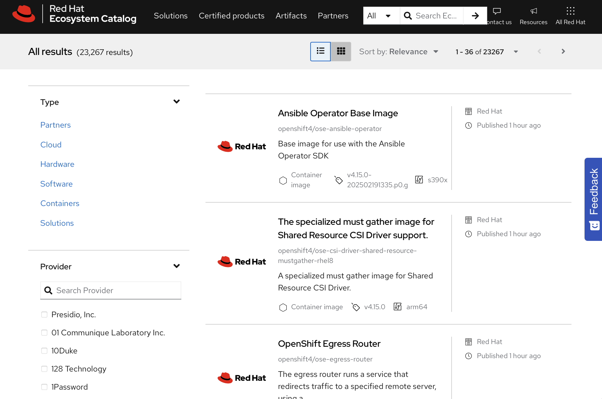

# Managing Containers with Podman
---

## Container Technology Overview

In computing, a container is an encapsulated process that includes the required runtime dependencies for a program to run. In a container, application-specific libraries are independent of the host operating system libraries. The host operating system and kernel provide libraries and functions that are not specific to the containerized application. The provided libraries and functions help to ensure that the container remains compact, and that it can quickly execute and stop as needed.

A container engine creates a union file system by merging container image layers. A layer is a component of the container image that represents a specific set of files or changes, such as system libraries, application binaries, or configuration files. Each layer builds on the previous one, forming a stacked structure that makes up the complete image. Because container image layers are immutable, a container engine adds a writable layer for runtime file modifications. Containers are ephemeral by default, which means that the container engine removes the writable layer when you remove the container.


The environment within a container is Linux-based, regardless of the host operating system. Containers use Linux kernel features, such as namespaces, control groups (cgroups), SELinux, and secure computing mode (seccomp). For example, containers use cgroups for resource management, such as CPU time allocation and system memory. Namespaces in particular provide the functionality to isolate processes within containers from each other and from the host system. When using containers on non-Linux operating systems, these Linux-specific features are often virtualized by the container engine implementation.

Containerization originated from technologies such as the `chroot` utility, a method to partially or fully isolate an environment, and evolved to the Open Container Initiative (OCI), which is a governance organization that defines standards for creating and running containers. Most container engines conform to the OCI specifications, so developers can confidently build their deployable target artifacts to run as OCI containers.

Containers use SELinux and secure computing mode to enforce security boundaries and to restrict the features that are available in containers.

## Benefits and Challenges of Using Containers

One of the main benefits is that containers can start in seconds, which makes them ideal for dynamic and scalable environments. They are also well suited for deploying modern applications, such as cloud-native applications. They are highly efficient, as they use fewer resources compared to virtual machines. Containers are portable, which means that they run consistently across development, testing, and production environments. Their isolated nature ensures that application environments remain separate and predictable.

However, containers also present some challenges. Data persistence requires additional configuration, such as using volumes to store data outside of the container's ephemeral storage. Networking becomes more complex in configurations that involve multiple containers or multiple hosts. Security management is another concern, as containers share the host's kernel and require careful access control. Although rootless containers improve security by allowing users to run containers without elevated privileges, rootless containers might also limit access to certain system functions.

## Images Versus Instances

Container images and container instances are commonly used terms when working with containers, and they have different meanings. A container image contains immutable data, instructions, and libraries that define an application. You can use container images to create container instances, which are executable versions of the image that include references to networking, disks, and other runtime necessities.

You can use a single container image multiple times to create many distinct container instances. You can also run these instances across multiple hosts. The application within a container is independent of the host environment.

<div style="border: 1px solid #aaa; border-radius: 6px; padding: 12px; background: #020202ff;">
<b>Note:</b><br><br>
OCI container images are defined by the image-spec specification, whereas OCI container instances are defined by the runtime-spec specification.<br><br>
</div>

Another way to think about container images versus container instances is that an instance relates to an image as an object relates to a class in object-oriented programming.

## Container Registries

A container image registry is a storage location that hosts container images and related artifacts for container-based applications. The `/etc/containers/registries.conf` file is a system-wide configuration file. This file lists the container registries that are available for tools like Podman, Buildah, and Skopeo.

Red Hat provides the following registries:

- registry.redhat.io : requires authentication
- registry.access.redhat.com : requires no authentication
- registry.connect.redhat.com : holds Red Hat Partner Connect program images

## Comparing Containers to Virtual Machines

Containers generally serve a similar role to virtual machines (VMs), where an application resides in a self-contained environment with virtualized networking for communication. Despite this initial similarity, containers have a smaller footprint, and start and stop faster than a virtual machine. For both memory and disk usage, VMs are often measured in gigabytes, whereas containers are measured in megabytes.

A VM is useful when an additional full computing environment is required, such as when an application requires specific, dedicated hardware. Additionally, a VM is preferable when an application requires a non-Linux operating system or a different kernel from the host.

## Containers Versus Virtual Machines

Virtual machines and containers use different software for management and functionality. Hypervisors, such as Kernel-based Virtual Machine (KVM), Xen, VMware, and Hyper-V, are applications that provide the virtualization functionality for VMs. The container equivalent of a hypervisor is a container engine, such as Podman.

| Feature / Aspect              | Virtual Machines                     | Containers                            |
|-------------------------------|--------------------------------------|---------------------------------------|
| **Machine-level functionality** | Hypervisor                          | Container engine                      |
| **Management**                 | VM management interface              | Container engine or orchestration software |
| **Virtualization level**       | Fully virtualized environment        | Only relevant parts                   |
| **Size**                       | Measured in gigabytes                | Measured in megabytes                 |
| **Portability**                | Generally only same hypervisor       | Any OCI-compliant engine              |


You can manage hypervisors with additional management software. The software can be included with the hypervisor, or it can be external, such as Virtual Machine Manager (virt-manager) with KVM. Alternatively, you can manage containers directly through the container engine itself. Additionally, you can use container orchestration tools, such as Red Hat OpenShift Container Platform (RHOCP) and Kubernetes, to run and manage containers at scale. RHOCP manages both containers and virtual machines from a common interface.

With VMs, interoperability is uncommon. A VM that runs on one hypervisor is usually not guaranteed to run on a different hypervisor. In contrast, containers that follow the OCI specification do not require a particular container engine to function. Many container engines can function as drop-in replacements for each other.

---
# Running Containers with Podman
---

## The Podman Container Management Tool

Podman is an open source tool for managing your containers locally. With Podman, you can find, run, build, or deploy Open Container Initiative (OCI) containers and container images.

Some container tools use a daemon to proxy the requests, which creates a single point of failure for container management tasks. In addition, a daemon might require elevated privileges, which might become a security concern.

Podman is daemonless by design, which means that Podman interacts directly with containers, images, and registries without a daemon. This design makes Podman a suitable tool to use in a production environment.

In Red Hat Enterprise Linux 10, Podman is installed by default. You can verify the Podman version that is installed in your machine by using the podman -v command. The version number might differ in your system.

```bash
podman -v
```

Podman provides three ways to interact with your containers: the Podman CLI, the RESTful API, and a desktop application named Podman Desktop.

This section focuses on running containers by using the Podman CLI.

## Container Image Registries

A container image is a packaged version of your application, with all the dependencies that are necessary for the application to run. You can download a container image from a container registry, and use this container image as a base to run your containers. Commonly used image registries include Red Hat Registry, Quay.io, Docker Hub, and Amazon Elastic Container Registry (Amazon ECR).

## Red Hat Container Registries

Red Hat distributes container images by using the following registries:

- `registry.redhat.io` : requires authentication
- `registry.access.redhat.com` : requires no authentication
- `registry.connect.redhat.com` : holds Red Hat Partner Connect program images

Red Hat Ecosystem Catalog provides centralized searching for these registries at https://catalog.redhat.com. You can use the Ecosystem Catalog to search for images and to get technical details about them. Go to https://catalog.redhat.com/search to search for container images.



The container image details page provides relevant information about the container image, such as the Containerfile that is used to create the image, the packages that are installed within the image, or a security scanning. You can also change the image version by selecting a specific tag.

## The Quay.io Container Registry

The Red Hat Registry stores only images from Red Hat and certified providers. To store your custom images, you can use the Quay.io registry. Storing public images in Quay.io is free, and paying customers receive further benefits, such as private repositories. Developers can also deploy an on-premise Quay instance, which you can use to set up an image registry on your infrastructure.

You can use your Red Hat developer account to log in to the Quay.io registry.

## Logging in to Container Image Registries

Usually, you provide authentication credentials to interact with a container registry by using the `podman login` command. The `podman login` command accepts the registry URL as an argument and then it requests the username and password.

The following example shows a login attempt to the `registry.redhat.io` registry with a username and password.

```bash
podman login registry.redhat.io
```

<div style="border: 1px solid #aaa; border-radius: 6px; padding: 12px; background: #020202ff;">
<b>Note:</b><br><br>
For security reasons, the podman login command does not show your password in the interactive session. Although you do not see what you are typing, Podman registers every key stroke. Press Enter when you have typed your full password in the interactive session to initiate the login.<br><br>
</div>

Some container registries might not require you to provide an authorized account, which means that you can download container images without providing credentials. In this case, you must provide the URL of the container image registry and leave the username and password information empty.

```bash
podman login registry.access.redhat.com
```

## Inspecting Configured Container Registries

To view your machine's default container image registry, you can use the `podman info` command. The `podman info` command shows OS and hardware characteristics, configured registries, installed plugins, and versioning information.

The following example shows an excerpt of the locally configured `my_org_registry.example.com` registry. Note that the output shows additional registries under the search field that are used to search for container images.

```bash
podman info
```
```bash
...output omitted...
registries:
  my_org_registry.example.com:
    Blocked: false
    Insecure: true
    Location: my_org_registry.example.com
    MirrorByDigestOnly: false
    Mirrors: null
    Prefix: my_org_registry.example.com
    PullFromMirror: ""
  search:
  - registry.access.redhat.com
  - registry.redhat.io
  - docker.io
  - quay.io
...output omitted...
```

Podman primarily uses two files to store registry configuration:

- The `/etc/containers/registries.conf` file (or the `/etc/containers/registries.conf.d` drop-in directory). Podman uses the `registries.conf` file to store registry configuration.

- The `${XDG_RUNTIME_DIR}/containers/auth.json` file. Podman stores credential information in the `${XDG_RUNTIME_DIR}/containers/auth.json` file, where `${XDG_RUNTIME_DIR}` refers to a directory that is specific to the current user. The credentials are encoded in the base64 format.

## Running and Managing Containers

After authenticating to a container registry, you can start running containers.

### Running Containers

You use the `podman run` command to run a container. The `podman run` command requires an image name as an argument, which can be stored locally or it can exist remotely in a registry. The `podman run` command downloads or pulls the container image and uses it to run a container.

An image might accept additional arguments, such as commands to be run in the container after it starts.

In the following example, you run a container that uses the ubi10 image from the `registry.redhat.io` registry to run the echo 'Hello World!' command. Podman searches for the image, pulls it, starts the container, and runs the requested command. Note that the command output shows the process of pulling the image from the registry.


```bash
podman run -d registry.redhat.io/ubi10 sleep infinity
```

### Displaying Containers

You can list the running containers by using the `podman ps` command. By default, the `podman ps` command lists the following details for your containers:

- The container's ID
- The name of the image that the container uses
- The command that the container executes
- The time that the container was created
- The status of the container
- The exposed ports in the container
- The name of the container

Podman can identify the containers either by the Universal Unique Identifier (UUID) short identifier, which is composed of 12 alphanumeric characters, or by the UUID long identifier, which is composed of 64 alphanumeric characters. The following example shows the list of containers that are running in the environment. The first column shows the 8699…​1cae string, which is the container's ID, or UUID short identifier.

```bash
podman ps
```

The list does not show the container that ran the echo command because the container stopped after running the command. However, stopping a container is not the same as removing a container. Although the container is stopped, Podman does not remove it. You can list all containers (running and stopped) by adding the `--all` or `-a` option to the `podman ps` command:

```bash
podman ps -a
```

If you do not provide a name for the container during its creation, then Podman generates a random string for the container name. Be sure to define a unique name to simplify the identification of your containers when managing their lifecycle. To assign a name to a container, use the podman run command with the `--name` option.

The following example shows running the which `python` command on the `my_python` container that is based on the `ubi9/python-312` image. The container prints `/opt/app-root/bin/python` as the result and then it stops.

```bash
podman run --name my_python \
registry.redhat.io/ubi9/python-312 which python
```

The `podman ps` command now shows `my_python` as the name for the container:

```bash
podman ps -a
```

### Restarting Containers

Execute the `podman restart` command to restart a running container. You can also use this command to start a stopped container.

The following command restarts a container named nginx:

```bash
podman restart nginx
```

### Stopping and Removing Containers

You can stop a container gracefully by using the `podman stop` command. When you execute the `podman stop` command, Podman sends a SIGTERM signal to the container. Processes use the SIGTERM signal to implement clean-up procedures before stopping.

The following example stops a container with a container ID of 1b982aeb75dd:

```bash
podman stop 1b982aeb75dd
```

ou can stop all the running containers by using the `--all` or `-a` flag. In the following example, the command stops three containers:

```bash
podman stop --all
```

If a container does not respond to the SIGTERM signal, then Podman sends a SIGKILL signal to forcefully stop the container. Podman waits 10 seconds by default before sending the SIGKILL signal.

You can send the SIGKILL signal to the container by using the `podman kill` command. In the following example, a container named httpd is stopped forcefully:

```bash
podman kill httpd
```

Use the podman rm command to remove a stopped container. The following command removes a stopped container with the container ID of c58cfd4b90df:

```bash
podman rm c58cfd4b90df
```

By default, you cannot remove running containers; you must first stop the running container and then remove it. You can add the `--force` (or `-f`) flag to remove the container forcefully:

```bash
podman rm c58cfd4b90df --force
```

You can also automatically remove a container when it exits by adding the `--rm` option to the `podman run` command:

```bash
podman run --rm registry.redhat.io/ubi10 \
echo 'Hello World!'
```

After the container prints the string, the container exits and Podman removes the container. The following example shows that the container is not listed after running the `podman ps` command with the `--all` option:

```bash
podman ps --all
```

## Exposing Container Ports

Many containerized applications, such as web servers or databases, must run indefinitely to wait for connections. You must also ensure that these containers can expose their service ports externally through a network protocol.

You can use the `podman run` command with the `-p` option to map a port in your local machine to a port inside the container. This way, the traffic in your local port is forwarded to the port inside the container, which enables you to access the application from your computer.

The following example creates a container that runs an Apache HTTP server by mapping the 8080 port in the mywebapp.example.com machine to the 8080 port inside the container. The container is not running in detached mode so that you can view the output in the terminal.

```bash
podman run -p 8080:8080 registry.redhat.io/rhel10/httpd-24:latest
```

The container is now serving requests by using the 8080 port in the mywebapp.example.com machine. You can access the content of the HTTP server from a machine in the network at mywebapp.example.com:8080 or directly from the mywebapp machine at localhost:8080.

```bash
curl 127.0.0.1:8080
```

To prevent the terminal from being blocked, run the container in detached mode by using the `podman run` command with the `-d` option:

```bash
podman run -d -p 8080:8080 \
registry.redhat.io/rhel10/httpd-24:latest
```
