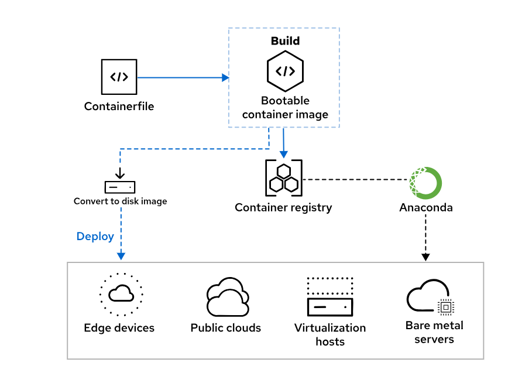

# Image Mode for Red Hat Enterprise Linux

## Introduction to Image Mode

Image mode for Red Hat Enterprise Linux 10 is a new deployment and management approach that uses container-native tools to build, deploy, and manage the operating system. With this method, you can deploy the operating system from a bootable container (bootc) image.


Container technology has existed for many years and has proven successful at deploying applications. The same efficient technique of using layered images can be applied to entire hosts. However, the base image is more complex than the ones that application containers use. A bootable container image must include the kernel, a boot loader, and other operating system components that are typically excluded from application containers.

Red Hat provides bootc base images for AMD/Intel x86_64 and the 64-bit ARM architectures. You can build your own derived image from the base image by adding your chosen application software and its dependencies.

## The Image Mode Workflow

Image mode introduces a container-native approach to system administration. Building a bootc container image is the foundation. This image is then deployed to various target systems. Management operations that follow the initial deployment involve updating the original container image and target systems fetching the new operating system updates from the registry.


**Build**

You can define your entire operating system by using a standard Containerfile. The file specifies the base bootc image to use as the starting point and provides additional build instructions for the image as needed. You can use the Podman tool to build and tag the container image.

**Deploy**

When the build is complete, the bootable container image must be pushed to a registry that target systems can access. The registry is the source of truth during initial deployment as well as during continued management of your systems.

The Anaconda installer for Red Hat Enterprise Linux supports image mode to deploy to bare metal as well as to virtual machine targets by using Kickstart automation.

For cloud environments, Red Hat provides the bootc-image-builder containerized tool to help create disk images of various types from bootc images. Supported formats include: qcow2 (QEMU), ami (Amazon), vmdk (vSphere), and gce (Google).

**Manage**

On systems that are deployed in image mode, the bootc command-line tool can manually fetch updates that are delivered in the form of container images and install them on the system. By default, target systems automatically update themselves when a later version of their bootc image is tagged in the container registry. Because the updates are transactional, a reboot is always required. The bootc command also supports rollbacks by updating the boot-loader entry to point to a previous installed deployment.

## Benefits of Image Mode

Compared to traditional package mode, image mode offers several advantages.

**Limited infrastructure drift**

Infrastructure drift is a challenge in today's cloud environments, when systems gradually deviate from the intended state due to manual configuration changes. Image mode limits infrastructure drift by using well-established container tools and techniques.

**Immutable operating system**

In image mode, the root file system is immutable by default and application updates are atomic. The /etc and /var directories are designated to store mutable machine local data. The immutable design enhances stability and security.

**System definition committed to version control**

A Containerfile is now a simplified blueprint for the operating system, to include system configuration and application files. Bootable containers are built by using existing tools such as Podman.

**Better scalability**

Container images are fast to build and later updates are efficiently stored in additional image layers. An organization can maintain a handful of images and deploy them on many systems in large data center environments.

**Simplified troubleshooting**

System updates are atomic and are delivered in the form of updated container images that can be rolled back if needed.

---
#Creating Installable Images for Image Mode.
---

## The Containerfile Format

When using image mode for Red Hat Enterprise Linux, you deploy software, associated dependencies, and configuration files to hosts by using container images that conform to the Open Container Initiative (OCI) standard. Container images deliver operating system updates that can also be rolled back if necessary.

You can use existing and familiar tools such as Podman to build container images. A key piece of the build process is the Containerfile, which is widely used to create application containers and has the benefit of a standardized format.


By adding a series of instructions to a Containerfile, you can customize an image to meet your needs. Each line in the Containerfile creates an image layer, which means that instructions are executed independently. During the build process, each instruction runs in an independent container by using an intermediate image built from the previous commands.

The following example Containerfile builds a typical application container:

```bash
# Use the ubi10 base image
FROM registry.redhat.io/ubi10 #1

# Install httpd
RUN dnf install -y httpd #2

# Copy a temporary index.html file to the web server root
COPY index.html /var/www/html/index.html #3

# Expose port 80 for httpd
EXPOSE 80 #4

# Set the entrypoint to run httpd in the foreground
ENTRYPOINT ["/usr/sbin/httpd", "-DFOREGROUND"] #5
```

1. The Red Hat Universal Base Image is the foundation for this application container.

2. The Apache HTTP service is layered on top of the base image.

3. The index.html file is copied from the project directory into the expected location in the container.

4. The `EXPOSE` instruction documents which port the service listens on at runtime. The HTTP port is TCP/80, which is defined in the standard Apache configuration file that ships in the httpd RPM package.

5. The `ENTRYPOINT` instruction defines the executable to run and any arguments to be passed to it when the container starts.

Although this sample Containerfile is sufficient for creating an application container, the approach to build a bootable container is somewhat different. Most importantly, the base image must be a specialized image that includes the required components for a full operating system, such as the kernel, a boot loader, and the systemd service manager. Red Hat provides the `rhel-bootc` base image, which incorporates tooling from the OSTree, `composefs`, and `bootc upstream` projects to enable image mode for RHEL.


<div style="border: 1px solid #aaa; border-radius: 6px; padding: 12px; background: #020202ff;">
<b>Important:</b><br><br>
Red Hat Enterprise Linux in image mode and the rhel-bootc image are subject to the Red Hat Enterprise Linux end user license agreement (EULA). Therefore, you cannot publicly redistribute the base or any derivative user-created images.<br><br>
</div>

For example, the following Containerfile installs and enables the httpd package on top of the rhel-bootc image. Note the differences from the previous application container example.

```bash
# Use the rhel-bootc base image
FROM registry.redhat.io/rhel10/rhel-bootc:latest #1

# Install and enable httpd
RUN dnf -y install httpd mod_ssl && dnf clean all #2
RUN systemctl enable httpd && firewall-cmd --add-service=https #3

# Add httpd related files
ADD ./etc/ /etc #4
COPY ./index.html /var/www/html/index.html 
```

1. The `FROM` line directs Podman to use the rhel-bootc container image as a base.

2. The `RUN` lines execute the command sequence within the container, creating new image layers in the process.

3. Because the image is for RHEL in image mode, this Containerfile enables the httpd service instead of configuring an `ENTRYPOINT` or `CMD` instruction. Additionally, this Containerfile opens the firewall for HTTPS instead of using an `EXPOSE` instruction.

4. The `ADD` line includes a file or directory at the destination within the container. The `ADD` command can resolve files over the network or unpack files within an archive in addition to local files.

5. The `COPY` command copies a file or directory at a relative path to the destination location. The COPY command does not unpack files within an archive, and instead copies archive files directly into the container.

<div style="border: 1px solid #aaa; border-radius: 6px; padding: 12px; background: #020202ff;">
<b>Note:</b><br><br>
The Containerfile(5) manual page details the full specification for the Containerfile format. Many commands can take additional options and arguments, which you can use to significantly customize the resulting container image.<br><br>
</div>

Some `Containerfile` commands have no effect for RHEL in image mode:

- The `ENTRYPOINT` and `CMD` instructions are replaced by starting services via the systemd service manager.

- The `ENV` instruction is replaced by configuring the systemd service.

- The `EXPOSE` instruction is only for documenting application ports. In image mode, you can control access to ports by using firewall configuration.

- The `USER` instruction is replaced by runtime user management.

Although these commands do not affect a RHEL system in image mode, you can still use commands such as the `ENV` command to facilitate intermediate steps in a Containerfile. For example, you might decide to define a list of packages by using the `ENV` command, and then install those packages later by using a `RUN` command

## Building Bootable Container Images

You can use the `podman build` command to build a bootc image from the command line. Podman uses a Containerfile in the specified directory to build a container image. The `--squash` option merges all new layers into a single layer, which reduces the image's complexity and layer count.

```bash
podman build --squash -t \
registry.example.com/user/webserver-bootc:latest .
```

After building an image, you can push the image to an image repository by using the podman push command.

```bash
podman push registry.example.com/user/webserver-bootc:latest
```

## Testing a Bootable Image in Application Mode

To test a bootable container before deploying it, use the `podman run` command to launch the container locally. The following example starts the `registry.example.com/user/webserver` container image and forwards the `8080` port to port `80` in the container:

```bash
podman run -d -p 8080:80 registry.example.com/user/webserver
```

You can then verify that the container functions as you expect. In this case, you can verify that the web server is accessible on port 8080 by using the curl command.

```bash
curl http://localhost:8080
```

You can also validate functionality by viewing the running processes in the container with the podman exec command.

```bash
podman exec -l ps -ef
```

Notice that PID 1 is the init process. The init process is the systemd service manager, which started the httpd service.

When running a `bootc-based` container in application mode, the included RHEL kernel does not start. Processes run in the context of the container platform, which is podman in this example.

---
# Installing Red Hat Enterprise Linux by Using Image Mode
---

## Deploying a Bootable Container

A bootable container image includes the kernel, the boot loader, and other operating system components that are otherwise excluded from application containers. Although you can launch a container instance from the bootc image to test an application that is built into the image, ultimately a bootable container image must be deployed to a host that boots from it.



When the contents of the image are installed on a physical or a virtual machine and the system boots up, the user space deployment itself does not run as a container. At this point, the container runtime that was used to build the image is no longer relevant. When the bootc tool is operating in deployed mode, the kernel that was installed from the image is executed during boot, and systemd runs as Process ID 1 to control all services, as is customary in Red Hat Enterprise Linux. The bootc tool is not a persistent daemon and does not impose any runtime overhead.

## Bare-metal Deployment by Using Anaconda Kickstart

To provision bare-metal servers, the recommended approach is to use the Anaconda installer's Kickstart feature, which supports image mode.

A Kickstart file helps to automate installation by providing answers to all the configuration options that the interactive installer would normally prompt the user for, such as storage configuration, user management, and package selection.

In general, all the standard commands and sections of a typical Kickstart file can be retained and used in image mode. The one notable exception is how software to be installed is specified. Traditionally, Anaconda is used in package mode and the `%packages` section in a Kickstart file is required to define software packages that you want to install:

```bash
%packages
@^minimal-environment
vim-enhanced
%end
```

To use Kickstart in image mode, you must remove the `%packages` section and replace it with the `ostreecontainer` command, to indicate the registry and the bootable container to deploy on the target system. The container image must be derived from the official rhel-bootc base image.

```bash
ostreecontainer --url=registry.lab.example.com:5000/student/webserver-bootc
```

This command is a reference to the `libostree` project, which `bootc` currently depends on for storing the base container image. The use of OSTree is a design choice, and its role might decrease in the future.

<div style="border: 1px solid #aaa; border-radius: 6px; padding: 12px; background: #020202ff;">
<b>Note:</b><br><br>
The direct use of the rpm-ostree command to make system changes or to install content is not supported.<br><br>
</div>

The RHEL `bootc` image is generic and does not include any configuration such as a default user account. To create user accounts and set passwords or to inject SSH public keys, you can use standard Kickstart commands. The following example sets the root password and creates a user account with administrator privileges:

```bash
rootpw --iscrypted $6$KUnFfrTzO8jv.PiH$YlBbOtXBkWzoMuRfb0.SpbQ....XDR1UuchoMG1
user --name=student --groups=wheel --iscrypted --password=$6$JJlPUjtsQ....F2co
```

After you successfully adjust your Kickstart file for use in image mode, you can publish the file to make it available in your environment. The most popular choice is to copy the file to a web server that can be accessed on the local network.

To start the Anaconda installer on a target system, you can choose from several methods. You might set up PXE services for network booting as a more advanced solution, or copy the RHEL binary installation ISO to a USB drive to boot the new machine manually. In either case, when the Anaconda boot menu starts on the target system, the `inst.ks=URL` argument must be provided on the kernel command line to inform the installer where the Kickstart file is located.

If the Kickstart file is not referenced correctly, then Anaconda starts the normal graphical user interface, which does not support image mode currently.

<div style="border: 1px solid #aaa; border-radius: 6px; padding: 12px; background: #020202ff;">
<b>Note:</b><br><br>
For more information about how to use Kickstart, refer to  Automatically Installing Red Hat Enterprise Linux. https://docs.redhat.com/en/documentation/red_hat_enterprise_linux/10/html-single/automatically_installing_rhel/index <br><br>
</div>

## Generating Disk Images for Hybrid Cloud Environments

Portability is an important factor when using Red Hat Enterprise Linux in image mode. In addition to bare-metal systems, the bootc images can also be deployed to machines in virtualized, cloud, and edge environments. This process involves converting a bootc image to one of the native disk formats.

The `bootc-image-builder` tool is available to generate disk images from the `bootc` image for various platforms:

| **Image format** | **Target environment**        |
|------------------:|:------------------------------|
| qcow2 (default)  | QEMU                          |
| vmdk             | VMware vSphere                |
| vhd              | Microsoft Virtual PC           |
| ami              | Amazon Machine Image           |
| gcd              | Google Compute Engine          |
| raw              | Unformatted raw disk           |


To get started with the `bootc-image-builder` tool, you must first download its container image from the Red Hat Ecosystem Catalog. This tool is intended for use as a container and it is not available as an RPM package in RHEL.

The following steps show how to use the podman command to get the necessary container image. The `sudo` command is used for privilege escalation because the `bootc-image-builder` tool must run as a `root` container when it is launched to generate disk images.

1. Authenticate to the registry:

```bash
sudo podman login registry.redhat.io
```

2. Download the bootc-image-builder container image:

```bash
sudo podman pull registry.redhat.io/rhel10/bootc-image-builder
```

## Creating a QCOW2 Disk Image

The default disk image format that the bootc-image-builder tool generates is QCOW2. This disk format can be used to deploy virtual machines that run on Kernel-based Virtual Machine (KVM) hypervisors.

Red Hat Enterprise Linux provides virtualization functions by using KVM. Virtualization capabilities are further expanded in the OpenShift Virtualization and Red Hat OpenStack Platform products.

The following example shows how to generate a QCOW2 disk image from a custom bootable container image that is derived from the official rhel-bootc base image.

The RHEL `bootc` base image is generic and contains no user accounts. The recommended approach to create users is to supply a customization file to the `bootc-image-builder` tool with the necessary user information. Create the `config.toml` file in your project directory to define users with content similar to the following example:

```bash
[[customizations.user]]
name = "user1"
password = "password1"
groups = ["wheel"]

[[customizations.user]]
name = "user2"
password = "password2"
groups = ["wheel"]
```

This example build configuration file is in the TOML data format; JSON is also supported.

During image build, the file must be mapped into the container by using the `/config.toml` path.

As another prerequisite, create a directory inside the project that binds to the output directory inside the container, where the `bootc-image-builder` tool writes the `qcow2` disk image.

```bash
mkdir output
```

To start the build process, run the `bootc-image-builder` container by using the following arguments:

```bash
sudo podman run \
--rm \
-it \
--privileged \ #1
--security-opt label=type:unconfined_t \
-v ./config.toml:/config.toml \  #2
-v ./output:/output \ #3
registry.redhat.io/rhel10/bootc-image-builder \
--type qcow2 \ #4
registry.lab.example.com/user/bootc-httpd:latest #5
```

1. This container must run with root privileges.
2. The customization file to create user accounts is mounted into the bootc-image-builder container by using the expected /config.toml path.
3. The output directory in the current working directory is mounted into the container by using the expected /output path.
4. Specify the disk image type.
5. Refer to the customized bootable container image to convert to a disk image.

## Deploying a New Virtual Machine on KVM

To test the new disk image, copy it to the file-system location where RHEL hypervisors expect to store images by default:

```bash
sudo cp output/qcow2/disk.qcow2 /var/lib/libvirt/images/
```

Then, create a virtual machine by using the `virt-install` command. The following example defines a minimal set of settings to create the machine and to import the disk that the `bootc-image-builder` container generated

```bash
sudo virt-install \
--name bootc-webserver \
--memory 4096 \
--import --disk /var/lib/libvirt/images/disk.qcow2 \
--graphics none \
--osinfo rhel10.0 \
--noautoconsole \
--noreboot
```

After successfully defining the new virtual machine, you can start it by using the `virsh` command.

```bash
sudo virsh start bootc-webserver
```