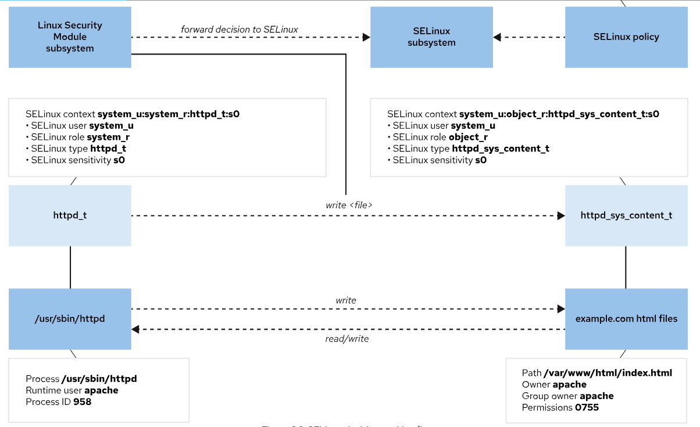

# Operating SELinux
---

## SELinux Architecture

Security Enhanced Linux (SELinux) is a critical security feature of Linux. Access to files, ports, and other resources is controlled at a granular level. Processes are permitted to access only the resources that their SELinux policy or Boolean settings specify.

File permissions control file access for a specific user or group. However, file permissions do not prevent an authorized user with file access from using a file for an unintended purpose.

For example, with write access to a file, other editors or programs can still open and modify a structured data file that is designed for only a specific program to write to. These operations could result in file corruption or a data security issue. File permissions do not stop such undesired access, because they do not control how a file is used but only who is allowed to read, write, or run a file.

SELinux consists of application-specific policies that the application's developers define to declare which actions and accesses are allowed for each binary executable, configuration file, and data file that the application uses. This policy is known as a targeted policy, because one policy defines an application's activities. Policies declare the predefined labels that are configured on individual programs, files, and network ports.

## SELinux Usage

SELinux enforces a set of access rules that explicitly define allowed actions between processes and resources. Any action that is not defined in an access rule is not allowed. Because only defined actions are allowed, applications with a poor security design are still protected from malicious use. Applications or services with a targeted policy run in a confined domain, whereas an application without a policy runs unconfined and without any SELinux protection. Individual targeted policies can be disabled to assist with application and security policy development and debugging.

SELinux has the following operational modes:

- **Enforcing:** SELinux enforces the security policies on an entire system. Enforcing mode is the default and recommended mode in Red Hat Enterprise Linux.
- **Permissive:** SELinux loads the policies and is active, but instead of enforcing access control rules, it logs access violations. This mode is helpful for testing and troubleshooting applications and rules.
- **Disabled:** SELinux is turned off and SELinux violations are not implemented or logged. This mode also avoids labeling any files or directories with security contexts, which makes it difficult to enable SELinux in the future. Disabling SELinux is strongly discouraged.

Important

    RHEL no longer supports setting the `SELINUX=disabled` option in the `/etc/selinux/config` file.

## SELinux Concepts

The primary goal of SELinux is to protect user data from improper use by compromised applications or system services. Most Linux administrators are familiar with the standard user, group, and world file permission security model, which is known as Discretionary Access Control (DAC) because administrators set file permissions as they need. SELinux provides an additional layer of object-based security, which is defined in granular rules. This layer of security is known as Mandatory Access Control (MAC). MAC policies apply to all users and cannot be bypassed for specific users by discretionary configuration settings.

For example, a web server's open firewall port allows remote anonymous access to a web client. However, a malicious user who accesses that port might try to compromise a system through an existing vulnerability. If a vulnerability compromises the permissions for the apache user and group, then a malicious user might directly access the `/var/www/html` document root content, or the system's `/tmp` and `/var/tmp` directories, or other accessible files and directories.

SELinux policies are security rules that define how specific processes access relevant files, directories, and ports. Every resource entity, such as a file, process, directory, or port, has an SELinux context label. The context label matches a defined SELinux policy rule to allow a process to access the labeled resource. By default, an SELinux policy does not allow any access unless an explicit rule grants access. When no allow rule is defined, all access is disallowed.

SELinux labels have `user`, `role`, `type`, and `security level` fields. Targeted policy, which is enabled in RHEL by default, defines rules by using the `type` context. Type context names typically end with `_t`.


## Policy Access Rule Concepts

For example, a web server process is labeled with the httpd_t type context. Web server files and directories in the `/var/www/html/` directory and other locations are labeled with the `httpd_sys_content_t` type context. Temporary files in the `/tmp` and `/var/tmp` directories have the `tmp_t` type contexts as a label. The web server's ports have the `http_port_t` type context as a label.

An Apache web server process runs with the `httpd_t` type context. A policy rule permits the Apache server to access files and directories that are labeled with the `httpd_sys_content_t` type context. By default, files in the `/var/www/html` directory have the httpd_sys_content_t type context. A web server policy has by default no allow rules for using files that are labeled `tmp_t`, such as in the `/tmp` and `/var/tmp` directories, thus disallowing access. With SELinux enabled, a malicious user who uses a compromised Apache process would still not have access to the `/tmp` directory files.

A MariaDB server process runs with the `mysqld_t` type context. By default, files in the `/data/mysql` directory have the `mysqld_db_t` type context. A MariaDB server can access the `mysqld_db_t` labeled files, but has no rules to allow access to files for other services, such as `httpd_sys_content_t` labeled files.



Many commands that list resources use the `-Z` option to manage SELinux contexts. For example, the `ps`, `ls`, `cp`, and `mkdir` commands all use the `-Z` option

```bash
ps axZ
```

In the following example, use the ps command `-Z` option to view the SELinux context of the httpd service:

```bash
ps -ZC httpd
```

In the following example, use the ls command -Z option to view the SELinux context of the /var/www directory:

```bash
ls -Z /var/www
```

## Change the SELinux Mode

Use the `getenforce` command to view the current SELinux mode:

```bash
getenforce
```

Use the `setenforce` command to change the SELinux mode:

```bash
setenforce
```
```bash
usage:  setenforce [ Enforcing | Permissive | 1 | 0 ]
```

Use the `setenforce` command to change to the permissive mode:

```bash
setenforce 0
```

Use the getenforce command to view the current SELinux mode:

```bash
getenforce
```

Alternatively, set the SELinux mode at boot time with a kernel parameter. Pass the `enforcing=0` kernel parameter to boot the system into the `permissive` mode, or pass the `enforcing=1` kernel parameter to boot into the `enforcing` mode. You can disable SELinux by passing the `selinux=0` kernel parameter, or pass `selinux=1` to enable SELinux.

Red Hat recommends rebooting the server when you change the SELinux mode from the permissive mode to the enforcing mode. A reboot ensures that the services that are started in the permissive mode are confined in the next boot.

## Set the Default SELinux Mode

To configure SELinux persistently, use the `/etc/selinux/config` file. In the following default example, the configuration sets SELinux to the `enforcing` mode. The comments list other valid values, such as the `permissive` and `disabled` modes.

```bash
# This file controls the state of SELinux on the system.
# SELINUX= can take one of these three values:
#     enforcing - SELinux security policy is enforced.
#     permissive - SELinux prints warnings instead of enforcing.
#     disabled - No SELinux policy is loaded.
...output omitted...

SELINUX=enforcing
# SELINUXTYPE= can take one of these three values:
#     targeted - Targeted processes are protected,
#     minimum - Modification of targeted policy. Only selected processes are protected.
#     mls - Multi Level Security protection.
SELINUXTYPE=targeted
```

The system reads this file at boot time and starts SELinux accordingly. The `selinux=0|1` and `enforcing=0|1` kernel arguments override this configuration.

---
# Controlling SELinux File Contexts
---

## Initial SELinux Context

All resources, such as processes, files, and ports, are labeled with an SELinux context. SELinux maintains a file-based database of file labeling policies in the `/etc/selinux/targeted/contexts/files` directory. New files obtain a default label when their file name matches an existing labeling policy.

When a new file's name does not match an existing labeling policy, the file inherits the same label as the parent directory. With labeling inheritance, all files are always labeled when created, regardless of whether an explicit policy exists for a file.

When files are created in default locations that have an existing labeling policy, or when a policy exists for a custom location, new files are then labeled with a correct SELinux context. However, if a file is created in an unexpected location without an existing labeling policy, then the inherited label might not be correct for the new file's intended purpose.

Furthermore, copying a file to a new location can cause that file's SELinux context to change, where the new context is determined by the new location's labeling policy, or from parent directory inheritance if no policy exists. A file's SELinux context can be preserved during copying to retain the context label that was determined for the file's original location. For example, the `cp -p` command preserves all file attributes during copying where possible, and the `cp --preserve=context` command preserves only SELinux contexts.

The `ls -Z` command displays the SELinux context of a file or directory.

<div style="border: 1px solid #aaa; border-radius: 6px; padding: 12px; background: #020202ff;">
<b>Note:</b><br><br>
Copying a file always creates a file inode, and that inode's attributes, including the SELinux context, must be initially set, as previously discussed.<br><br>
However, moving a file does not typically create an inode if the move occurs within the same file system, but instead moves the existing inode's file name to a new location. Because the existing inode's attributes do not need to be initialized, a file that is moved with the mv command preserves its SELinux context unless you set a new context on the file with the -Z option.<br><br>
After you copy or move a file, verify that it has the appropriate SELinux context and set it correctly if necessary.
</div>


The following example demonstrates how this process works.

Create two files in the `/tmp` directory.

```bash
touch /tmp/file1 /tmp/file2
```

Both files receive the `user_tmp_t` context type due to context inheritance from the parent directory.

```bash
ls -Z /tmp/file*
```

```bash
unconfined_u:object_r:user_tmp_t:s0 /tmp/file1
unconfined_u:object_r:user_tmp_t:s0 /tmp/file2
```

The `/var/www/html` directory has the `httpd_sys_content_t` context.

```bash
ls -Zd /var/www/html/
```

```bash
system_u:object_r:httpd_sys_content_t:s0 /var/www/html/
```

Move one file from the /tmp directory to the `/var/www/html` directory.

```bash
mv /tmp/file1 /var/www/html/
```

Copy the other file to the same directory.

```bash
cp /tmp/file2 /var/www/html/
```

The moved file retained its original label and the copied file inherited the destination directory label. The SELinux user role is `unconfined_u`, the SELinux role is `object_r`, and the (lowest possible) sensitivity level is `s0`. Advanced SELinux configurations and features use these values.

```bash
ls -Z /var/www/html/file*
```
```bash
unconfined_u:object_r:user_tmp_t:s0 /var/www/html/file1
unconfined_u:object_r:httpd_sys_content_t:s0 /var/www/html/file2
```

## Change the SELinux Context

You can manage the SELinux context on files by using the `semanage fcontext`, `restorecon`, and `chcon` commands.

The recommended method to change the context for a file is to create a file context policy by using the `semanage fcontext` command, and then to apply the specified context in the policy to the file by using the `restorecon` command. This method ensures that you can relabel the file to its correct context with the restorecon command whenever necessary. The advantage of this method is that you do not need to remember what the context is supposed to be, and you can correct the context on a set of files.

<div style="border: 1px solid #aaa; border-radius: 6px; padding: 12px; background: #020202ff;">
<b>Important:</b><br><br>
When an SELinux system relabel occurs, all files on a system are labeled with their policy defaults. When you use the restorecon command on a file, any context that you change manually on the file is replaced if it does not match the rules in the SELinux policy.
</div>

The following example creates a directory with the `default_t` SELinux context, which it inherited from the `/` parent directory.

Create the `/virtual` directory

```bash
mkdir /virtual
```

View the file context of the `/virtual` directory.

```bash
ls -Zd /virtual
```
```bash
unconfined_u:object_r:default_t:s0 /virtual
```

The `chcon` command sets the file context of the `/virtual` directory to the `httpd_sys_content_t` type.

```bash
chcon -t httpd_sys_content_t /virtual
```

View the updated file context of the `/virtual` directory.

```bash
ls -Zd /virtual
```

The `restorecon` command resets the context to the default value of `default_t`. Note the `Relabeled` message.

```bash
restorecon -v /virtual
```
```bash
Relabeled /virtual from unconfined_u:object_r:httpd_sys_content_t:s0 to unconfined_u:object_r:default_t:s0
```

View the updated file context of the `/virtual` directory.

```bash
ls -Zd /virtual
```
```bash
unconfined_u:object_r:default_t:s0 /virtual
```

The `restorecon` command resets the context to the default value of `default_t`. Note the Relabeled message.

```bash
restorecon -v /virtual
```
```bash
unconfined_u:object_r:httpd_sys_content_t:s0 /virtual
```

The `restorecon` command resets the context to the default value of `default_t`. Note the Relabeled message.

```bash
restorecon -v /virtual
```

View the updated file context of the `/virtual` directory.

```bash
ls -Zd /virtual
```
```bash
unconfined_u:object_r:default_t:s0 /virtual
```

## Define SELinux Default File Context Policies

The `semanage fcontext` command displays and modifies the policies that determine the default file contexts. You can list all the file context policy rules by running the `semanage fcontext -l` command. These rules use extended regular expression syntax to specify the path and file names.

When viewing policies, the most common extended regular expression is (/.*)?, which is usually appended to a directory name. This notation is humorously named the pirate, because it looks like a face with an eye patch and a hooked hand next to it.

This syntax is described as "a set of characters that begin with a slash and followed by any number of characters, where the set can either exist or not exist". The expression matches the directory itself, even when empty, and also matches almost any file name that is created within that directory.

For example, the following rule specifies that the `/var/www/cgi-bin` directory, and any files in it or in its subdirectories (and in their subdirectories, and so on), have the `system_u:object_r:httpd_sys_script_exec_t:s0` SELinux context, unless a more specific rule overrides this one.

```bash
/var/www/cgi-bin(/.*)?  all files  system_u:object_r:httpd_sys_script_exec_t:s0
```

<div style="border: 1px solid #aaa; border-radius: 6px; padding: 12px; background: #020202ff;">
<b>Note:</b><br><br>
The all files field option from the previous example is the default file type that the semanage command uses when you do not specify one.<br><br>
This option applies to all file types that you can use with the semanage command; they are the same as the standard file types as in the Controlling Access to Files (RH0020L) lesson.<br><br>
You can get more information from the semanage-fcontext(8) man page.<br><br>
</div>

## Basic File Context Operations

The following table is a reference for the `semanage fcontext` command options to add, remove, or list SELinux file context policies:

**The `semanage fcontext` Command**

| Option        | Description                                |
|---------------|--------------------------------------------|
| `-a, --add`   | Add a record of the specified object type. |
| `-d, --delete`| Delete a record of the specified object type. |
| `-l, --list`  | List records of the specified object type. |

To manage SELinux contexts, install the `policycoreutils` and `policycoreutils-python-utils` packages, which contain the `restorecon` and `semanage` commands.

To reset all files in a directory to the default policy context, first use the semanage fcontext -l command to locate and verify that the correct policy exists with the intended file context. Then, use the restorecon command on the wildcarded directory name to reset all the files recursively.

In the following example, view the file contexts before and after using the `semanage` and `restorecon` commands.

First, verify the SELinux context for the files

```bash
ls -Z /var/www/html/file*
```
```bash
unconfined_u:object_r:user_tmp_t:s0 /var/www/html/file1
unconfined_u:object_r:httpd_sys_content_t:s0 /var/www/html/file2
```

Then, use the `semanage fcontext -l` command to list the default SELinux file contexts:

```bash
semanage fcontext -l
```
```bash
...output omitted...
/var/www(/.*)?       all files    system_u:object_r:httpd_sys_content_t:s0
...output omitted...
```

The semanage command output indicates that all the files and subdirectories in the `/var/www` directory have the `httpd_sys_content_t` context by default. Running `restorecon` command on the wildcarded directory restores the default context on all files and subdirectories.


```bash
restorecon -Rv /var/www/
```
```
Relabeled /var/www/html/file1 from unconfined_u:object_r:user_tmp_t:s0 to unconfined_u:object_r:httpd_sys_content_t:s0
```

View the file context of the `/var/www/html/file*` files.

```bash
ls -Z /var/www/html/file*
```
```bash
unconfined_u:object_r:httpd_sys_content_t:s0 /var/www/html/file1
unconfined_u:object_r:httpd_sys_content_t:s0 /var/www/html/file2
```

The following example uses the `semanage` command to add a context policy for a new directory.

First, create the `/virtual` directory.

```bash
mkdir /virtual
```

Create the /virtual/index.html file.

```bash
touch /virtual/index.html
```

View the SELinux context for the /virtual directory.

```bash
ls -Zd /virtual/
```
```bash
unconfined_u:object_r:default_t:s0 /virtual
```

View the SELinux context for the /virtual/index.html file.

```bash
ls -Z /virtual/
```
```bash
unconfined_u:object_r:default_t:s0 index.html
```

Use the `semanage fcontext` command to add an SELinux file context policy for the directory.

```bash
semanage fcontext -a -t httpd_sys_content_t '/virtual(/.*)?'
```

Use the `restorecon` command on the wildcarded directory to set the default context on the directory and all files within it

```bash
restorecon -RFvv /virtual
```
```bash
Relabeled /virtual from unconfined_u:object_r:default_t:s0 to system_u:object_r:httpd_sys_content_t:s0
Relabeled /virtual/index.html from unconfined_u:object_r:default_t:s0 to system_u:object_r:httpd_sys_content_t:s0
```

View the SELinux context for the `/virtual` directory.

```bash
ls -Zd /virtual/
```
```bash
drwxr-xr-x. root root system_u:object_r:httpd_sys_content_t:s0 /virtual/
```

View the SELinux context for the `/virtual/index.html` file.

```bash
ls -Z /virtual/
```
```bash
-rw-r--r--. root root system_u:object_r:httpd_sys_content_t:s0 index.html
```

Use the semanage fcontext command with the -C option to view any local customizations to the default policy.

```bash
semanage fcontext -l -C
```
```
SELinux fcontext     type         Context

/virtual(/.*)?       all files    system_u:object_r:httpd_sys_content_t:s0
```
---
# Tuning the SELinux Policy by Adjusting Booleans
---

## SELinux Booleans

An application or service developer writes an SELinux targeted policy to define the allowed behavior of the targeted application. A developer can include optional application behavior in the SELinux policy that can be enabled when the behavior is allowed on a specific system. SELinux Booleans enable or disable the SELinux policy's optional behavior. With Booleans, you can selectively tune the behavior of an application.

These optional behaviors are application-specific, and must be discovered and selected for each targeted application. Service-specific Booleans are documented in that service's SELinux man page.

For example, the web server httpd service has its `httpd(8)` man page, and an `httpd_selinux(8)` man page to document its SELinux policy, including the supported process types, file contexts, and the available Boolean-enabled behaviors. The SELinux man pages are provided by the `selinux-policy-doc` package.

Use the `getsebool` command to list available Booleans for the targeted policies on this system, and the current Boolean status. Use the `setsebool` command to enable or disable the running state of these behaviors. The `setsebool -P` command makes the setting persistent by writing to the policy file. Only privileged users can set SELinux Booleans.

```bash
getsebool -a
```
```bash
abrt_anon_write --> off
abrt_handle_event --> off
abrt_upload_watch_anon_write --> on
...output omitted...
```

## Example Httpd Policy Boolean

The `httpd` service policy includes the `httpd_enable_homedirs` Boolean, which enables the sharing of home directories with the `httpd` service. Typically, a user's local home directory is accessible to the user only when logged in to the local system. Alternatively, home directories are shared and accessed by using a remote file sharing protocol, such as NFS. In both scenarios, home directories are not shared by using the `httpd` service, by default, and are not available to the user through a browser.

In the following example, list the status of the httpd_enable_homedirs Boolean:

```bash
getsebool httpd_enable_homedirs
```
```bash
httpd_enable_homedirs --> off
```

You can enable sharing and enable users to access their home directories with a browser. When enabled, the `httpd` service shares home directories that are labeled with the `user_home_dir_t` file context. Users can then access and manage their home directory files from a browser.

## Manage the Policy Boolean

Setting SELinux Booleans with the `setsebool` command without the `-P` option is temporary, and settings return to the persistent values after rebooting. View additional information with the `semanage boolean -l` command, which lists the Booleans from the policy files, including whether a Boolean is persistent, the default and current values, and a short description.

```bash
semanage boolean -l | grep httpd_enable_homedir
```
```bash
httpd_enable_homedirs          (off   ,  off)  Allow httpd to enable homedirs
```

In the following example, enable the `httpd_enable_homedirs` Boolean:

```bash
setsebool httpd_enable_homedirs on
```

In the following example, list the httpd_enable_homedirs Boolean:

```bash
semanage boolean -l | grep httpd_enable_homedirs
```
```bash
httpd_enable_homedirs          (on   ,  off)  Allow httpd to enable homedirs
```

In the following example, verify that the `httpd_enable_homedirs` Boolean is enabled:

```bash
getsebool httpd_enable_homedirs
```
```bash
httpd_enable_homedirs --> on
```

The previous example temporarily set the current value for the httpd_enable_homedirs Boolean to on, until the system reboots.

To change the default setting, use the `setsebool -P` command to make the setting persistent:

```bash
setsebool -P httpd_enable_homedirs on
```

View the Boolean's information from the policy file:

```bash
semanage boolean -l | grep httpd_enable_homedirs
```
```bash
httpd_enable_homedirs          (on   ,   on)  Allow httpd to enable homedirs
```

To list only persistent Booleans with customized settings compared to the original policy, use the `semanage boolean -l -C` command.

```bash
semanage boolean -l -C
```

```bash
httpd_enable_homedirs          (on   ,   on)  Allow httpd to enable homedirs
```