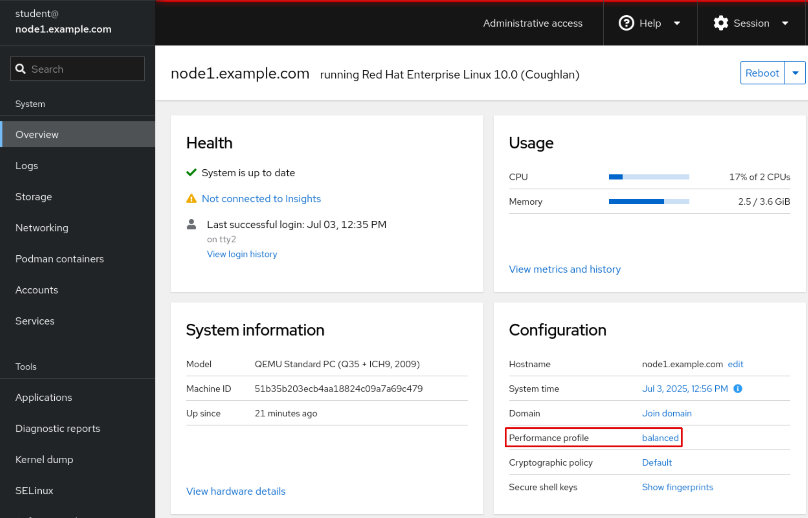
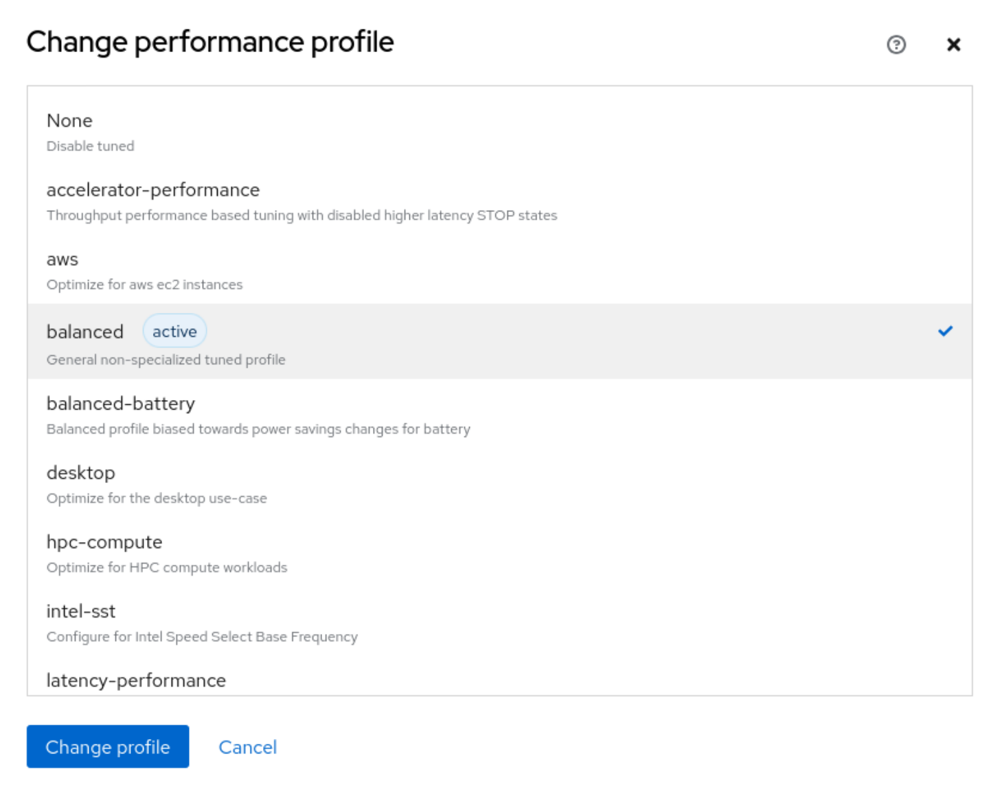

# Setting a Tuning Profile
---

## Tuning Systems

System administrators seek ways to get the best performance out of their hardware, by fine-tuning system settings to meet different demands. TuneD is a powerful tool for Red Hat Enterprise Linux that simplifies this process. It automatically optimizes system performance and power efficiency by applying predefined tuning profiles that are tailored to specific workload requirements, to ensure that your system is always running optimally, whether it is a high-performance server or a power-conscious laptop.

TuneD runs continuously in the background as a daemon. It can apply tuning adjustments statically or dynamically. In Red Hat Enterprise Linux, static tuning is the default mode of operation for TuneD.

## The Default Static Tuning Mode

Static tuning configures kernel parameters and other system settings as defined in tuning profiles. When the TuneD service starts, or if you switch to a different profile, these settings are applied immediately. Because TuneD is enabled to run on boot by default, these settings are applied every time that your system starts. These settings remain constant, and provide a stable baseline for overall performance without further adjustments, even when system activity changes.

## Configuring Dynamic Tuning

Although static tuning offers a robust and predictable foundation, TuneD also pro   vides dynamic tuning. This feature enables the tuned daemon to constantly monitor system activity and to adjust settings when the runtime behavior changes. If you enable this feature, then your system's tuning continuously adapts to the current workload, and builds on the initial settings from your chosen profile.

To accomplish this monitoring and changes, the tuned daemon uses specialized modules named monitor plug-ins and tuning plug-ins, respectively.

Monitor plug-ins analyze the system and gather real-time data such as CPU load, disk I/O, and network traffic.

Tuning plug-ins then use this information for dynamic tuning. For example, the net plug-in can dynamically change the interface speed based on interface usage.

Dynamic tuning is disabled by default in Red Hat Enterprise Linux to ensure predictable performance. You can enable dynamic tuning by changing the `dynamic_tuning` variable to 1 in the `/etc/tuned/tuned-main.conf` configuration file. If you enable dynamic tuning, then the tuned daemon periodically monitors the system and adjusts settings based on its runtime behavior.

You can control how often these updates happen by setting the `update_interval` variable (in seconds) in the `/etc/tuned/tuned-main.conf` configuration file.

```bash
...output omitted...
# Dynamicaly tune devices, if disabled only static tuning will be used.
dynamic_tuning = 1
...output omitted...
# Update interval for dynamic tunings (in seconds).
# It must be multiply of the sleep_interval.
update_interval = 10
...output omitted...
```

## Installing and Enabling the Tuning Service

In Red Hat Enterprise Linux, the TuneD tool is typically preinstalled.

Use the following command to install the tuned package:

```bash
dnf install tuned
```

Use the following command to enable the `tuned` service:

```bash
systemctl enable --now tuned
```

The TuneD application provides profiles in the following categories:

- Power-saving profiles
- Performance-boosting profiles

The performance-boosting profiles might focus on the following aspects:

- Low latency for storage and network.
- High throughput for storage and network.
- Virtual machine performance.
- Virtualization host performance.

The following table lists the tuning profiles that are distributed with Red Hat Enterprise Linux 10:

**Table 9.1. Tuning Profiles That Are Distributed with Red Hat Enterprise Linux 10**

| Tuned Profile            | Purpose                                                                 |
|---------------------------|-------------------------------------------------------------------------|
| accelerator-performance   | Increased performance-based tuning.                                     |
| aws                       | Optimize for Amazon Web Services (AWS) EC2 instances.                  |
| balanced                  | General nonspecialized tuned profile.                                   |
| balanced-battery          | Balanced profile for power saving.                                      |
| desktop                   | Optimize for the desktop use-case.                                      |
| hpc-compute               | Optimize for High-Performance Computing (HPC) compute workloads.        |
| intel-sst                 | Configure for Intel Speed Select Base Frequency.                        |
| latency-performance       | Optimize for deterministic performance at the cost of increased power consumption. |
| network-latency           | Optimize for deterministic performance at the cost of increased power consumption, focused on low-latency network performance. |
| network-throughput        | Optimize for streaming network throughput, generally necessary only on earlier CPUs or 40 G+ networks. |
| optimize-serial-console   | Optimize for serial console use.                                        |
| powersave                 | Optimize for low power consumption.                                     |
| throughput-performance    | Broadly applicable tuning that provides excellent performance across various common server workloads. |
| virtual-guest             | Optimize for running inside a virtual guest.                            |
| virtual-host              | Optimize for running Kernel-based Virtual Machine (KVM) guests.         |

The TuneD application stores its preinstalled profiles, which are referred to as system or factory profiles, in the `/usr/lib/tuned/profiles` directory. These profiles are not intended for direct editing.

Each profile is in its own directory, which contains the main tuned.conf configuration file and, optionally, other related files.

The following example lists the profiles in the `/usr/lib/tuned/profiles` directory:

```bash
ls /usr/lib/tuned/profiles/
```

The following example lists the contents of the `/usr/lib/tuned/profiles/virtual-guest` directory:

```bash
ls /usr/lib/tuned/profiles/virtual-guest/
```

The `tuned.conf` configuration file appears as follows:

```bash
#
# tuned configuration
#

[main]
summary=Optimize for running inside a virtual guest
include=throughput-performance

[vm]
# If a workload mostly uses anonymous memory and it hits this limit, the entire
# working set is buffered for I/O, and any more write buffering would require
# swapping, so it's time to throttle writes until I/O can catch up.  Workloads
# that mostly use file mappings may be able to use even higher values.
#
# The generator of dirty data starts writeback at this percentage (system default
# is 20%)
dirty_ratio = 30

[sysctl]
# Filesystem I/O is usually much more efficient than swapping, so try to keep
# swapping low.  It's usually safe to go even lower than this on systems with
# server-grade storage.
vm.swappiness = 30
```

The [main] section in the file can include a summary of the tuning profile. This section also supports the include directive, which is a feature that enables profile inheritance. The TuneD profile (the child profile) can inherit all settings from another profile (its parent profile). With this inheritance-based configuration model, when creating tuning profiles, you can use a preinstalled profile as a foundation. You can then add or modify specific parameters to suit your needs.

To create or customize tuning profiles, copy the relevant profile directory from the `/usr/lib/tuned/profiles` directory to the `/etc/tuned/profiles` directory, and make your modifications. If profile directories with the same name exist in both locations, then the one in the `/etc/tuned/profiles` directory takes precedence. Therefore, never directly modify files in the `/usr/lib/tuned/profiles` system directory.

The remaining sections in the `tuned.conf` file use tuning plug-ins to modify system parameters. For instance, in the previous example, the [sysctl] section modifies the vm.swappiness kernel parameter through the sysctl tuning plug-in. The vm.swappiness parameter dictates how aggressively the kernel moves processes from physical memory to swap space.

To check the value of this parameter on your system, use the `sysctl` command:

```bash
sysctl vm.swappiness
```

This parameter accepts values from 0 to 100. A lower value, such as 30, would be set by activating the `virtual-guest` profile to reduce the kernel's tendency to use swap space.

## Managing Profiles from the Command Line

The `tuned-adm` command is your primary tool for managing the TuneD application and its profiles.

The command supports the following tuning activities:

- Query current active settings.
- List all available tuning profiles.
- Receive a recommended tuning profile for your system.
- Directly switch between tuning profiles.
- Deactivate all TuneD settings.

You can identify the currently active tuning profile with the `tuned-adm` active command.

```bash
tuned-adm active
```

```bash
tuned-adm verify
```

The `tuned-adm list` command lists all available tuning profiles, including built-in and custom-created profiles.

```bash
tuned-adm list
```

For information about a specific tuning profile, use the `tuned-adm profile_info` command followed by the profile's name.

```bash
tuned-adm profile_info network-latency
```

If no profile is specified, then the `tuned-adm profile_info` command displays information for the currently active tuning profile.

To switch to a different profile that better matches your system's current tuning requirements, use the tuned-adm profile command followed by the name of the profile. This command changes the active tuning profile persistently.

```bash
tuned-adm profile virtual-guest
```

The `tuned-adm` recommend command suggests a tuning profile based on various system characteristics. These characteristics include factors such as whether the system is a virtual machine, and other predefined categories that are selected during system installation.

```bash
tuned-adm recommend
```

To revert the settings that the current profile applied, you have two options: either switch to a different profile or deactivate the tuned daemon. To turn off all TuneD activity, use the `tuned-adm off` command.


```bash
tuned-adm off
```

## Managing Profiles with the Web Console

To manage system performance profiles with the web console, you must log in and escalate your privileges. You can then execute commands that modify system performance profiles, which require administrative access due to their impact on core system parameters.

You can switch to the administrative access mode in the web console by clicking either the Limited access or the Turn on administrative access button. You are then prompted to enter your password.

As a privileged user, click the Overview menu option in the left navigation bar. The Performance profile field displays the current active profile.



To select a different profile, click the active profile link. In the Change performance profile user interface, scroll through the profile list and select the chosen profile by clicking it. Then, click the Change profile button to apply the change.



To verify changes, return to the main Overview page, and confirm that it displays the chosen profile in the Performance profile field.

## Enabling the Web Console

Starting in Red Hat Enterprise Linux 10, the web console is preinstalled. You can install the web console by installing the `cockpit` package:

```bash
dnf install cockpit -y
```

Enable and start the `cockpit.socket` unit to access the web console:

```bash
systemctl enable --now cockpit.socket
```

If you are using a custom firewall configuration, then you must open the 9090 port or add the cockpit service to allow incoming connections to the web console.

```bash
firewall-cmd --add-service=cockpit --permanent
```

Update the `firewalld` service with the changes:

```bash
firewall-cmd --reload
```

To access the web console, open the https://servername:9090 URL and replace servername with your server's hostname or IP address.

By default, the `cockpit `service uses a self-signed TLS certificate to secure connections. When you connect for the first time, your web browser might display a security warning due to a commercial Certificate Authority not trusting this certificate. You can safely ignore this warning.

Log in to the web console by using the user and password on the system.

